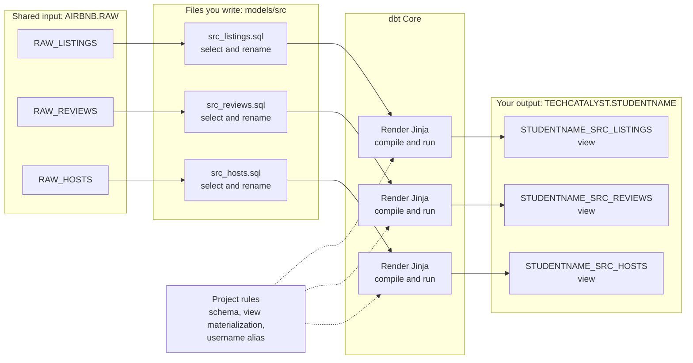

# Activity 1: First Models

**Module:** Week 5 Day 4
**Estimated Time:** 40 to 50 minutes
**Difficulty:** Beginner
**Format:** Individual, self-paced; compare with a partner at each checkpoint
**Prerequisites:** Activity 0 complete, `dbt debug` passing

## Objective

Build your first three dbt models: thin staging views over the raw Airbnb tables. The first two are written out in full so you can study the shape as you type them; the third you write from requirements alone. By the end you can say what a model is (a `SELECT` statement dbt materializes for you), run one, and find its output in Snowflake under your name prefix.

This lab and the ones after it are a complete, self-paced sequence: 0 to 3 in order, 4 as stretch. Everything you need is in the instructions.

Use the same learning loop for every model:

1. Predict what the SQL will return.
2. Write the model.
3. Run only the model you are working on.
4. Inspect the warehouse object.
5. Read dbt's compiled SQL.
6. Explain what dbt added beyond your `SELECT`.

## The data you are standing on

The shared database `AIRBNB` has a `RAW` schema, already loaded:

| Table | Grain | Columns worth knowing |
|---|---|---|
| `RAW.RAW_LISTINGS` | one listing | `id`, `name`, `room_type`, `minimum_nights`, `host_id`, `price` (a string, with a dollar sign), `created_at`, `updated_at` |
| `RAW.RAW_REVIEWS` | one review | `listing_id`, `date`, `reviewer_name`, `comments`, `sentiment` |
| `RAW.RAW_HOSTS` | one host | `id`, `name`, `is_superhost` (`t`/`f`), `created_at`, `updated_at` |

Everyone reads `AIRBNB.RAW`. Everything you build lands in `TECHCATALYST.<STUDENTNAME>` with your username prefix.

## The flow you are building

Read this diagram from left to right. Each raw table has one thin staging model. dbt Core combines your model SQL with the project rules, compiles the result, and asks Snowflake to create a view in your schema.



**Caption:** One raw table becomes one staging view. The raw tables remain unchanged; your models create a clean naming boundary in your own schema.

**Text description:** `RAW_LISTINGS`, `RAW_REVIEWS`, and `RAW_HOSTS` each flow into a matching `src_*.sql` model. dbt applies the configured schema, view materialization, and username alias, renders any Jinja, and runs the compiled SQL. Snowflake creates three prefixed views in `TECHCATALYST.<STUDENTNAME>`.

What to notice:

- This activity does not join the three datasets. Each model preserves the grain of one raw table.
- Your `.sql` file describes the rows and columns. It does not contain `CREATE VIEW`.
- `dbt_project.yml` and the alias macro supply build behavior that is shared across models.
- Snowflake stores the output object; dbt stores the project definition, dependency metadata, and compiled artifacts.

Before writing any model, look at the data. In Snowsight:

```sql
SELECT * FROM AIRBNB.RAW.RAW_LISTINGS LIMIT 10;
SELECT * FROM AIRBNB.RAW.RAW_REVIEWS  LIMIT 10;
SELECT * FROM AIRBNB.RAW.RAW_HOSTS    LIMIT 10;
```

## Why staging models exist

Raw tables have raw problems: `id` means something different in every table, `price` is a string, names are inconsistent. A staging model is a thin rename-and-select layer that gives every downstream model one clean, consistently named starting point. No business logic yet; that comes in Activity 2. One staging model per raw table is the standard shape.

This separation is useful because downstream models should not each invent their own names for the same raw columns. If the raw listings table changes later, the staging layer becomes the single place to adapt the rest of the project.

## Two SQL ideas before you type

### A model is still a `SELECT`

The body of a dbt model is usually ordinary SQL. You do not write `CREATE VIEW` or `CREATE TABLE`. dbt wraps your `SELECT` in the correct DDL based on the configured materialization.

### A CTE names an intermediate result

A common table expression, or CTE, is the named query inside `WITH ... AS (...)`. In this first model the CTE is not required. The query could be written as one `SELECT` directly from the raw table. We keep the CTE here because it gives you an intermediate step you can inspect, and the same shape becomes genuinely useful in Activity 2 when a model has multiple inputs.

Do not add a CTE automatically to every query. Use one when naming an intermediate step makes the transformation easier to read, inspect, or reuse.

## Task 1: `src_listings` (worked example, type it yourself)

Create `models/src/src_listings.sql`:

Create the `src` subfolder:

```bash
mkdir -p models/src
```

Then create the `src_listings.sql` file:

```bash
touch models/src/src_listings.sql
```

Then enter the following:

```sql
WITH raw_listings AS (
    SELECT * FROM AIRBNB.RAW.RAW_LISTINGS
)
SELECT
    id AS listing_id,
    name AS listing_name,
    listing_url,
    room_type,
    minimum_nights,
    host_id,
    price AS price_str,
    created_at,
    updated_at
FROM raw_listings
```

Activity 0 removed dbt's example models. Confirm that `models/example/` is gone so the command runs only your models.

## Your first `dbt run`: command and selection primer

`dbt run` builds or rebuilds **models**. It reads the project configuration, renders Jinja, compiles each selected model into warehouse SQL, and asks Snowflake to create or update the configured view, table, or incremental table. When multiple models are selected, dbt follows the dependency graph instead of relying on filename order.

Plain `dbt run` selects every model in the project:

```bash
dbt run
```

At this moment, your project contains only `src_listings`, so "every model" means one model. Later, after the project grows, the same plain command will rebuild all models.

`dbt run` does not load seeds, run snapshots, or execute tests. Those resources have their own commands. Activity 3 introduces `dbt seed`, `dbt test`, and `dbt build`.

### The selection forms you will use

| Command | What dbt selects | When you would use it |
|---|---|---|
| `dbt run` | Every model in the project | Validate or rebuild the complete model DAG |
| `dbt run --select src_reviews` | Only `src_reviews` | Work on one model without rebuilding everything |
| `dbt run -s src_reviews` | Exactly the same as the command above | Use the shorter spelling of `--select` |
| `dbt run --select src_listings src_reviews` | The listed models | Rebuild a small group of models |
| `dbt run --select +dim_listings_w_hosts` | The model and all its upstream ancestors | Rebuild everything needed to produce one downstream model |
| `dbt run --select fct_reviews --full-refresh` | `fct_reviews`, rebuilt from all input rows | Replace an incremental table instead of processing only new rows |

`--select` and `-s` are interchangeable. The activities intentionally show both because you will encounter both forms in documentation and real projects. The long form is easier to read; the short form is faster to type.

Read a dbt command as three possible parts:

```text
dbt  run  --select src_reviews  --full-refresh
     |    |                     |
     |    |                     optional behavior
     |    optional scope
     action
```

- The **action** says what dbt should do, such as `run`, `compile`, `seed`, or `test`.
- The **scope** says which resources the action should consider.
- A behavior flag such as `--full-refresh` changes how the selected action runs.

Selection syntax is shared across many dbt commands. For example, `dbt compile --select src_reviews` compiles one model, while `dbt test --select src_reviews` runs tests associated with that selected model. The action changes; the idea of narrowing the scope stays the same.

The selector chooses **which dbt models run**. It does not filter rows inside a model. Row filtering still belongs in the model's SQL.

The position of `+` carries meaning:

- `+model_name` includes the model and its upstream parents.
- `model_name+` includes the model and its downstream children.
- `+model_name+` includes the model, its parents, and its children.

When a selector becomes more complex, preview it before building:

```bash
dbt ls --select +dim_listings_w_hosts
```

`dbt ls` lists the matched resources without building them. You will use this preview in Activity 2.

**Checkpoint:** the run reports one model built. In Snowsight:

```sql
SELECT *
FROM TECHCATALYST.<STUDENTNAME>.<STUDENTNAME>_SRC_LISTINGS
LIMIT 5;
```

Your prefix is there because of the Activity 0 macro; you never typed it. Notice what dbt did: you wrote a `SELECT`, and a **view** appeared, named, placed, and owned, because `dbt_project.yml` says `src` models are views.

Pause and separate the responsibilities:

- Snowflake executed the SQL and stores the view.
- dbt decided the object name, location, materialization, and run behavior.
- Your model defines the rows and columns the view returns.

## Task 2: `src_reviews` (worked example, type it yourself)

Create `models/src/src_reviews.sql`:

```sql
WITH raw_reviews AS (
    SELECT * FROM AIRBNB.RAW.RAW_REVIEWS
)
SELECT
    listing_id,
    date AS review_date,
    reviewer_name,
    comments AS review_text,
    sentiment AS review_sentiment
FROM raw_reviews
```

Build only the new model. This time use the short form of `--select`:

```bash
dbt run -s src_reviews
```

Read that command as: "run models, but select only `src_reviews`."

## Task 3: `src_hosts` (solo)

Your turn. Create `models/src/src_hosts.sql`:

1. A CTE named `raw_hosts` selecting everything from `AIRBNB.RAW.RAW_HOSTS`.
2. A final select renaming `id` to `host_id` and `name` to `host_name`, keeping `is_superhost`, `created_at`, `updated_at`.

Run it and verify in Snowsight.

**Checkpoint:** this query returns the renamed columns:

```sql
SELECT host_id, host_name
FROM TECHCATALYST.<STUDENTNAME>.<STUDENTNAME>_SRC_HOSTS
LIMIT 5;
```

Compare your model with the first two before opening the solution. The column names should be different, but the pattern should be the same: identify the input grain, give ambiguous columns business-specific names, and keep the staging logic thin.

## Task 4: Read what dbt wrote

dbt compiles your model into real SQL before running it. Look at:

```
target/compiled/airbnb/models/src/src_hosts.sql
```

and

```
target/run/airbnb/models/src/src_hosts.sql
```

The first is your SELECT after Jinja rendering; the second is what actually executed (a `CREATE VIEW ... AS` wrapped around it, with your alias). When a model misbehaves, these files are where you look first: debugging compiled SQL beats guessing.

There is little Jinja in these three models yet, but that changes in Activity 2. The compilation step is what turns expressions such as `{{ ref('src_listings') }}` into a physical Snowflake relation.

## Knowledge Check

Answer without looking back:

1. Why did you rename `id` differently in listings and hosts?
2. Why did you keep `price` as `price_str` instead of converting it here?
3. What made these models views rather than tables?
4. What is the difference between `target/compiled/` and `target/run/`?
5. What is the difference between `dbt run`, `dbt run --select src_hosts`, and `dbt run -s src_hosts`?
6. In `dbt run --select +dim_listings_w_hosts`, what does the leading `+` add to the selection?

## Success Criteria

- Three views exist in `TECHCATALYST.<STUDENTNAME>` under your prefix: `_SRC_LISTINGS`, `_SRC_REVIEWS`, and `_SRC_HOSTS`.
- `dbt run` completes with no errors and you can run a single model with `-s`.
- You can identify the action, selection scope, and optional behavior flag in a dbt command.
- You can explain: what a model is, why the staging layer renames columns, and where to find the compiled SQL.

## Note on the CTE style

Each model opens with a CTE that selects everything, then a final `SELECT` does the shaping. With one raw table this can be collapsed into a single query. Here the named step is a teaching scaffold and a preview of the multi-input pattern used next. In production code, choose the shortest form that remains easy to understand.
