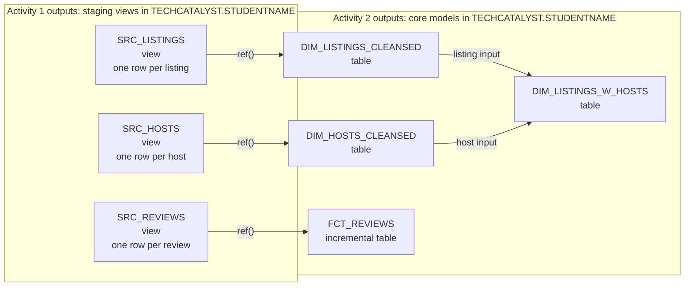
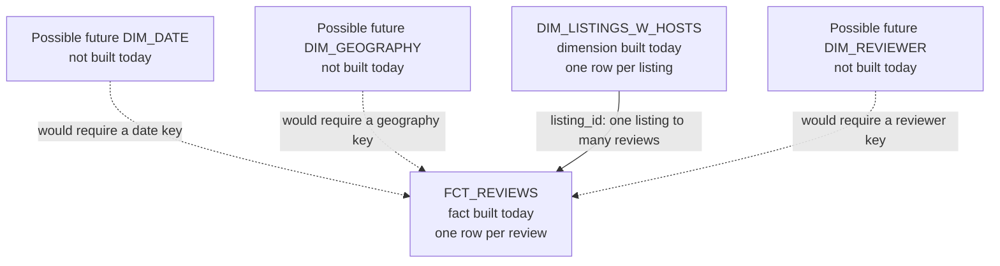
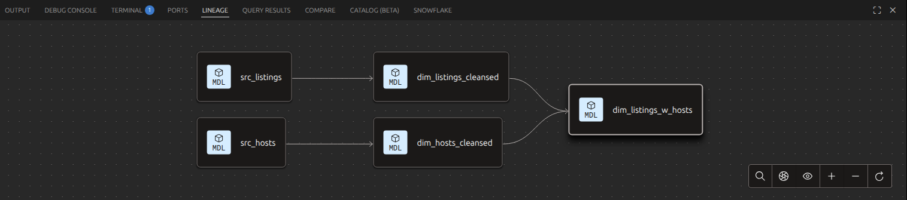

# Activity 2: Materializations and Core Models

**Module:** Week 5 Day 4
**Estimated Time:** 60 to 70 minutes
**Difficulty:** Intermediate
**Format:** Individual, self-paced; compare with a partner at each checkpoint
**Prerequisites:** Activity 1 complete (three staging views built)

## Objective

Build the cleansed core of the Airbnb project: two dimension tables, an incremental fact table, and a joined dimension. Along the way you meet `ref()`, the function that makes dbt a dependency graph instead of a pile of scripts, and you watch an incremental model process only what is new.

## The one idea to hold onto

From now on, models never name other models by their table name. They say `{{ ref('src_listings') }}`. dbt resolves the name (with your prefix), builds things in the right order, and draws the lineage graph from these references. Hardcoding `TECHCATALYST.<STUDENTNAME>.<STUDENTNAME>_SRC_LISTINGS` would work today and break everything later; `ref()` is the contract.

`ref()` solves three problems at once:

1. **Naming:** it resolves the correct database, schema, and aliased object name.
2. **Ordering:** it tells dbt that the referenced model must be built first.
3. **Lineage:** it creates an edge in the project's directed acyclic graph, or DAG.

## Jinja and SQL have different jobs

In this expression:

```sql
SELECT * FROM {{ ref('src_listings') }}
```

`SELECT * FROM` is SQL that Snowflake understands. `{{ ref('src_listings') }}` is Jinja that dbt evaluates before Snowflake sees the query. The compiled SQL contains a physical relation such as:

```sql
SELECT * FROM TECHCATALYST.JDOE.JDOE_SRC_LISTINGS
```

You write the logical name because physical names can change between students and environments.

## Materializations are storage decisions

| Materialization | What dbt creates | Good fit in this project | Trade-off |
|---|---|---|---|
| `view` | A stored query | Thin staging models | Always current, but query work repeats |
| `table` | Stored query results | Reused dimensions and marts | Fast to read, but must be rebuilt |
| `incremental` | A table updated with selected new rows | Growing review facts | Faster later runs, but needs careful change logic |

Folder defaults from Activity 0 choose the materialization. The model SQL still defines the data.

## The Activity 2 build flow

Activity 1 created three staging views. Activity 2 does not return to `AIRBNB.RAW` directly. It builds trusted core models from those staging views, one dependency at a time.



**Figure 1. Activity 2 dependency flow.** Each arrow represents a `ref()` dependency. dbt can build independent branches separately, but it will not build a child before its parents.

**Text description:** `src_listings` becomes `dim_listings_cleansed`, and `src_hosts` becomes `dim_hosts_cleansed`. Those two dimensions feed `dim_listings_w_hosts`. Separately, `src_reviews` feeds the incremental `fct_reviews` model. The folder configuration makes staging models views, dimension models tables, and fact models incremental tables.

Notice that the SQL decides **which rows and columns** belong in a model, while the materialization decides **how Snowflake stores** that result. The final fact and dimension are not joined during the build. Analysts join them later when answering a question.

Create the folders used in this activity:

```bash
mkdir -p models/dim models/fct models/mart
```

## Task 1: `dim_listings_cleansed` (worked example, type it yourself)

Business rules for listings: a minimum stay of 0 nights means 1, and `price` must become a number. Create `models/dim/dim_listings_cleansed.sql`:

```sql
WITH src_listings AS (
    SELECT * FROM {{ ref('src_listings') }}
)
SELECT
    listing_id,
    listing_name,
    room_type,
    CASE
        WHEN minimum_nights = 0 THEN 1
        ELSE minimum_nights
    END AS minimum_nights,
    host_id,
    REPLACE(price_str, '$') :: NUMBER(10, 2) AS price,
    created_at,
    updated_at
FROM src_listings
```

Run with `dbt run -s dim_listings_cleansed`. Here, `-s` is the short form of `--select`, so only this model is rebuilt.

**Checkpoint:** in Snowsight, `<STUDENTNAME>_DIM_LISTINGS_CLEANSED` is a **table** (not a view; the `dim` folder config did that), `price` is numeric, and `SELECT MIN(minimum_nights) FROM ...` returns 1, not 0.

Why is this a dimension? Its grain is one row per listing, and its columns describe a listing. Dimensions answer questions such as "what kind of room was reviewed?" or "which host owns the listing?"

## Task 2: `dim_hosts_cleansed` (solo)

Create `models/dim/dim_hosts_cleansed.sql`:

1. A CTE referencing `src_hosts` with `ref()`.
2. Select every column, but replace a null `host_name` with `'Anonymous'` using `NVL(host_name, 'Anonymous')`.

**Checkpoint:** this query returns 0:

```sql
SELECT COUNT(*)
FROM TECHCATALYST.<STUDENTNAME>.<STUDENTNAME>_DIM_HOSTS_CLEANSED
WHERE host_name IS NULL;
```

The grain is one row per host. `host_id` identifies the entity; `host_name` and `is_superhost` describe it.

## Task 3: `fct_reviews`, your first incremental model

Reviews arrive forever, and rebuilding all of them on every run would get slower every day. An incremental model processes **only the new rows** after its first full build.

This model's grain is one row per review. A fact table stores events or measurements at a declared grain. Here, `listing_id` connects each review event to the listing dimension.

Create `models/fct/fct_reviews.sql`:

```sql
{{
  config(
    materialized = 'incremental',
    on_schema_change = 'fail'
  )
}}
WITH src_reviews AS (
    SELECT * FROM {{ ref('src_reviews') }}
)
SELECT *
FROM src_reviews
WHERE review_text IS NOT NULL


  AND review_date > (SELECT MAX(review_date) FROM {{ this }})

```

The config block has two jobs:

- `materialized='incremental'` repeats the `fct` folder default. It is technically redundant here, but it makes this model's critical behavior visible when someone opens the file by itself.
- `on_schema_change='fail'` stops an incremental run if the model's output columns no longer match the existing target table. Activity 4 deliberately adds a column and uses `--full-refresh` to rebuild safely.

Read the Jinja before running: on the first build, the `is_incremental()` block is skipped and every review loads. On later runs, only reviews newer than the newest one already in **your** table (`{{ this }}`) are processed.

- `is_incremental()` is true only when the target table already exists, the model is configured as incremental, and the command is not a full refresh.
- `{{ this }}` compiles to the current model's physical relation.
- The maximum review date acts as a watermark.

This is a deliberately simple watermark. A production pipeline must also decide how to handle late-arriving reviews or multiple events that share the same timestamp. The goal here is to see the incremental mechanism before adding those policies.

```bash
dbt run -s fct_reviews
```

**Checkpoint:** note the row count from the first run.

### Watch the increment happen

Prove the increment yourself. The one exception to "nobody writes to RAW" is this single, additive insert, tagged with your own name so it never collides with anyone:

1. In Snowsight, add one fresh review for listing 3176:

   ```sql
   INSERT INTO AIRBNB.RAW.RAW_REVIEWS
   VALUES (
       3176,
       CURRENT_TIMESTAMP(),
       UPPER('<STUDENTNAME>'),
       'excellent stay!',
       'positive'
   );
   ```

2. `dbt run -s fct_reviews` again.
3. The run log shows a tiny number of rows processed, not the full table. That difference is the entire point of incremental models. (If classmates inserted their rows before your rerun, you pick up theirs too; count the processed rows against how many inserts happened since your last run.)

Example incremental run:

```text
1 of 1 OK created sql incremental model JDOE.jdoe_fct_reviews ................. [SUCCESS 1 in 2.17s]
```

Compare it with the initial full run:

```text
1 of 1 OK created sql incremental model JDOE.jdoe_fct_reviews ........... [SUCCESS 409698 in 2.99s]
```


4. Confirm your row arrived where it should:

   ```sql
   SELECT * FROM TECHCATALYST.<STUDENTNAME>.<STUDENTNAME>_FCT_REVIEWS
   WHERE reviewer_name = UPPER('<STUDENTNAME>');
   ```

Example result:

```text
3176    2026-07-27 04:38:05.689    JDOE    excellent stay!    positive
```


Insert your row exactly once. RAW stays append-only today: no updates, no deletes, nothing untagged.

Also try a full rebuild and read the log line that says the table was rebuilt from scratch:

```bash
dbt run -s fct_reviews --full-refresh
```

Example full-refresh result:

```text
1 of 1 OK created sql incremental model JDOE.jdoe_fct_reviews ........... [SUCCESS 409699 in 3.84s]
```


## Task 4: `dim_listings_w_hosts` (solo)

The first model with two parents. Create `models/dim/dim_listings_w_hosts.sql`:

1. Two CTEs: `l` from `ref('dim_listings_cleansed')`, `h` from `ref('dim_hosts_cleansed')`.
2. Select the listing columns plus `host_name` and `is_superhost` (alias it `host_is_superhost`), joining on `host_id` with a LEFT join.
3. For `updated_at`, take the **most recent** of the two tables' `updated_at` values (`GREATEST(l.updated_at, h.updated_at)`).

**Checkpoint:** row count equals `dim_listings_cleansed` exactly (a LEFT join adds no rows and loses none). Verify with two counts in Snowsight.

## What star schema did you just build?

A star schema separates measurable events from the descriptive context used to analyze them.

| Model | Role | Grain | Key used for analysis |
|---|---|---|---|
| `fct_reviews` | Fact | One row per review | `listing_id` |
| `dim_listings_w_hosts` | Dimension | One row per listing | `listing_id` |



**Figure 2. The small star schema built in this activity.** The solid relationship is the one you build today. The dotted relationships show examples of dimensions that a larger warehouse might add; they are not lab deliverables.

**Text description:** `fct_reviews` is the center of the star and contains one row per review. It joins through `listing_id` to `dim_listings_w_hosts`, which contains one row per listing and its host attributes. Possible date, geography, and reviewer dimensions could surround the same fact table in a larger design.

`fct_reviews` sits at the center of the analysis. Analysts join it to `dim_listings_w_hosts` to group review events by room type, price, host, or superhost status.

This is an **event fact table**. It does not need a column named `amount` to be useful. Each row records that one review happened, so `COUNT(*)` becomes a valid measure. For example, an analyst can count reviews by room type after joining the fact to the dimension.

`dim_hosts_cleansed` and `dim_listings_cleansed` are reusable intermediate dimensions. The joined model deliberately denormalizes host attributes into the listing dimension, which makes the final analytical join simpler. This lab builds a small star with one analysis-ready dimension. A larger warehouse could add date, geography, or reviewer dimensions.

The two CTEs in `dim_listings_w_hosts` earn their place because the model has two upstream relations with different grains. Naming each input keeps the join readable. This is different from adding a CTE to a one-table query by habit.

## Task 5: Inspect the DAG

### Visual route in VS Code

The dbt extension may open a registration or sign-in screen. Registration is not required for this lab.

1. Ignore or close the registration screen.
2. In the VS Code Explorer, right-click `models/dim/dim_listings_w_hosts.sql`.
3. Select **dbt: View Lineage**.
4. If a second choice appears, select the project lineage view.
5. Trace each parent model backward until you reach the staging models.



The extension is only visualizing metadata created by the project. dbt Core remains the engine that parses and runs your models.

### Core-only route

List `dim_listings_w_hosts` and all its ancestors:

```bash
dbt ls --select +dim_listings_w_hosts
```

The leading `+` means "include all upstream parents." You should see the two staging branches that feed the joined dimension.

Now let dbt build that selected subgraph:

```bash
dbt run --select +dim_listings_w_hosts
```

You never wrote a numbered execution order. The `ref()` calls created it. Finally, run the whole project and read the order in the log:

```bash
dbt run
```

Activity 4 will generate a browsable documentation site with the visual lineage graph.

## Explain it back

1. Why is a review a fact while a listing is a dimension?
2. What is the grain of each final analytical model?
3. What three jobs does `ref()` perform?
4. Why does the incremental branch use `{{ this }}` rather than `ref('fct_reviews')`?
5. When did a CTE improve readability in this activity?
6. Which nodes in the star schema diagram are built today, and why are the other nodes dotted?

## Success Criteria

- All seven models build clean: three `src` views, three `dim` tables, and one incremental `fct`.
- You saw an incremental run process only new rows, and a `--full-refresh` rebuild everything.
- Every inter-model reference in your project is a `ref()`; no model names another by its physical table name.
- You can explain in one sentence each: view vs table vs incremental, what `{{ this }}` points to, and what the lineage graph is drawn from.
- You can trace both staging-to-core branches and distinguish the star schema built today from possible future dimensions.

## Stretch

1. Change `dim_hosts_cleansed` to materialize as a view with a per-model config block (`{{ config(materialized='view') }}`), run, and check what changed in Snowflake. Put it back.
2. In the compiled SQL for `fct_reviews` (under `target/compiled/`), find what `{{ this }}` became. Why must it be your prefixed name and not just `fct_reviews`?
