# Activity 0: Your First Code-Free ETL with Apache NiFi

**Module:** Week 5, Day 5  
**Estimated Time:** 75 to 90 minutes  
**Difficulty:** Beginner  
**Format:** Pairs  
**Platforms:** Ubuntu, Apache NiFi 2.10.0, Amazon S3, and Snowflake  
**Dataset:** The Brazilian highway accidents CSV from Week 4 Day 4

> **AI allowed, review required.** You may use an AI assistant to explain an error, but you must understand the flow that you build.

## The Goal

Build this visual ETL pipeline, watch the data move, run it a second time to discover a duplicate-loading problem, inspect its history, and then shut it down:

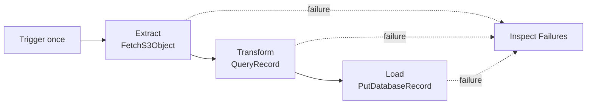

You are not learning to administer NiFi today. You are learning how a visual dataflow works.

## Learning Objectives

By the end of this activity, you will be able to:

- explain what NiFi is and why data engineers use it
- identify FlowFiles, processors, connections, queues, and controller services
- build an S3-to-Snowflake flow on the NiFi canvas
- transform records without writing a Python ETL script
- use bulletins and provenance to understand what happened
- interpret the activity counters displayed on a processor
- explain why this flow creates duplicates when it runs twice
- explain how these ideas transfer to Snowflake Openflow

## The NiFi Mental Model

| Idea | Plain-language meaning | What you will see |
|---|---|---|
| FlowFile | A package containing data plus attributes that describe it | One CSV sample moving across the canvas |
| Processor | A specialized component that performs one action | Fetch, transform, load, or log |
| Relationship | A named outcome from a processor | `success`, `failure`, `retry`, or `clean` |
| Connection and queue | The path for one relationship and its waiting area | Data can wait safely if the next processor is stopped |
| Controller Service | Reusable configuration or a shared resource used by processors | CSV parsing rules, AWS access, and a Snowflake connection pool |
| Process Group | A container that organizes part of a larger flow | You work on the root canvas today, so you do not need one |
| Input and Output Ports | Interfaces that move FlowFiles into or out of a Process Group | The toolbar includes these icons, but this flat flow does not need them |
| Provenance | NiFi's history of what happened to the data | Evidence that the sample was fetched, transformed, and loaded |

Think of a FlowFile as an envelope. Its **content** is the payload, such as CSV bytes. Its **attributes** are labels on the envelope, such as a filename or record count. Processors work on the envelope or its payload, then route it through a named relationship.

Controller services do not move FlowFiles. They provide reusable capabilities to processors. For example, both `QueryRecord` and `PutDatabaseRecord` can use the same CSV parsing rules instead of each repeating that configuration.

NiFi separates actions, configuration, routing outcomes, queues, scheduling, and history. That creates more visible pieces than a short script, but each piece answers an operational question: What should run? With which configuration? Where should success or failure go? What is waiting? What happened to this data?

## Why Use NiFi?

NiFi is useful when a team wants to:

- build and change data movement visually
- connect systems using reusable processors
- see queues, failures, and back pressure
- trace what happened to a piece of data
- let engineers and operators inspect the same flow

This is often called **low-code** or **code-free ETL**. You still configure components and use a small SQL expression, but you do not write a complete extraction, transformation, and loading program.

Snowflake Openflow is built on Apache NiFi. Openflow manages more of the deployment and security, but the core ideas of processors, connections, controller services, scheduling, and provenance transfer directly.

## Before You Start

You need:

- a disposable Ubuntu host with at least 4 GB of memory
- `sudo` access
- the Ubuntu host address supplied by your instructor
- browser access to port `8443` on that host
- a Snowflake username, password, warehouse, database, role, and personal schema

The classroom network must limit port `8443` access to approved student or classroom IP addresses. Do not open it to the entire internet.

## Deliverable

Create:

```text
student-work/week5/day5/nifi-lab-notes.md
```

Include:

1. one screenshot of the completed NiFi flow
2. the Snowflake row count after the first run
3. your predicted and actual row count after the second run
4. an explanation of why the second run created duplicates and how that differs from `COPY INTO`
5. one provenance event and what it proves
6. two sentences comparing NiFi with Snowflake Openflow

Do not include credentials.

## Part 1: Quick Install and Start

The goal of this section is simply to reach the NiFi canvas.

### Step 1: Install Java and download tools

Run on Ubuntu:

```bash
sudo apt-get update
sudo apt-get install -y openjdk-21-jdk unzip curl

java -version
```

The first line of the Java output must show version `21`.

Set `JAVA_HOME` for this terminal:

```bash
export JAVA_HOME="$(dirname "$(dirname "$(readlink -f "$(command -v java)")")")"
export PATH="$JAVA_HOME/bin:$PATH"
```

### Step 2: Download, verify, and unzip NiFi

```bash
sudo mkdir -p /opt/nifi
sudo chown "$(id -un)":"$(id -gn)" /opt/nifi
cd /opt/nifi

curl -fLO "https://downloads.apache.org/nifi/2.10.0/nifi-2.10.0-bin.zip"
```

The download is large and may take several minutes.

This SHA-512 check confirms that the downloaded file matches the official Apache release:

```bash
printf '%s  %s\n' \
  "a56c93cad6794beceeaa2e398a2ee9721160acdd16e479050c57879a661024113360c5d5778bcc379c76e6485805869e24cdb534bcf8cb30c6956d09377169d7" \
  "nifi-2.10.0-bin.zip" \
  | sha512sum -c -
```

Expected:

```text
nifi-2.10.0-bin.zip: OK
```

Stop if the check fails. Do not unzip a file that does not match the official checksum.

```bash
unzip -q nifi-2.10.0-bin.zip
cd /opt/nifi/nifi-2.10.0
```

### Step 3: Set a lab login, start NiFi, and open the canvas

Set a disposable login:

```bash
./bin/nifi.sh set-single-user-credentials \
  'your-name' \
  'choose-a-12-character-lab-password'
```

Replace both quoted values before running the command. Use a password with at least 12 characters. Do not reuse your Snowflake password.

NiFi starts on `localhost` by default. This one-time classroom lab uses direct browser access, so bind NiFi to the host's network interfaces and start it:

```bash
sed -i \
  's/^nifi.web.https.host=.*/nifi.web.https.host=0.0.0.0/' \
  conf/nifi.properties
./bin/nifi.sh start
./bin/nifi.sh status
```

The first start can take about one minute.
The classroom network restriction on port `8443` is the access boundary for this temporary lab.

Open the address supplied by your instructor:

```text
https://<ubuntu-host>:8443/nifi
```

If the browser runs on the same Ubuntu computer as NiFi, use:

```text
https://localhost:8443/nifi
```

Your browser will warn about the self-signed classroom certificate. Confirm that the address is your assigned Ubuntu host, use the browser's advanced option to continue, and sign in with the NiFi login you created.

You should now see an empty NiFi canvas.

## Part 2: Create the Snowflake Target

### Step 4: Create one small target table

Open a Snowflake worksheet. Replace `<YOUR_SCHEMA>` with your assigned schema:

```sql
USE ROLE DE;
USE WAREHOUSE COMPUTE_WH;
USE DATABASE TECHCATALYST;
USE SCHEMA <YOUR_SCHEMA>;

CREATE OR REPLACE TABLE ACCIDENTS_NIFI_1000 (
    ACCIDENT_DATE       VARCHAR,
    DAY_OF_WEEK         VARCHAR,
    STATE_CODE          VARCHAR,
    WEATHER_CONDITION   VARCHAR,
    FATALITIES          VARCHAR,
    TOTAL_INJURIES      VARCHAR
);
```

The columns remain text so you can focus on NiFi instead of type-conversion rules.

## Part 3: Add the Controller Services

#### What is a controller service, and why is it not a processor?

A processor *does* something to a FlowFile: it fetches, transforms, or loads. A controller service does not touch FlowFiles at all. It is a reusable capability that a processor borrows while it runs. Picture the processors as workers on a line and the controller services as the shared tools and credentials hanging on the wall that any worker can pick up.

Keeping this configuration separate buys you three things: several processors can share one tested setup, an operator can update a shared resource (such as a database password) in one place, and an expensive resource (such as a pool of open connections) is built once instead of rebuilt inside every processor.

NiFi ships many kinds of controller service. You will create four, and each is a different *category*, not four copies of one thing:

| Controller service | Category and what it provides | Used by |
|---|---|---|
| `PublicS3AnonymousCredentials` | Credentials provider: how a processor authenticates to a cloud service | `FetchS3Object` |
| `AccidentsCSVReader` | Record reader: how raw CSV bytes become rows with named fields | `QueryRecord` and `PutDatabaseRecord` |
| `CleanAccidentsCSVWriter` | Record writer: how records are turned back into CSV bytes | `QueryRecord` |
| `SnowflakeJDBC` | Connection pool: a reusable set of open database connections | `PutDatabaseRecord` |

You will configure each service first, then enable all four together at the checkpoint.

### Step 5: Download and verify the Snowflake JDBC driver

NiFi's Snowflake connection needs a JDBC driver. Keep it in a dedicated driver directory:

```bash
mkdir -p /opt/nifi/drivers

curl -fL \
  "https://repo1.maven.org/maven2/net/snowflake/snowflake-jdbc/4.3.1/snowflake-jdbc-4.3.1.jar" \
  -o /opt/nifi/drivers/snowflake-jdbc-4.3.1.jar

chmod 644 /opt/nifi/drivers/snowflake-jdbc-4.3.1.jar
```

Verify the driver before configuring NiFi:

```bash
printf '%s  %s\n' \
  "5d43d21df0e9b45b3a21c52889aea958177351ecd417bcad594ce7e9f5459082" \
  "/opt/nifi/drivers/snowflake-jdbc-4.3.1.jar" \
  | sha256sum -c -
```

Expected:

```text
/opt/nifi/drivers/snowflake-jdbc-4.3.1.jar: OK
```

Stop and download the driver again if the check fails. In Step 10, you will give the controller service this exact path.
You do not need to restart NiFi. The controller service loads the driver from this path when you enable it.

### Step 6: Open Controller Services

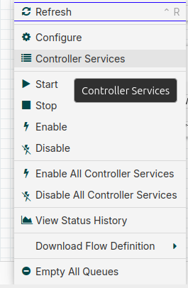

On the empty canvas:

1. Right-click a blank area.
2. Select **Controller Services**.
3. Select **+** to add a service.

### Step 7: Add anonymous S3 access

Add:

```text
AWSCredentialsProviderControllerService
```

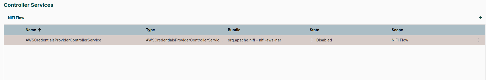

Then click Edit and change the Name.

Name it:

```text
PublicS3AnonymousCredentials
```

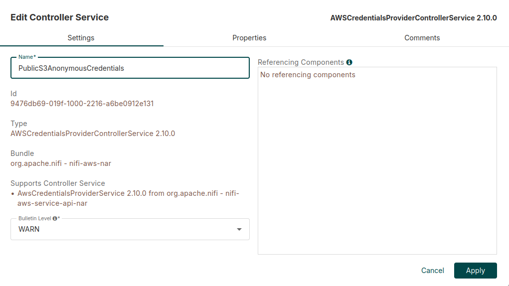

Set:

| Property | Value |
|---|---|
| Use Anonymous Credentials | `true` |
| Use Default Credentials | `false` |

Leave the access key and secret key empty. Select **Apply**. Leave the service disabled until the checkpoint after Step 10.

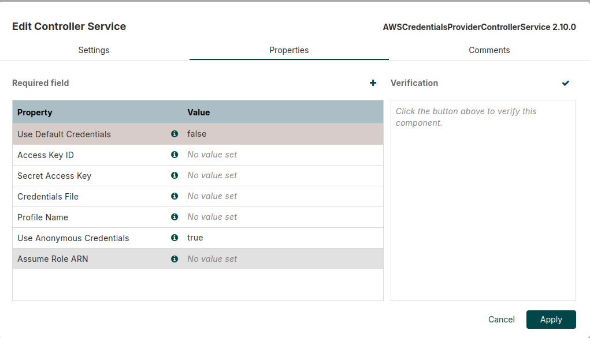

### Step 8: Add the CSV reader

#### Why a CSV reader?

On its own, the fetched S3 content is just a block of text. NiFi cannot ask "what is in the `state` column?" until something teaches it how that text is shaped. A record reader is that teacher. It parses the bytes into rows and gives each column a name (a schema), so a downstream processor can address a field by name instead of counting commas. Setting **Schema Access Strategy** to `Use String Fields From Header` tells the reader to take the column names from the first line of the file. Once fields have names, `QueryRecord` can write plain SQL like `TRIM("state")`.

Add:

```text
CSVReader
```

Name it:

```text
AccidentsCSVReader
```

Set:

| Property | Value |
|---|---|
| Schema Access Strategy | `Use String Fields From Header` |
| CSV Format | `RFC 4180` |
| Treat First Line as Header | `true` |
| Character Set | `UTF-8` |

Select **Apply**. Leave the service disabled until the checkpoint after Step 10.

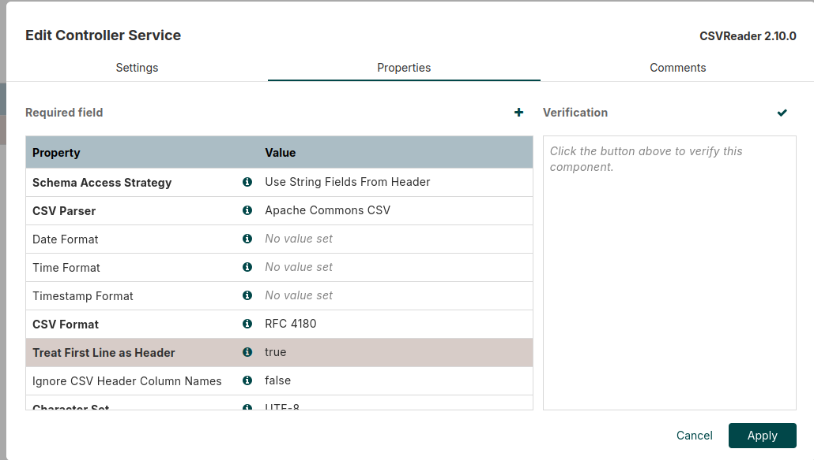

### Step 9: Add the CSV writer

#### Why a CSV writer?

A record writer is the mirror image of the reader. After `QueryRecord` transforms the records in memory, the writer serializes them back into bytes for the next processor to consume. This reader-then-writer pattern is why NiFi is so flexible: the same processor logic works whether the data arrives as CSV, JSON, or Avro. You change the format by swapping the reader or writer service, not by rewriting the flow. Here `Inherit Record Schema` tells the writer to keep the column names the reader already discovered.

Add:

```text
CSVRecordSetWriter
```

Name it:

```text
CleanAccidentsCSVWriter
```

Set:

| Property | Value |
|---|---|
| Schema Access Strategy | `Inherit Record Schema` |
| Schema Write Strategy | `Do Not Write Schema` |
| CSV Format | `RFC 4180` |
| Include Header Line | `true` |
| Character Set | `UTF-8` |

Select **Apply**. Leave the service disabled until the checkpoint after Step 10.

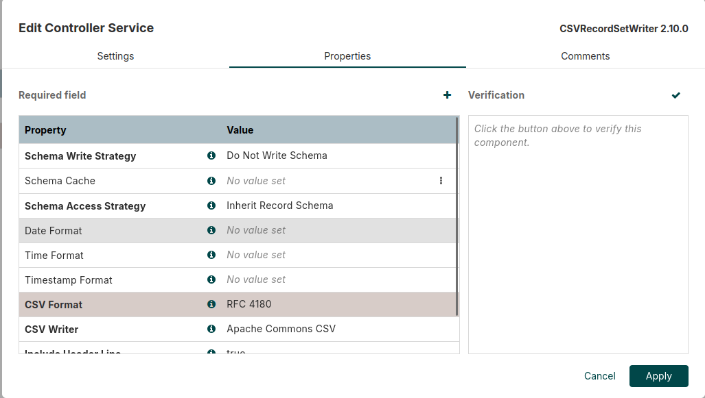

### Step 10: Add the Snowflake connection

Add:

```text
DBCPConnectionPool
```

Name it:

```text
SnowflakeJDBC
```

Replace both placeholders in the connection URL with your own assigned values:

- Replace `<ACCOUNT_IDENTIFIER>` with your Snowflake account identifier, such as `myorg-myaccount`. Enter only the identifier. Do not include `https://` or `.snowflakecomputing.com`.
- Replace `<YOUR_SCHEMA>` with the same schema you used in Step 4, such as `STUDENT01`.
- Remove the angle brackets. Do not leave either placeholder in the finished URL.

For example:

```text
jdbc:snowflake://myorg-myaccount.snowflakecomputing.com/?warehouse=COMPUTE_WH&db=TECHCATALYST&schema=STUDENT01&role=DE
```

Then set:

| Property | Value |
|---|---|
| Database Connection URL | `jdbc:snowflake://<ACCOUNT_IDENTIFIER>.snowflakecomputing.com/?warehouse=COMPUTE_WH&db=TECHCATALYST&schema=<YOUR_SCHEMA>&role=DE` |
| Database Driver Class Name | `net.snowflake.client.api.driver.SnowflakeDriver` |
| Database Driver Location(s) | `/opt/nifi/drivers/snowflake-jdbc-4.3.1.jar` |
| Database User | Your Snowflake username |
| Password | Your Snowflake password |
| Max Total Connections | `1` |
| Validation Query | Leave blank (`No value set`) |

Copy the driver class exactly. Snowflake JDBC 4.x uses `net.snowflake.client.api.driver.SnowflakeDriver`.
Copy the driver location exactly. NiFi uses this property to load the JAR for this controller service.
The connection URL must begin with `jdbc:snowflake://`, contain no spaces, and must not begin with `https://`.
Do not leave **Database User** blank.
The validation query is not needed for this one-time insert activity. Leave it blank. Do not enter `SELECT 1`. In the tested NiFi 2.10.0, Java 21, and Snowflake JDBC 4.3.1 combination, that validation result can initialize an incompatible Arrow memory path before the lab begins.

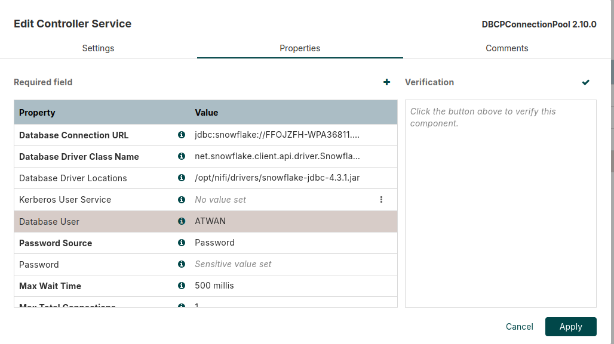

Select **Apply**. Leave the service disabled until the checkpoint below.

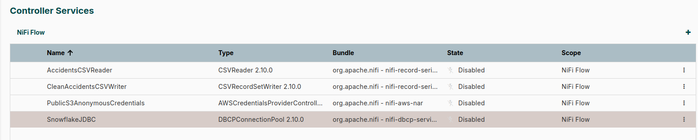

### Controller Services checkpoint

The screenshot above shows the services before they are enabled. A processor that references a disabled controller service is invalid and cannot start.

Before returning to the canvas, enable all four services:

1. Find `PublicS3AnonymousCredentials`.
2. Open the **three-dot menu** at the far right of its row and select **Enable**.
3. If NiFi asks about referencing components, choose to enable only the controller service. You will start the processors later.
4. Repeat for:
   - `AccidentsCSVReader`
   - `CleanAccidentsCSVWriter`
   - `SnowflakeJDBC`
5. Wait until the **State** column shows **Enabled** for all four services.

Do not continue while any of the four services says **Disabled**, **Enabling**, or **Invalid**.

Why are services enabled separately from processors? A controller service can prepare a reusable resource, such as a connection pool, while every processor remains stopped. Several processors can share one tested configuration, and an operator can update that shared resource in one place.

## Part 4: Build the Visual Flow

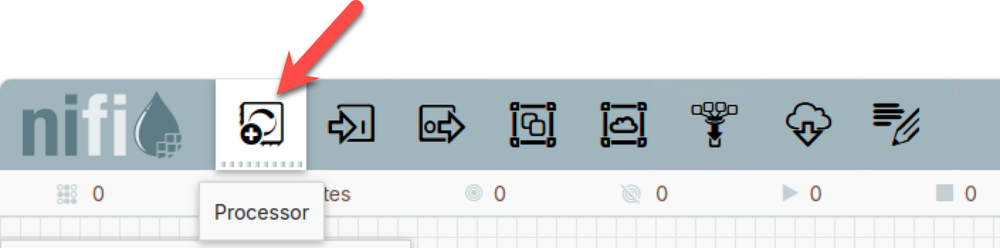

A processor is the verb of a NiFi flow: one prebuilt, focused action. You do not write processors; you pick them and configure them.

Drag the **Processor** icon from the toolbar onto the canvas. The selector may show about 292 choices in NiFi 2.10.0. Each entry is one ready-made action shipped by an installed NiFi extension bundle: fetch an S3 object, run SQL over records, insert into a database, log attributes, and hundreds more. The exact count can vary. You do not need to learn all of them. Search for the action your flow needs, the way you would search a library for a function instead of memorizing every one.

Add these five processors:

| Processor | Job in this flow |
|---|---|
| `GenerateFlowFile` | Create one empty FlowFile that acts as the trigger |
| `FetchS3Object` | Retrieve the named S3 object into that FlowFile |
| `QueryRecord` | Parse the CSV and transform its records with SQL |
| `PutDatabaseRecord` | Insert the transformed records into Snowflake |
| `LogAttribute` | Record FlowFile attributes if a failure reaches it |

The toolbar also shows **Input Port** and **Output Port** icons, sitting right beside the Processor icon. Ports are not processors and do no work on the data. If a Process Group is a room that holds part of a flow, the ports are its labeled doors: an Input Port is where FlowFiles enter the group and an Output Port is where they leave. You use them when a flow grows large enough to split into reusable rooms. This lab builds one flat flow on the root canvas, so it connects processors directly and does not need ports.

### Step 11: Configure the one-time trigger

Rename `GenerateFlowFile` (right-click, then select **Configure**):

```text
1 - Trigger One Run
```

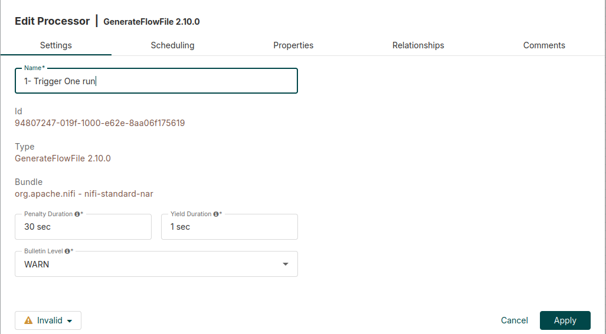

Set:

| Property | Value |
|---|---|
| File Size | `0 B` |
| Batch Size | `1` |
| Data Format | `Text` |

On **Scheduling**, set **Run Schedule** to `1 hour`.

You will use **Run Once**, so the schedule is only a guard against accidental repeated loads.

### Step 12: Configure the S3 extract

Rename `FetchS3Object`:

```text
2 - Fetch 1000 Accidents from S3
```

Set:

| Property | Value |
|---|---|
| AWS Credentials Provider Service | `PublicS3AnonymousCredentials` |
| Bucket | `techcatalyst-de-2026` |
| Object Key | `raw/accidents/accidents_2017_to_2023_english.csv` |
| Region | `US East (N. Virginia)` or `us-east-1` |
| Range Start | `0 B` |
| Range Length | `285588 B` |
| Requester Pays | `false` |

Include the `B` unit in both range values. NiFi rejects a range value that contains only a number.

The byte range contains the CSV header and exactly 1,000 complete records. It keeps this one-time activity fast.

#### What does `FetchS3Object` actually do?

It makes an S3 `GET` request for the exact **Bucket** and **Object Key** above. It transfers the requested bytes and writes them into the content of the incoming FlowFile. In other words, it does download data from S3 to NiFi, but it does not download every object in the bucket and it does not parse the CSV.

This lab requests only bytes `0` through `285587`, a precomputed boundary containing the header and 1,000 complete rows. If **Range Length** were blank, this processor would retrieve the entire named object. Arbitrary byte ranges are unsafe for CSV because a range can begin or end in the middle of a record. We use a tested boundary for this teaching sample.

To ingest many S3 objects, a production flow often uses `ListS3` to discover object keys and then sends one FlowFile per key to `FetchS3Object`. Large flows also need deliberate queue limits, back pressure, file partitioning, and duplicate protection. Today’s single-object range keeps the focus on the NiFi model.

### Step 13: Configure the transformation

Rename `QueryRecord`:

```text
3 - Clean Six Fields
```

Set:

| Property | Value |
|---|---|
| Record Reader | `AccidentsCSVReader` |
| Record Writer | `CleanAccidentsCSVWriter` |

Stay on the **Properties** tab and add the transformation:

1. Select the **+** button above the property table.
2. Enter this property name:

```text
clean
```

3. Paste this query into the property value:

```sql
SELECT
    TRIM("inverse_data") AS "accident_date",
    LOWER(TRIM("week_day")) AS "day_of_week",
    UPPER(TRIM("state")) AS "state_code",
    LOWER(TRIM("wheather_condition")) AS "weather_condition",
    TRIM("deaths") AS "fatalities",
    TRIM("total_injured") AS "total_injuries"
FROM FLOWFILE
```

4. Confirm the new property.
5. Select **Apply** to save and close the processor.

This one processor selects, renames, trims, and normalizes fields.

The reader turns CSV text into a record model that SQL can address by field name. The writer serializes the transformed records back into CSV content for the next processor. `QueryRecord` performs the transformation, while the two controller services define how to interpret and produce the bytes.

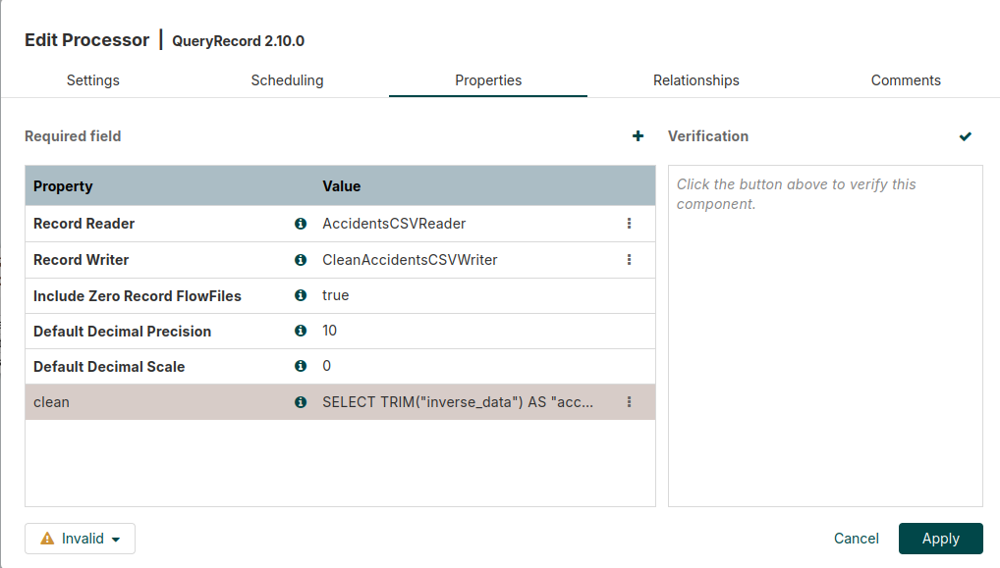

The property name `clean` becomes a new relationship with the same name. NiFi creates that relationship only after you apply the processor changes.
The processor may still show **Invalid** at this point because its relationships have not been handled yet. That is expected.

Reopen `3 - Clean Six Fields`, then open **Relationships**. You should now see `failure`, `original`, and `clean`.

Set the checkboxes as follows:

| Relationship | Terminate | Retry | Why |
|---|---|---|---|
| `original` | Checked | Unchecked | The original unmodified CSV is not needed after the query runs |
| `failure` | Unchecked | Unchecked | You will connect failures to `Inspect Failures` |
| `clean` | Unchecked | Unchecked | You will connect the transformed records to `4 - Load Snowflake` |

The `original` row must have **terminate** checked. Otherwise, NiFi marks the processor invalid because that relationship is neither connected nor automatically terminated.

If you see only `failure` and `original`, return to **Properties**, confirm that the `clean` row exists, select **Apply**, and reopen the processor.

### Step 14: Configure the Snowflake load

Rename `PutDatabaseRecord`:

```text
4 - Load Snowflake
```

Set:

| Property | Value |
|---|---|
| Record Reader | `AccidentsCSVReader` |
| Database Connection Pooling Service | `SnowflakeJDBC` |
| Statement Type | `INSERT` |
| Database Name | `TECHCATALYST` |
| Schema Name | `<YOUR_SCHEMA>` |
| Table Name | `ACCIDENTS_NIFI_1000` |
| Maximum Batch Size | `1000` |
| Translate Field Names | `true` |
| Unmatched Column Behavior | `Fail on Unmatched Columns` |
| Unmatched Field Behavior | `Fail on Unmatched Fields` |

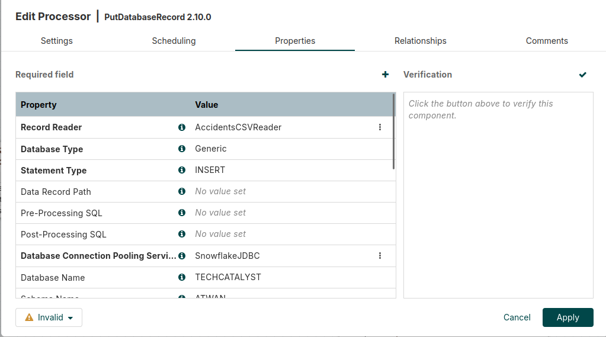

Open **Relationships** and set the checkboxes as follows:

| Relationship | Terminate | Retry | Why |
|---|---|---|---|
| `failure` | Unchecked | Unchecked | You will connect permanent database errors to `Inspect Failures` |
| `retry` | Unchecked | Unchecked | You will connect temporary database errors to `Inspect Failures` for this one-time lab |
| `success` | Checked | Unchecked | A successfully loaded FlowFile does not need another destination |

The relationship named `retry` and the checkbox labeled **retry** are different:

- The `retry` relationship is an output path for an operation that might succeed later.
- The **retry** checkbox tells NiFi to send that relationship back through the same processor automatically.

Leave the **retry** checkbox unchecked in this activity. Step 16 connects the `retry` relationship to `Inspect Failures`.

Select **Apply**. The processor may still show **Invalid** until the `failure` and `retry` relationships are connected in Step 16. That is expected.

### Step 15: Configure the failure viewer

Rename `LogAttribute`:

```text
Inspect Failures
```

Keep its default properties and automatically terminate `success`.

To do that, open **Relationships**, check **terminate** for `success`, and select **Apply**.

`LogAttribute` does not repair a failed FlowFile. It gives you a simple place to observe its attributes in NiFi’s application log. The visible red bulletin usually provides the fastest first clue during this lab.

### Step 16: Connect the processors

Hover over a processor and drag its connection arrow to the next processor. Choose the relationship shown below:

| From | Relationship | To |
|---|---|---|
| `1 - Trigger One Run` | `success` | `2 - Fetch 1000 Accidents from S3` |
| `2 - Fetch 1000 Accidents from S3` | `success` | `3 - Clean Six Fields` |
| `3 - Clean Six Fields` | `clean` | `4 - Load Snowflake` |
| `2 - Fetch 1000 Accidents from S3` | `failure` | `Inspect Failures` |
| `3 - Clean Six Fields` | `failure` | `Inspect Failures` |
| `4 - Load Snowflake` | `failure` and `retry` | `Inspect Failures` |

Your canvas should now resemble the diagram at the top of the activity.

**Note** when you drag a dialog box appears:

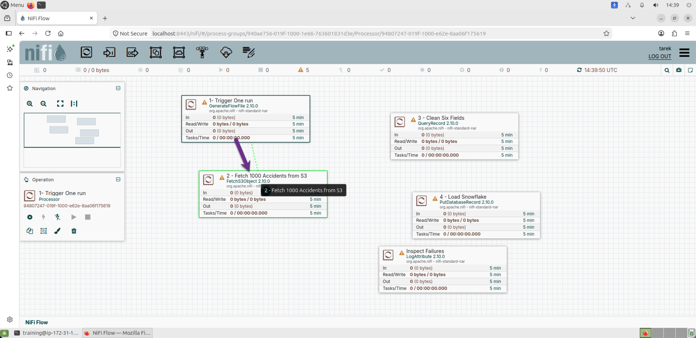

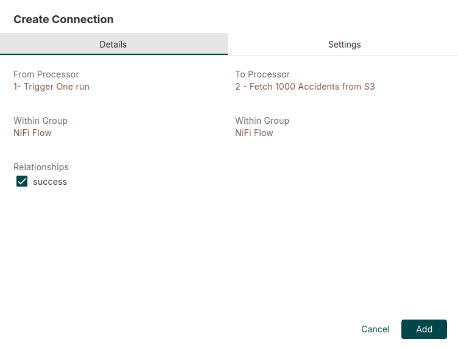

Notice the important idea: every connection is also a visible queue. If a downstream processor stops or fails, data waits in that queue instead of disappearing.

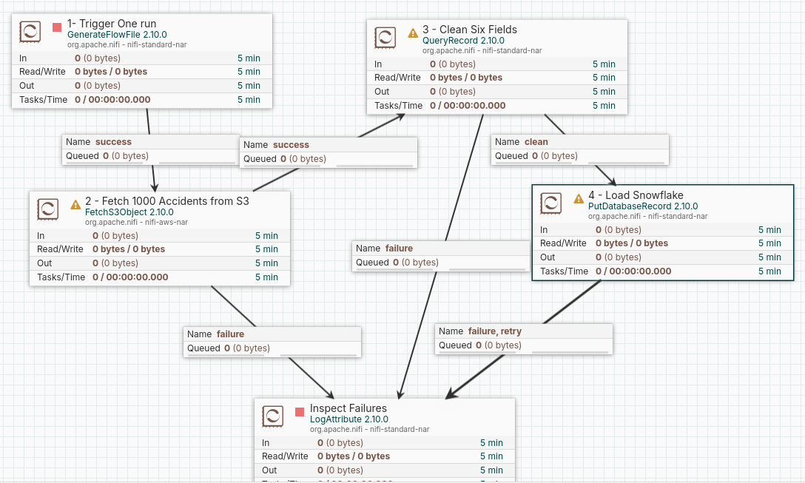

## Part 5: Run the Flow for the First Time

### Step 17: Confirm the table is empty

```sql
SELECT COUNT(*) AS ROW_COUNT
FROM TECHCATALYST.<YOUR_SCHEMA>.ACCIDENTS_NIFI_1000;
```

Expected:

```text
0
```

### Step 18: Make the processors valid, then start them

Read the small status symbol beside each processor name:

- an orange warning triangle means the processor is invalid and cannot start
- a red square means the processor is valid but stopped
- a green triangle means the processor is running

NiFi disables the **Start** button for an invalid processor.

1. Right-click a blank area, open **Controller Services**, and confirm that the four services show **Enabled**.
2. Return to the canvas and look for orange warning triangles.
3. If a triangle remains, open that processor and expand **Invalid** at the bottom-left.
4. Fix the exact property, relationship, or controller-service message shown.

When a processor is valid, its orange warning triangle disappears and its Play button becomes available.

Start the processors from downstream to upstream:

1. Right-click `Inspect Failures` and select **Start**. If it already has a green Play symbol, leave it running.
2. Right-click `4 - Load Snowflake` and select **Start**.
3. Right-click `3 - Clean Six Fields` and select **Start**.
4. Right-click `2 - Fetch 1000 Accidents from S3` and select **Start**.

You can also select one processor and use the triangular **Start** button in the Operation panel. Starting downstream first ensures that each queue already has a running consumer.

Do not start `1 - Trigger One Run`.

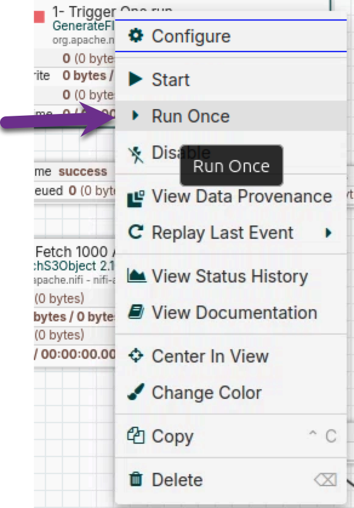

Right-click `1 - Trigger One Run` and select **Run Once**.

Watch the connection queues. The counters should rise briefly and return to zero.

### Step 19: Read the canvas

Read each processor box like a speedometer, not an odometer. It shows recent activity inside a rolling time window (normally `5 min`), not a lifetime total since the flow started. Four lines report what moved through in that window:

| Display | Meaning |
|---|---|
| **In** | Number and content size of FlowFiles pulled from incoming queues |
| **Read/Write** | Bytes of FlowFile content read from and written to NiFi’s Content Repository on disk |
| **Out** | Number and content size of FlowFiles transferred to connected outgoing queues |
| **Tasks/Time** | Number of processor executions and their combined processing time |

These four lines also do not all measure network traffic. For example:

- `GenerateFlowFile` has no incoming FlowFile, so **In** can be `0`, but **Out** becomes one empty trigger.
- `FetchS3Object` receives that zero-byte trigger, then writes about 285,588 bytes of downloaded S3 content into the FlowFile.
- `QueryRecord` reads the source CSV content and writes new transformed content.
- `PutDatabaseRecord` reads the CSV and performs an external database insert. The Snowflake row count is the evidence of that side effect.

If a processor later shows zero activity, the work may simply have aged out of the five-minute window. It does not mean that NiFi remembers the object and skipped it. Likewise, a queue showing zero means it is currently empty, not that no data passed through it.

Also check:

- no red bulletin appears
- no FlowFile remains queued
- `Inspect Failures` receives nothing
- the processors show successful activity

A red bulletin is a warning or error message, not a reason to start over. Hover over it, read the message, and correct the named property or connection. Bulletins expire from the canvas after a short time, while provenance provides a longer history of FlowFile events.

Before continuing, explain these ideas to your partner:

1. Why did `GenerateFlowFile` create an empty FlowFile?
2. Did `FetchS3Object` fetch one object, every object, or part of one object?
3. Which component parsed the CSV, and which component changed the records?
4. Why are the CSV rules and Snowflake connection controller services instead of processors?
5. What would happen to a FlowFile if the next processor stopped?
6. Why can **Read/Write** differ from **In/Out**?

## Part 6: Validate and Explore

### Step 20: Check Snowflake

Run:

```sql
SELECT COUNT(*) AS ROW_COUNT
FROM TECHCATALYST.<YOUR_SCHEMA>.ACCIDENTS_NIFI_1000;
```

Expected:

```text
1000
```

Inspect a few records:

```sql
SELECT *
FROM TECHCATALYST.<YOUR_SCHEMA>.ACCIDENTS_NIFI_1000
LIMIT 10;
```

You should see:

- uppercase state codes
- lowercase weekday values
- lowercase weather values
- six clearly named target columns

Record the first-run count in your notes before continuing.

### Step 21: Run the same input again

Before clicking anything, predict the next row count:

```text
My prediction after a second run: __________
```

Now right-click `1 - Trigger One Run`, select **Run Once**, wait for all queues to return to zero, and run:

```sql
SELECT COUNT(*) AS ROW_COUNT
FROM TECHCATALYST.<YOUR_SCHEMA>.ACCIDENTS_NIFI_1000;
```

Expected:

```text
2000
```

Why? The second trigger causes `FetchS3Object` to retrieve the same object range again. `PutDatabaseRecord` then performs another set of plain `INSERT` operations. Nothing in this flow records that the S3 object and range were already loaded, so the same 1,000 records are inserted again.

This is different from the file-loading behavior you saw earlier:

| Loader | What happens when the same source file is submitted again by default? |
|---|---|
| This NiFi flow | Loads it again because the flow has no duplicate check |
| Snowflake `COPY INTO` | Normally skips a file recorded in its load metadata |
| Databricks `COPY INTO` | Skips files already recorded as loaded, making the operation retriable and idempotent |

NiFi itself is not “a duplicate loader.” It gives the designer building blocks, and the designer must choose the delivery guarantee. A production design could use a load-control table keyed by bucket, object key, version, or checksum; load into a staging table and `MERGE`; or enforce a stable unique key. `ListS3` can remember listing state and help discover new objects, but discovery state alone is not a complete business-level duplicate strategy.

Answer in your notes:

1. Why did the table reach 2,000 rows?
2. Why did Snowflake or Databricks `COPY INTO` behave differently?
3. Which production duplicate-control design would you choose, and why?

### Step 22: Inspect provenance

Right-click `3 - Clean Six Fields` and select **View data provenance**.

Open one event and find:

- the processor name
- the event type
- the FlowFile identifier
- the size of the content
- the `record.count` attribute

This is one of NiFi's most useful ideas. The flow is visual, but NiFi also keeps evidence of what happened to the data.

Add one event to your notes and explain what it proves.

### Step 23: Compare NiFi with Openflow

Add two sentences to your notes:

1. What NiFi idea would transfer directly to Snowflake Openflow?
2. What setup work would a managed service remove?

Use this comparison:

| Standalone Apache NiFi | Snowflake Openflow |
|---|---|
| You install and run the software | Snowflake manages the deployment |
| You configure the connections and flow | You still work with processors, connections, and flow configuration |
| You manage the host and local files | The managed service handles more infrastructure and security |
| You inspect queues, bulletins, and provenance | The same dataflow observability ideas remain important |

## Part 7: Stop and Clean Up

This is a disposable activity.

1. Select all processors and choose **Stop**.
2. Stop NiFi:

   ```bash
   cd /opt/nifi/nifi-2.10.0
   ./bin/nifi.sh stop
   ```

3. Stop or terminate the Ubuntu host when your instructor tells you to.
4. Confirm that the Snowflake warehouse auto-suspends.

If asked to remove the table, drop only your own table:

```sql
DROP TABLE IF EXISTS TECHCATALYST.<YOUR_SCHEMA>.ACCIDENTS_NIFI_1000;
```

## Starter Checklist

```text
[ ] Java 21 works
[ ] NiFi checksum says OK
[ ] NiFi canvas opens
[ ] Four controller services are enabled
[ ] Five processors are connected
[ ] First run produces 1,000 Snowflake rows
[ ] Second run produces 2,000 Snowflake rows
[ ] Duplicate behavior is explained
[ ] All queues return to zero
[ ] One provenance event is recorded
[ ] NiFi and the Ubuntu host are stopped
```

Use this notes template:

```markdown
# NiFi Lab Notes

## Completed Flow

Paste one screenshot here.

## Snowflake Result

- Rows after first run:
- Prediction before second run:
- Rows after second run:

## Duplicate-Load Experiment

- Why the same records loaded again:
- How this differs from Snowflake or Databricks `COPY INTO`:
- One production design that could prevent duplicates:

## Provenance

- Event:
- What it proves:

## NiFi and Openflow

1.
2.
```

## Expected Output

At the end of a successful run:

```text
Java version: 21
NiFi version: 2.10.0
Snowflake rows after first run: 1,000
Snowflake rows after second run: 2,000
Queued FlowFiles: 0
Failure FlowFiles: 0
```

## Success Criteria

- You can explain FlowFiles, processors, connections, queues, controller services, and provenance.
- You can explain what **In**, **Read/Write**, **Out**, and **Tasks/Time** report.
- The visual flow extracts from S3, transforms six fields, and loads Snowflake.
- The Snowflake table contains 1,000 rows after the first run and 2,000 after the deliberate second run.
- You can explain why this flow is not idempotent and how `COPY INTO` differs.
- All queues drain to zero.
- No FlowFile reaches `Inspect Failures`.
- Your notes contain the requested evidence and no credentials.
- NiFi and the disposable host are stopped after the activity.

## Troubleshooting

| Symptom | What to check |
|---|---|
| `UnsupportedClassVersionError` | Run `java -version`. NiFi 2.10.0 needs Java 21. |
| Browser cannot open NiFi | Confirm NiFi is running, the address is correct, and classroom port `8443` access is enabled for your IP. |
| A controller service will not enable | Open its red validation message and correct the exact missing or invalid property. |
| `No suitable driver for the given Database Connection URL` | In `SnowflakeJDBC`, use driver class `net.snowflake.client.api.driver.SnowflakeDriver` and location `/opt/nifi/drivers/snowflake-jdbc-4.3.1.jar`. Confirm the checksum in Step 5 succeeded. |
| `UnsafeAllocationManager` or an Arrow initialization error | Clear **Validation Query** in `SnowflakeJDBC` so it shows `No value set`, then disable and re-enable the controller service. |
| S3 returns `403 Access Denied` | Confirm anonymous credentials are enabled and the bucket and object key match the guide. |
| QueryRecord Relationships shows only `failure` and `original` | Return to Properties, confirm the `clean` property exists, select **Apply**, and reopen the processor. |
| `QueryRecord` fails | Confirm the byte range, CSV reader settings, and the `clean` query. |
| PutDatabaseRecord remains `Invalid` after terminating `success` | This is expected until Step 16 connects both `failure` and `retry` to `Inspect Failures`. |
| The Play button is disabled | The processor is invalid or disabled. Enable all referenced controller services, then expand **Invalid** on the processor and fix each listed problem. |
| A processor is invalid | Hover over its warning icon. Connect or terminate every required relationship. |
| Snowflake connection fails | Recheck the account identifier, driver path, username, password, role, warehouse, database, and schema. |
| First Snowflake count is not 1,000 | Confirm the table was empty before the first run and that the S3 byte range matches Step 12. |
| Second Snowflake count is not 2,000 | Confirm the first count was 1,000 and that every queue drained after the second **Run Once**. |
| A queue does not drain | The next processor is stopped, invalid, or reporting a bulletin. |
