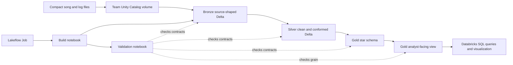
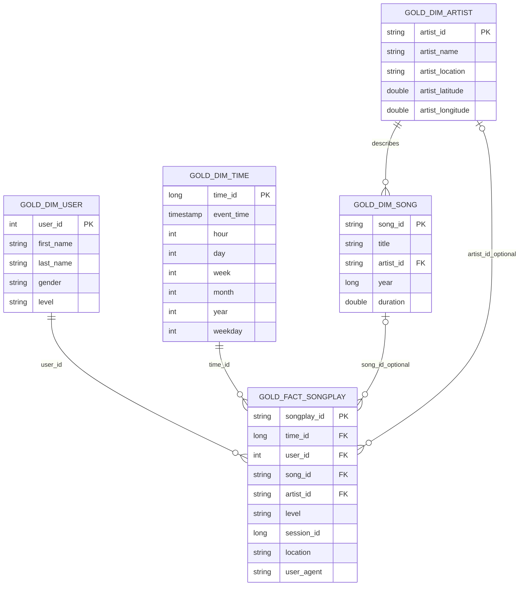

# Instructor Reference Visuals: Million Song Lakehouse

Use these visuals to assess team diagrams after students have submitted their own designs. They are not required to match the layout exactly, but the same layers, grains, keys, and optional relationships should be visible.

## Visual 1: Project Architecture

**Type:** Mermaid architecture diagram  
**Learning objective:** Connect files, Delta layers, orchestration, validation, and analyst use.

**Caption:** The Lakeflow Job runs the build before validation. Data moves from governed files to progressively more useful Delta tables. A persistent view exposes the star schema for SQL analysis without copying the data.

**Alt text:** A left-to-right flow shows compact files entering a Unity Catalog volume, then Bronze, Silver, Gold, an analyst-facing view, and SQL analysis. A Lakeflow Job runs the build notebook followed by a validation notebook that checks the layers and view grain.

**Integration guidance:** Use during the project debrief. Ask teams to point to the boundary between file storage and managed tables.

## Visual 2: Gold Star Schema ERD

**Type:** Mermaid ERD  
**Learning objective:** Show fact grain, dimension keys, and optional metadata relationships.

**Caption:** Each fact row represents one eligible listening event. User and time are required; song and artist are optional because the metadata is a subset.

**Alt text:** A star schema places the songplay fact in the center with required links to user and time dimensions and optional links to song and artist dimensions. Artist also describes many songs.

**Integration guidance:** Use after presentations to clarify why null song and artist keys are allowed without calling the fact row invalid.

## Reference Table Contracts

| Table | Grain | Primary key | Expected rows |
|---|---|---|---:|
| `gold_dim_song` | one row per source song | `song_id` | 14,896 |
| `gold_dim_artist` | one row per artist | `artist_id` | 9,553 |
| `gold_dim_user` | one latest known row per user | `user_id` | 97 |
| `gold_dim_time` | one row per listening timestamp | `time_id` | 6,813 |
| `gold_fact_songplay` | one row per eligible listening event | `songplay_id` | 6,820 |
| `gold_songplay_analysis_vw` | one joined row per eligible listening event | `songplay_id` | 6,820 |
