# Summary of 2_DecisionTree

[<< Go back](../README.md)

## Decision Tree
- **n_jobs**: -1
- **criterion**: entropy
- **max_depth**: 4
- **explain_level**: 2

## Validation
 - **validation_type**: split
 - **train_ratio**: 0.75
 - **shuffle**: True
 - **stratify**: True

## Optimized metric
logloss

## Training time

1.8 seconds

## Metric details
|           |    score |   threshold |
|:----------|---------:|------------:|
| logloss   | 0.705301 |  nan        |
| auc       | 0.714952 |  nan        |
| f1        | 0.827119 |    0.409524 |
| accuracy  | 0.743719 |    0.409524 |
| precision | 0.866667 |    0.754386 |
| recall    | 0.985714 |    0        |
| mcc       | 0.343479 |    0.409524 |

## Metric details with threshold from accuracy metric
|           |    score |   threshold |
|:----------|---------:|------------:|
| logloss   | 0.705301 |  nan        |
| auc       | 0.714952 |  nan        |
| f1        | 0.827119 |    0.409524 |
| accuracy  | 0.743719 |    0.409524 |
| precision | 0.787097 |    0.409524 |
| recall    | 0.871429 |    0.409524 |
| mcc       | 0.343479 |    0.409524 |

## Confusion matrix (at threshold=0.409524)
|                 |   Predicted as bad |   Predicted as good |
|:----------------|-------------------:|--------------------:|
| Labeled as bad  |                 26 |                  33 |
| Labeled as good |                 18 |                 122 |

## Learning curves
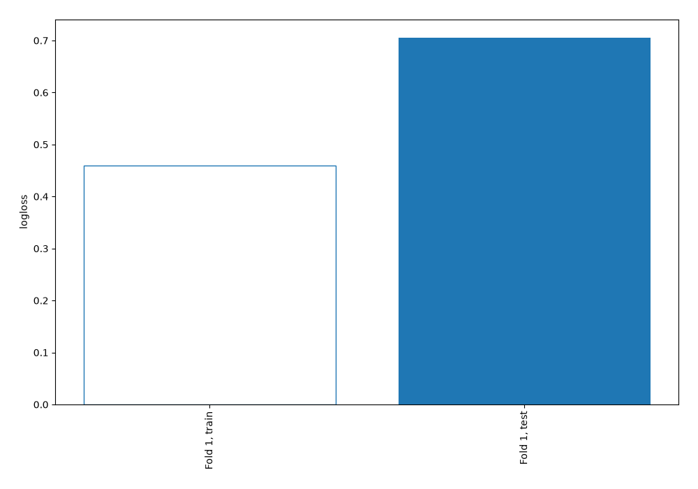

## Decision Tree 

### Tree #1
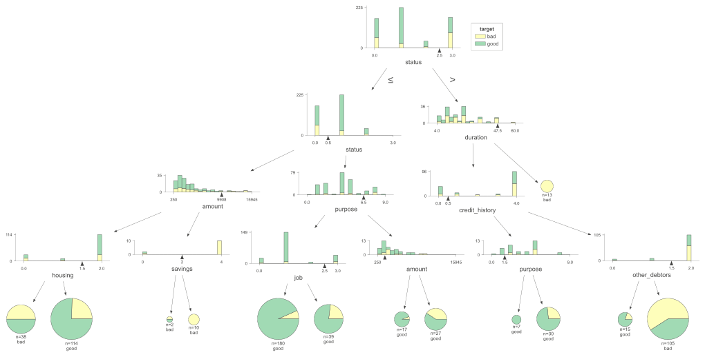

### Rules

if (status <= 2.5) and (status > 0.5) and (purpose <= 6.5) and (job <= 2.5) then class: good (proba: 93.33%) | based on 180 samples

if (status <= 2.5) and (status <= 0.5) and (amount <= 9908.5) and (housing > 1.5) then class: good (proba: 75.44%) | based on 114 samples

if (status > 2.5) and (duration <= 47.5) and (credit_history > 0.5) and (other_debtors > 1.5) then class: bad (proba: 59.05%) | based on 105 samples

if (status <= 2.5) and (status > 0.5) and (purpose <= 6.5) and (job > 2.5) then class: good (proba: 76.92%) | based on 39 samples

if (status <= 2.5) and (status <= 0.5) and (amount <= 9908.5) and (housing <= 1.5) then class: bad (proba: 50.0%) | based on 38 samples

if (status > 2.5) and (duration <= 47.5) and (credit_history <= 0.5) and (purpose > 1.5) then class: good (proba: 73.33%) | based on 30 samples

if (status <= 2.5) and (status > 0.5) and (purpose > 6.5) and (amount > 1708.0) then class: good (proba: 59.26%) | based on 27 samples

if (status <= 2.5) and (status > 0.5) and (purpose > 6.5) and (amount <= 1708.0) then class: good (proba: 94.12%) | based on 17 samples

if (status > 2.5) and (duration <= 47.5) and (credit_history > 0.5) and (other_debtors <= 1.5) then class: good (proba: 80.0%) | based on 15 samples

if (status > 2.5) and (duration > 47.5) then class: bad (proba: 100.0%) | based on 13 samples

if (status <= 2.5) and (status <= 0.5) and (amount > 9908.5) and (savings > 2.0) then class: bad (proba: 100.0%) | based on 10 samples

if (status > 2.5) and (duration <= 47.5) and (credit_history <= 0.5) and (purpose <= 1.5) then class: good (proba: 100.0%) | based on 7 samples

if (status <= 2.5) and (status <= 0.5) and (amount > 9908.5) and (savings <= 2.0) then class: bad (proba: 50.0%) | based on 2 samples

## Permutation-based Importance
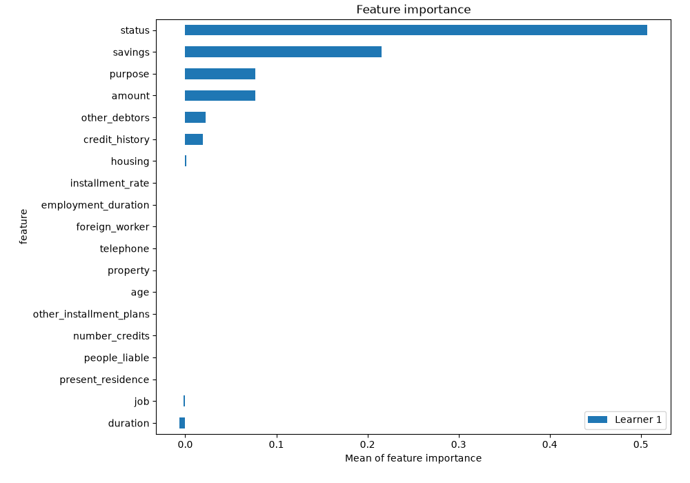
## Confusion Matrix

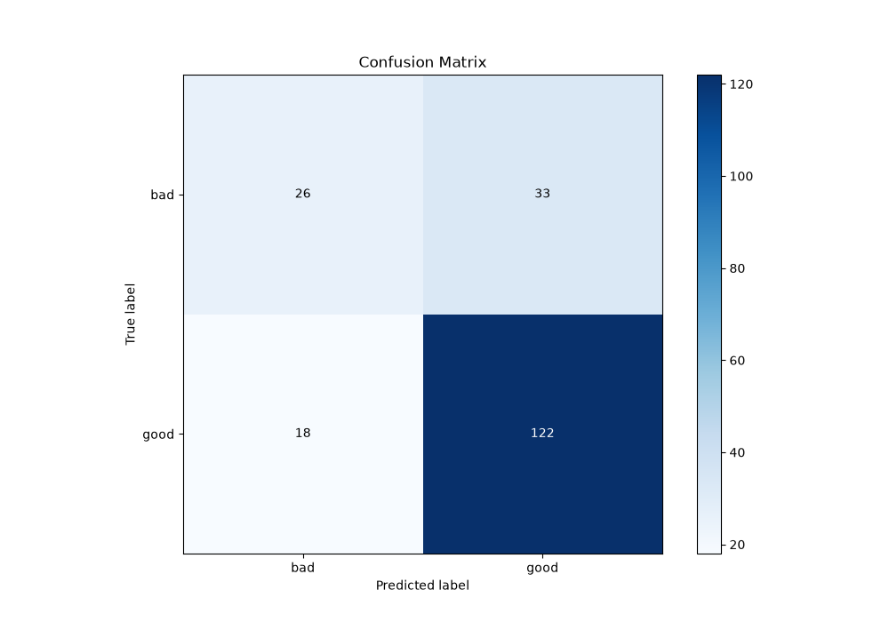

## Normalized Confusion Matrix

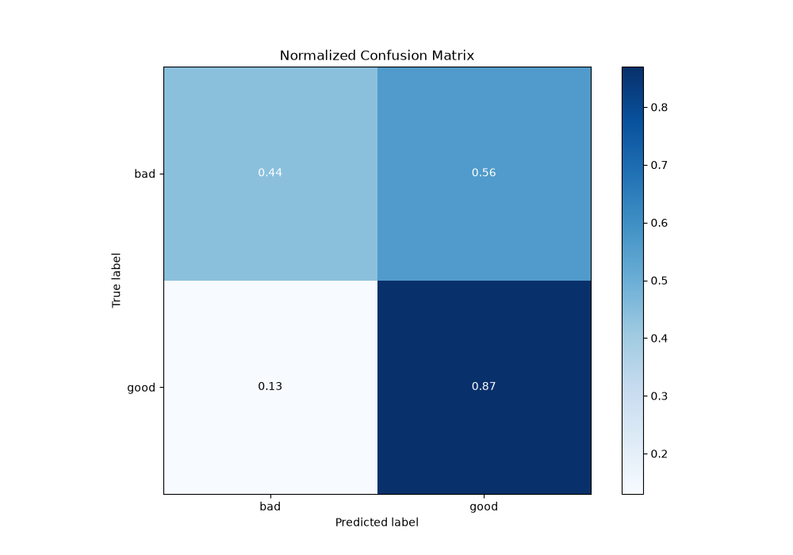

## ROC Curve

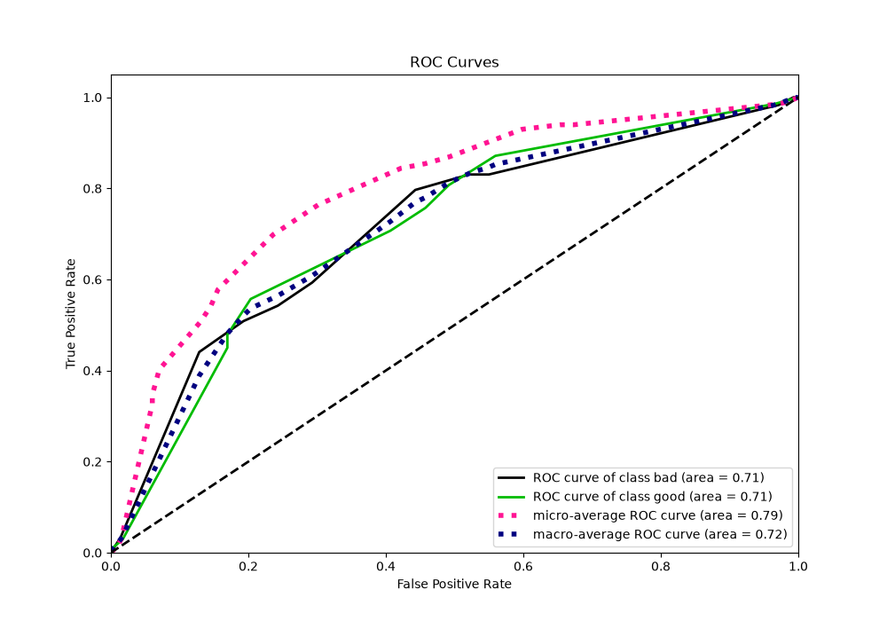

## Kolmogorov-Smirnov Statistic

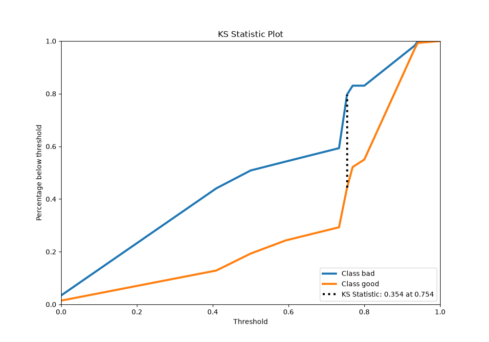

## Precision-Recall Curve

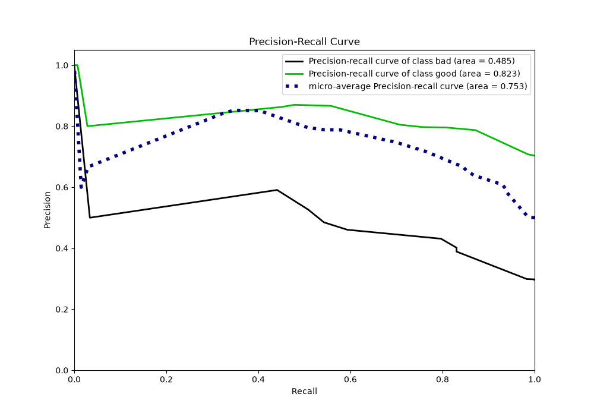

## Calibration Curve

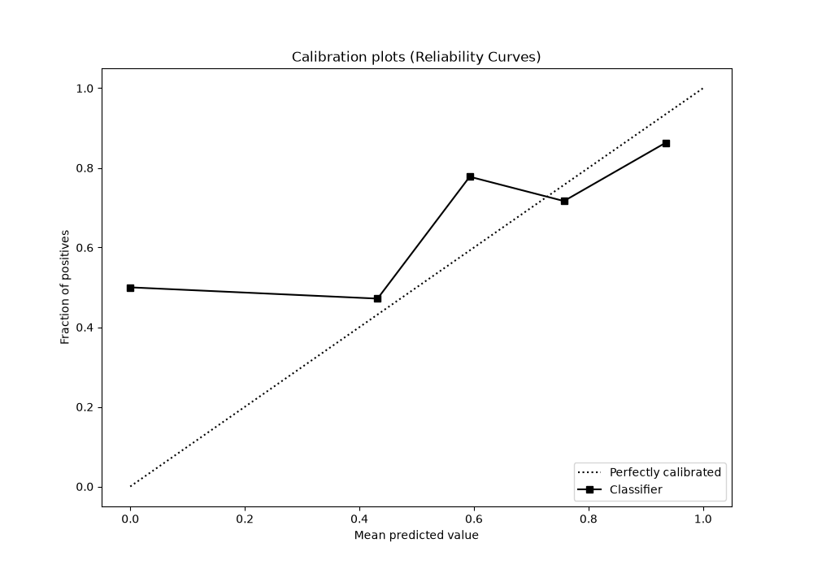

## Cumulative Gains Curve

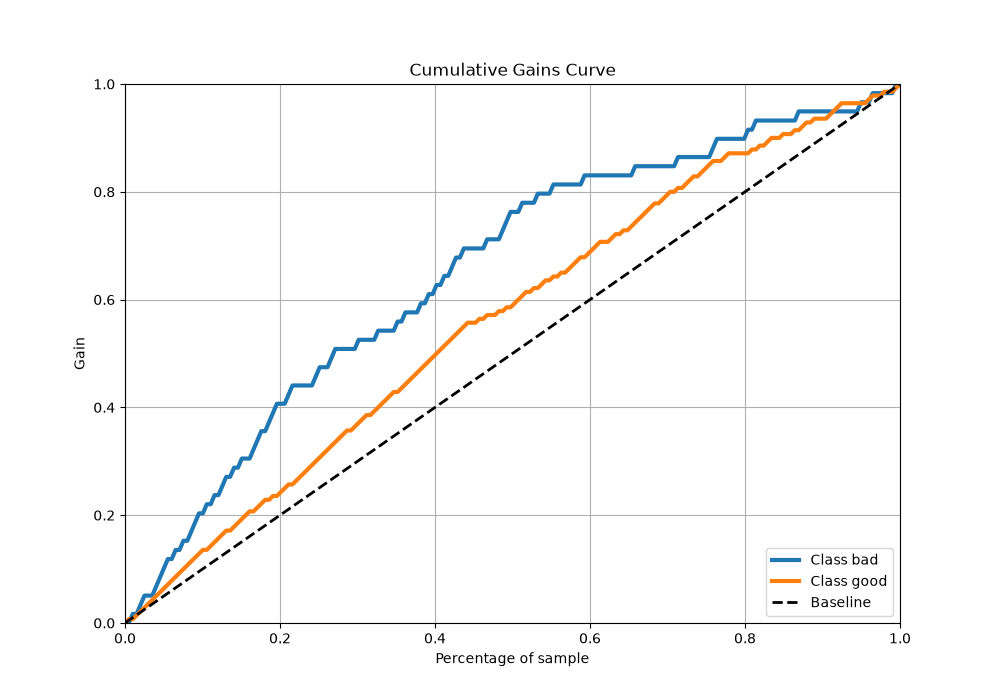

## Lift Curve

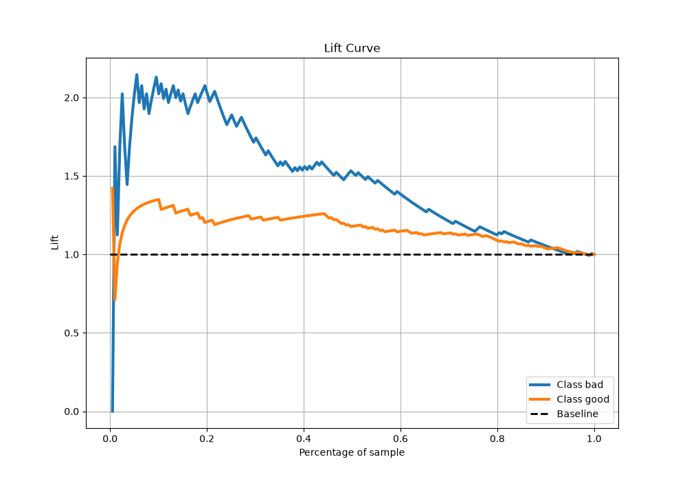

[<< Go back](../README.md)
