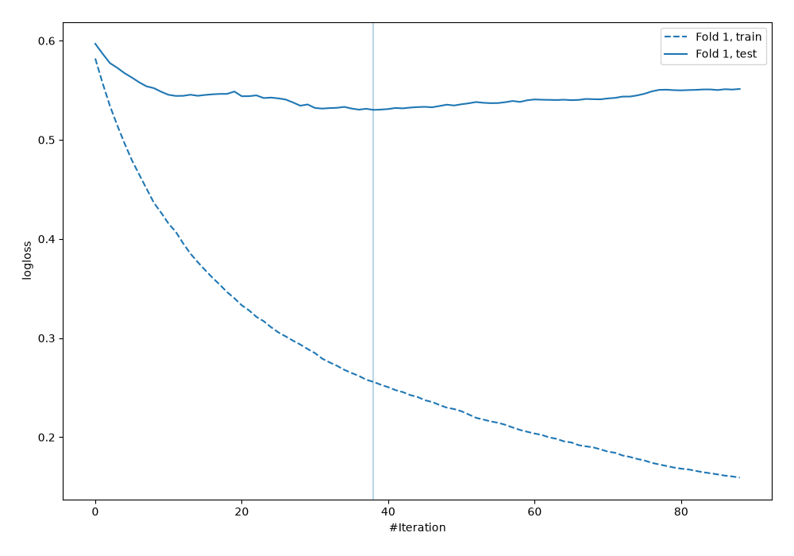
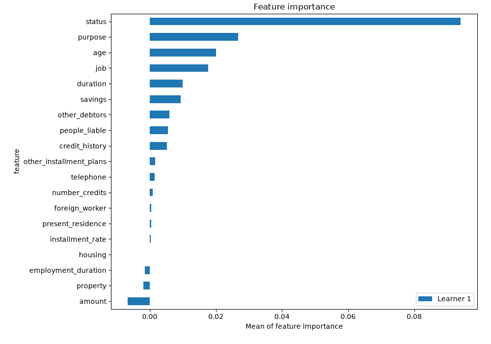
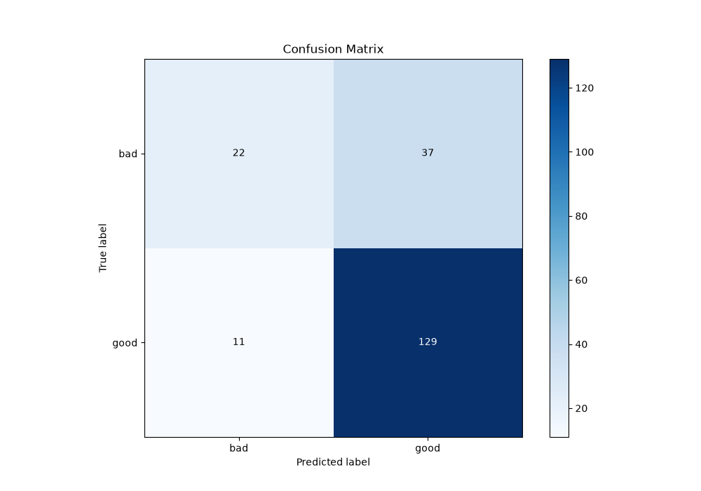
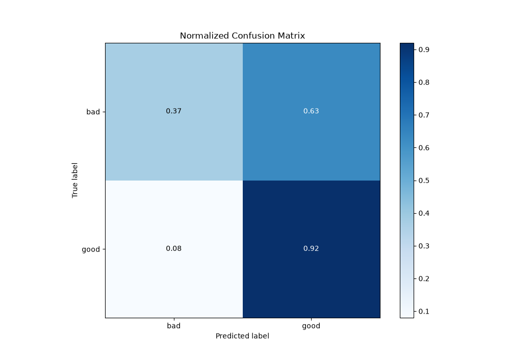
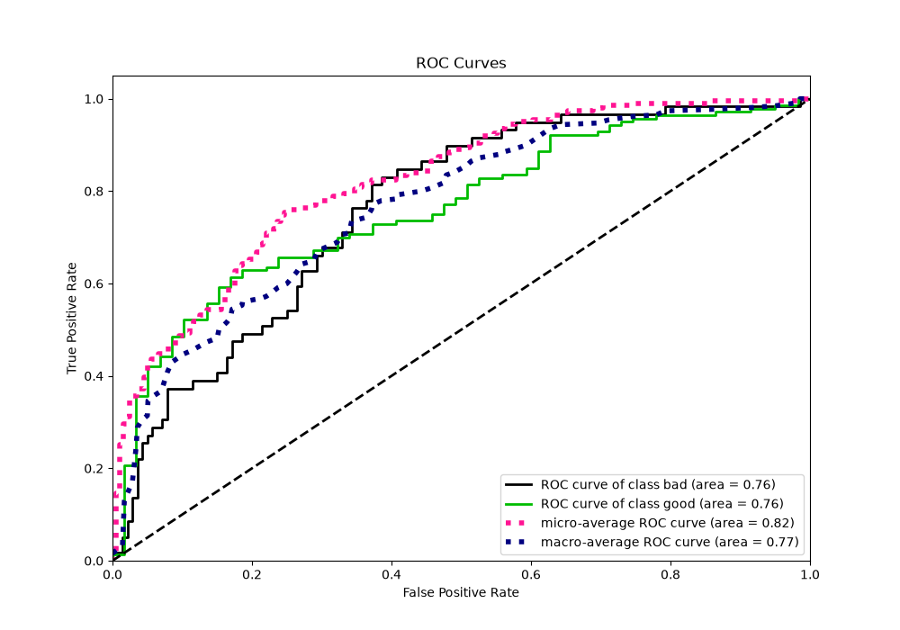
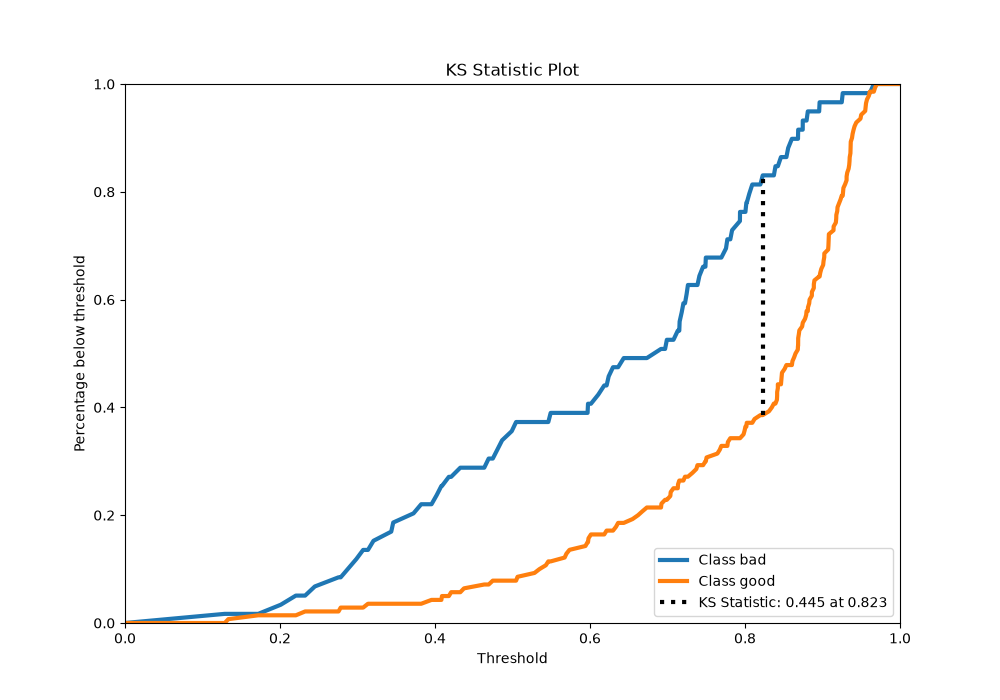
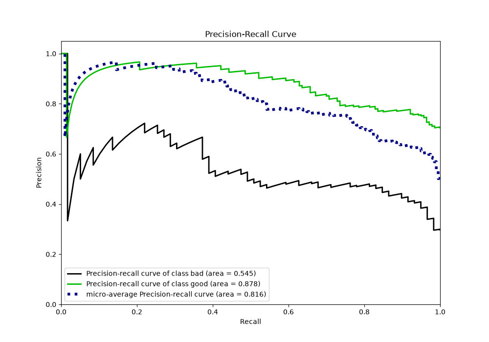
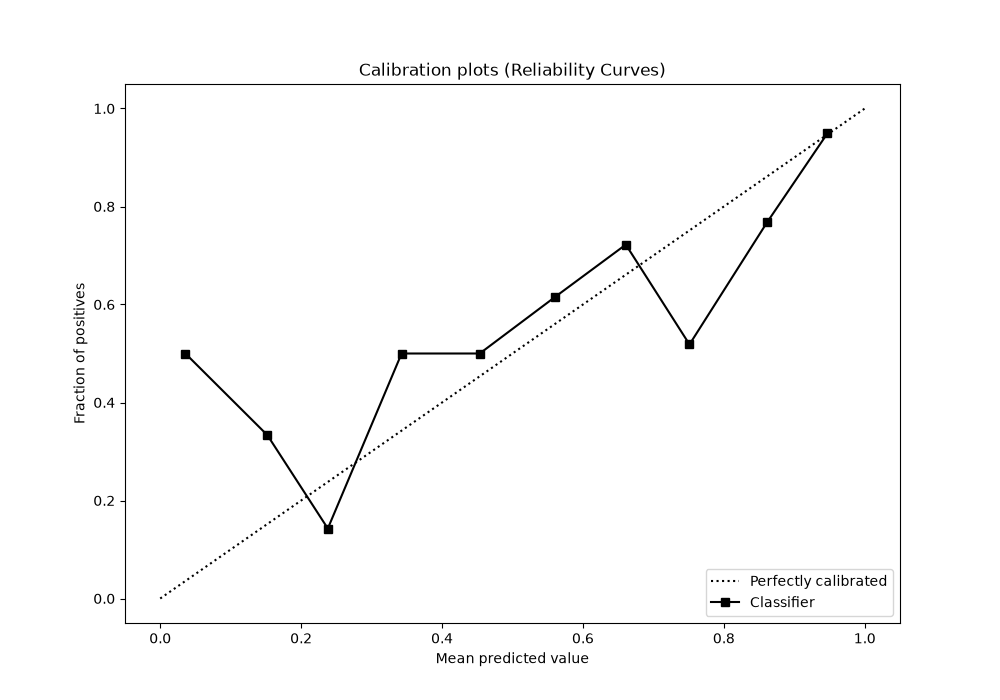
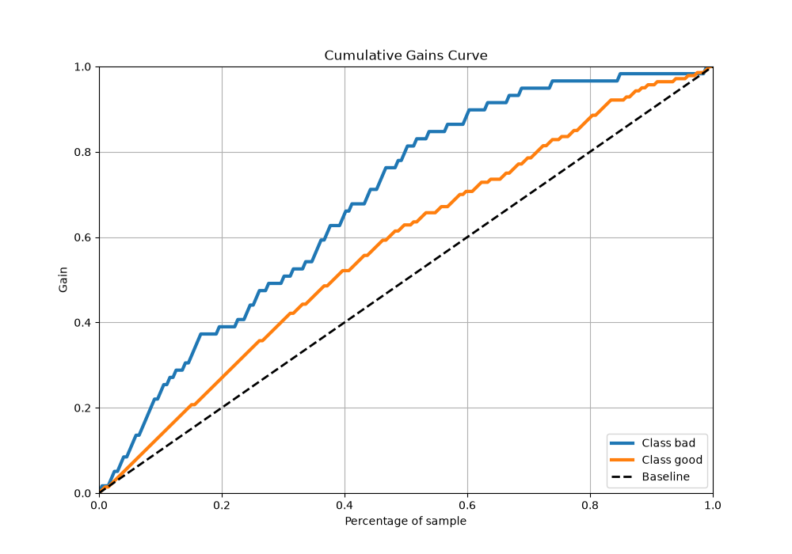
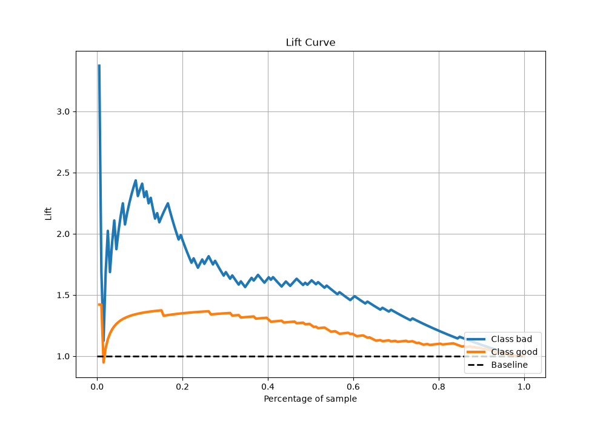

# Summary of 4_Default_Xgboost

[<< Go back](../README.md)

## Extreme Gradient Boosting (Xgboost)
- **n_jobs**: -1
- **objective**: binary:logistic
- **eta**: 0.075
- **max_depth**: 6
- **min_child_weight**: 1
- **subsample**: 1.0
- **colsample_bytree**: 1.0
- **eval_metric**: logloss
- **explain_level**: 2

## Validation
 - **validation_type**: split
 - **train_ratio**: 0.75
 - **shuffle**: True
 - **stratify**: True

## Optimized metric
logloss

## Training time

1.2 seconds

## Metric details
|           |    score |   threshold |
|:----------|---------:|------------:|
| logloss   | 0.530189 |  nan        |
| auc       | 0.762591 |  nan        |
| f1        | 0.843137 |    0.505563 |
| accuracy  | 0.758794 |    0.505563 |
| precision | 0.888889 |    0.810874 |
| recall    | 1        |    0.115819 |
| mcc       | 0.403853 |    0.810874 |

## Metric details with threshold from accuracy metric
|           |    score |   threshold |
|:----------|---------:|------------:|
| logloss   | 0.530189 |  nan        |
| auc       | 0.762591 |  nan        |
| f1        | 0.843137 |    0.505563 |
| accuracy  | 0.758794 |    0.505563 |
| precision | 0.777108 |    0.505563 |
| recall    | 0.921429 |    0.505563 |
| mcc       | 0.361396 |    0.505563 |

## Confusion matrix (at threshold=0.505563)
|                 |   Predicted as bad |   Predicted as good |
|:----------------|-------------------:|--------------------:|
| Labeled as bad  |                 22 |                  37 |
| Labeled as good |                 11 |                 129 |

## Learning curves

## Permutation-based Importance

## Confusion Matrix

## Normalized Confusion Matrix

## ROC Curve

## Kolmogorov-Smirnov Statistic

## Precision-Recall Curve

## Calibration Curve

## Cumulative Gains Curve

## Lift Curve

[<< Go back](../README.md)
