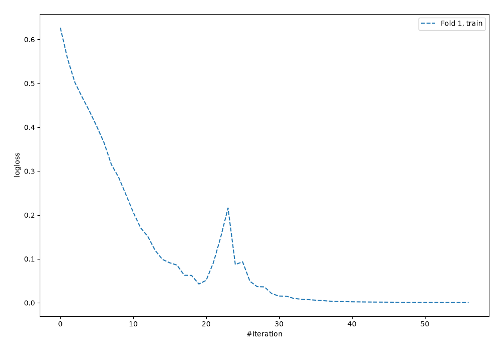
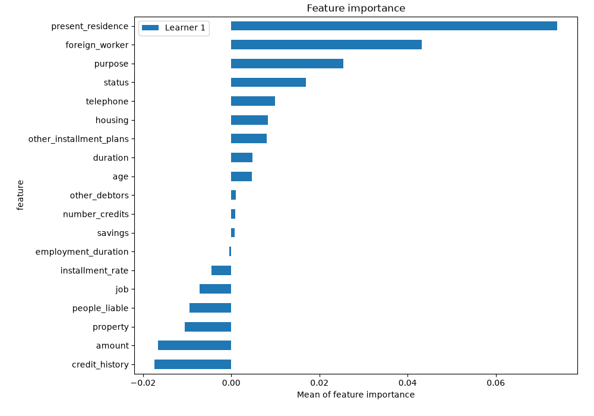
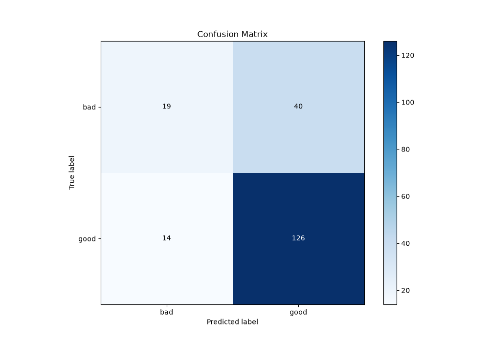
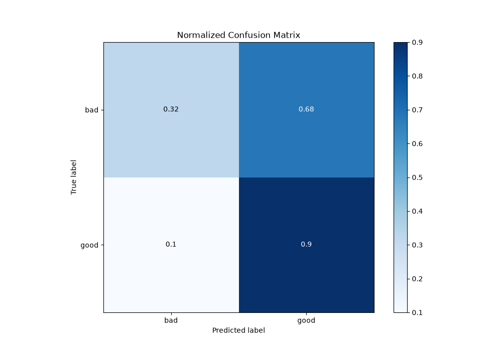
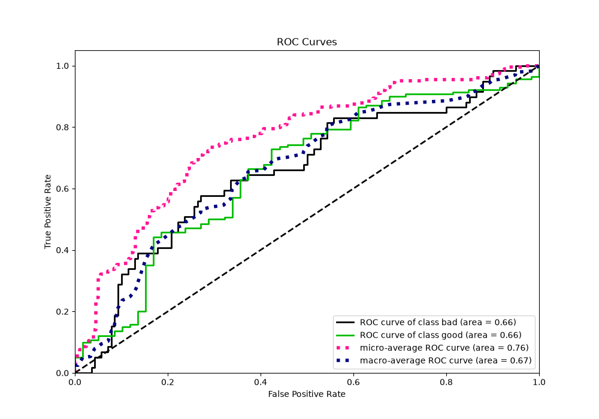
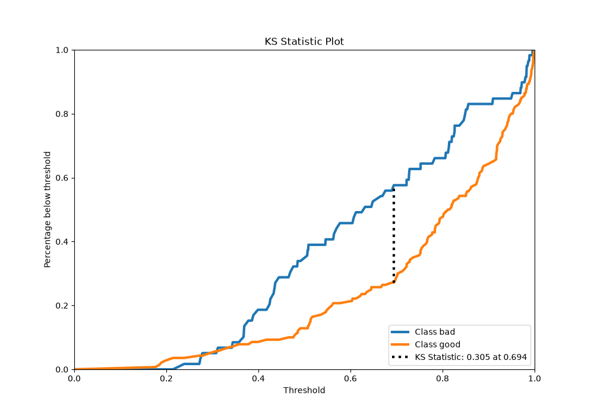
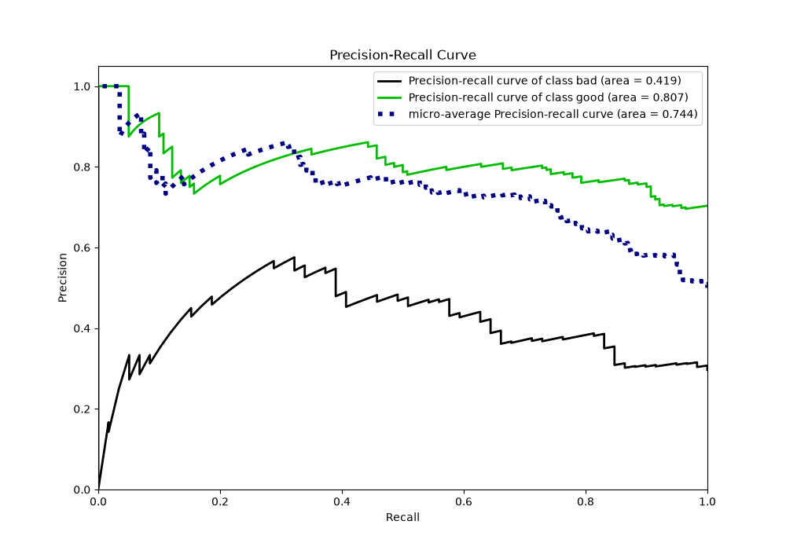
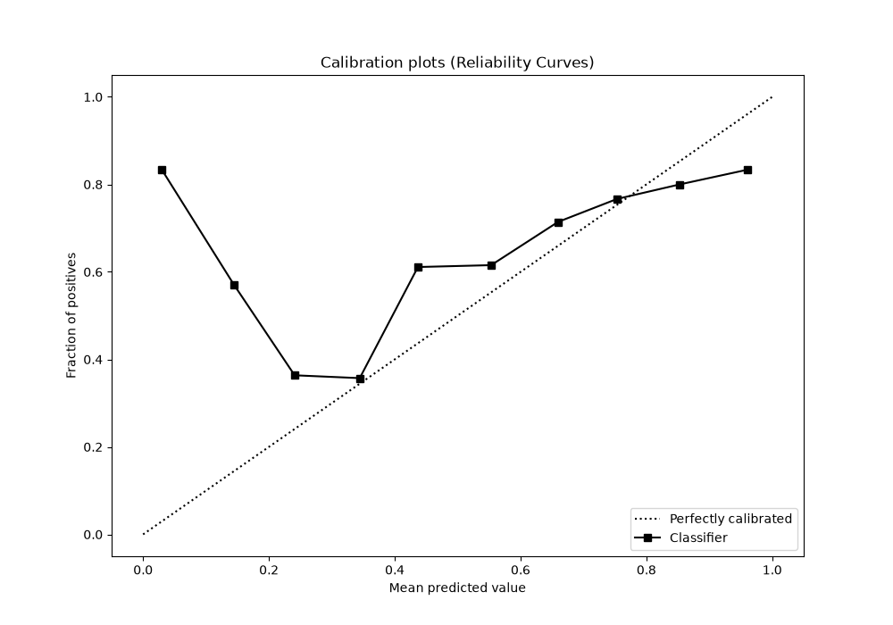
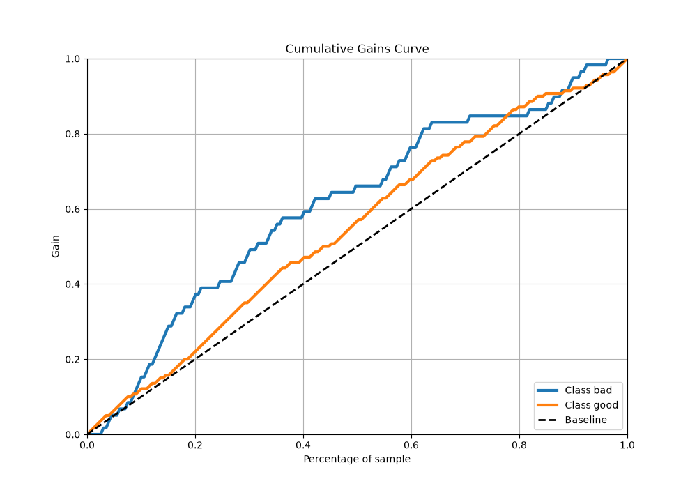
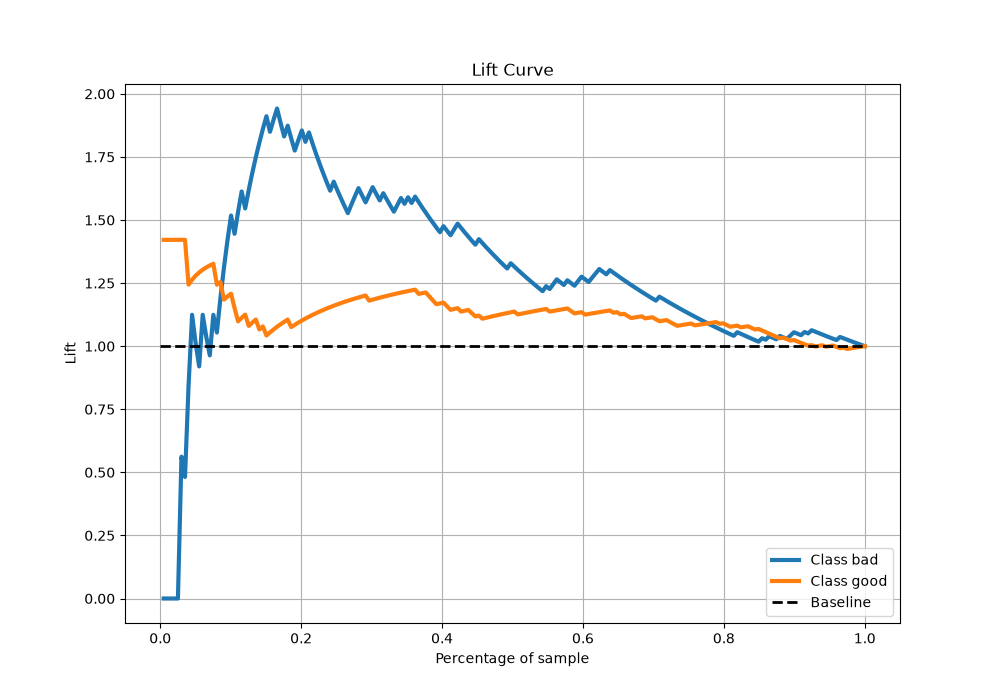

# Summary of 5_Default_NeuralNetwork

[<< Go back](../README.md)

## Neural Network
- **n_jobs**: -1
- **dense_1_size**: 32
- **dense_2_size**: 16
- **learning_rate**: 0.05
- **explain_level**: 2

## Validation
 - **validation_type**: split
 - **train_ratio**: 0.75
 - **shuffle**: True
 - **stratify**: True

## Optimized metric
logloss

## Training time

1.1 seconds

## Metric details
|           |    score |   threshold |
|:----------|---------:|------------:|
| logloss   | 0.662826 |  nan        |
| auc       | 0.659685 |  nan        |
| f1        | 0.825959 |    0.158449 |
| accuracy  | 0.728643 |    0.477319 |
| precision | 0.808696 |    0.728686 |
| recall    | 1        |    0.158449 |
| mcc       | 0.289733 |    0.695713 |

## Metric details with threshold from accuracy metric
|           |    score |   threshold |
|:----------|---------:|------------:|
| logloss   | 0.662826 |  nan        |
| auc       | 0.659685 |  nan        |
| f1        | 0.823529 |    0.477319 |
| accuracy  | 0.728643 |    0.477319 |
| precision | 0.759036 |    0.477319 |
| recall    | 0.9      |    0.477319 |
| mcc       | 0.272645 |    0.477319 |

## Confusion matrix (at threshold=0.477319)
|                 |   Predicted as bad |   Predicted as good |
|:----------------|-------------------:|--------------------:|
| Labeled as bad  |                 19 |                  40 |
| Labeled as good |                 14 |                 126 |

## Learning curves

## Permutation-based Importance

## Confusion Matrix

## Normalized Confusion Matrix

## ROC Curve

## Kolmogorov-Smirnov Statistic

## Precision-Recall Curve

## Calibration Curve

## Cumulative Gains Curve

## Lift Curve

[<< Go back](../README.md)
