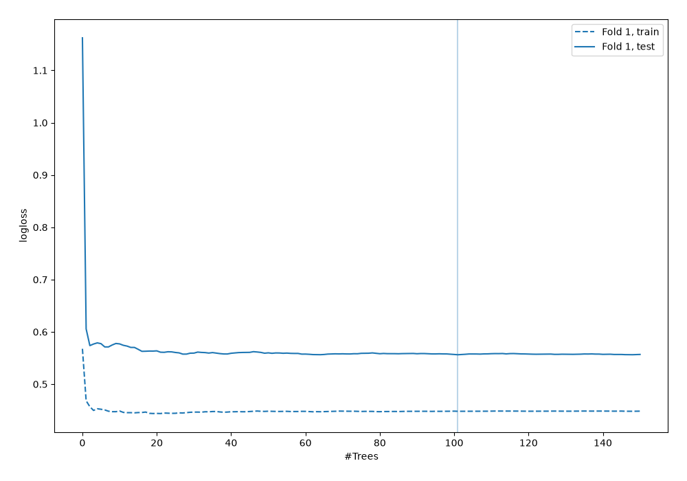
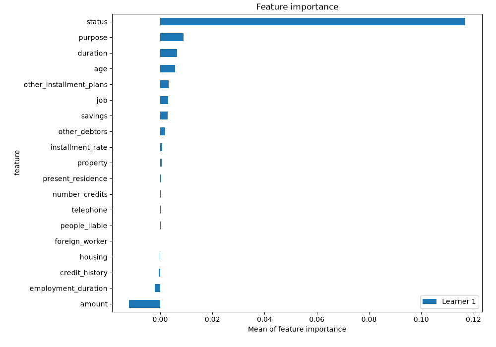
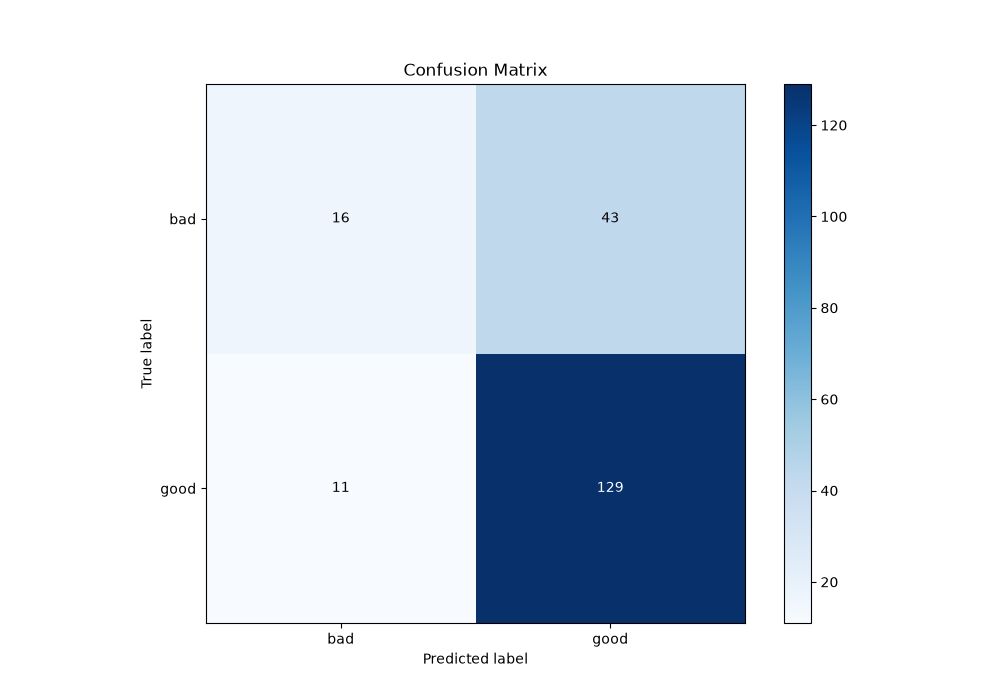
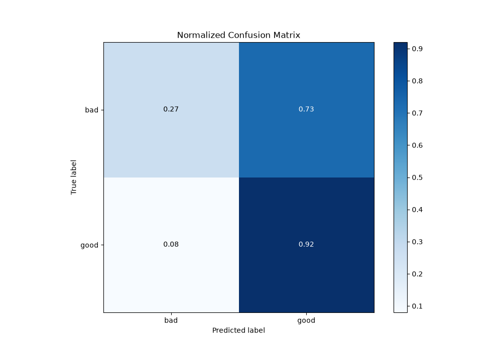
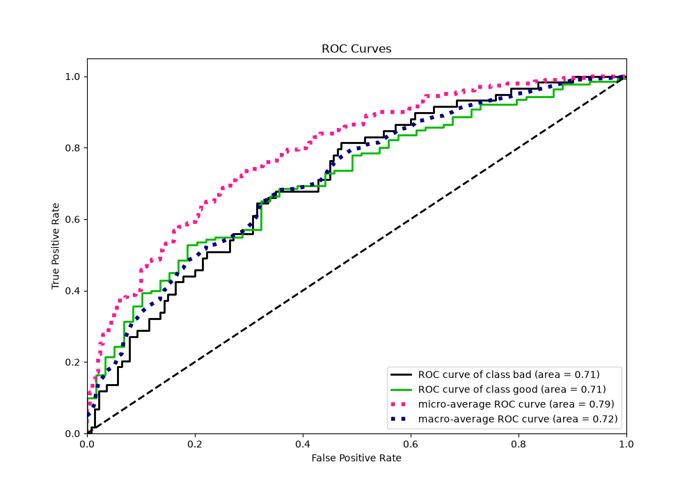
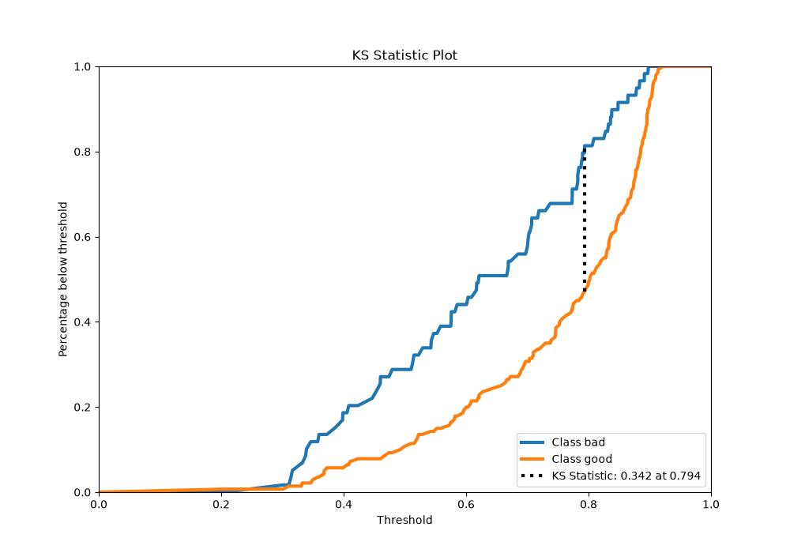
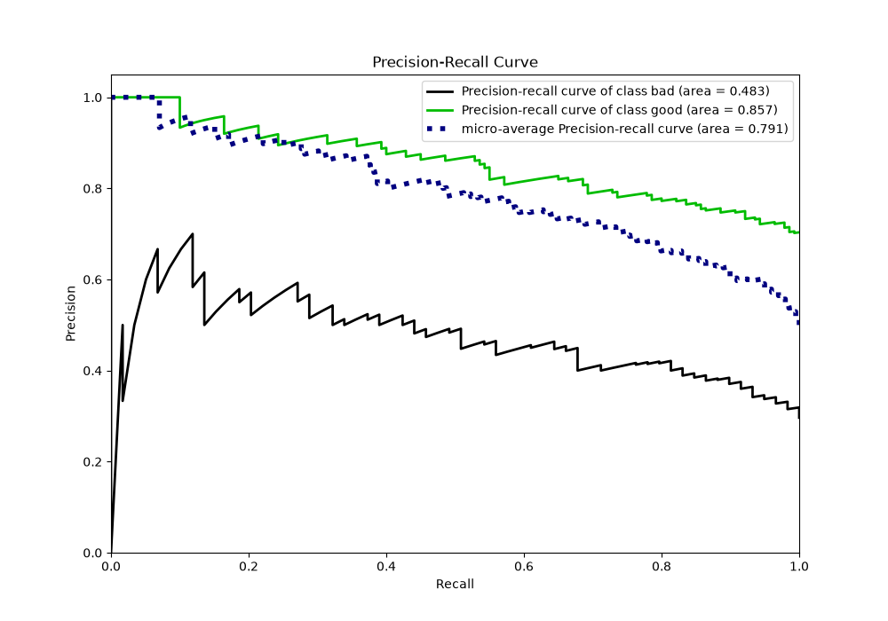
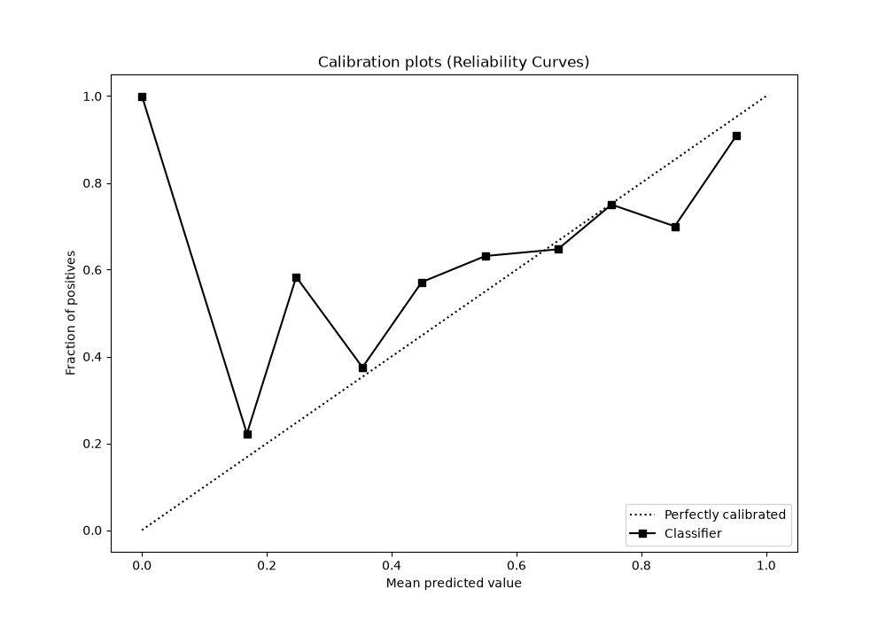
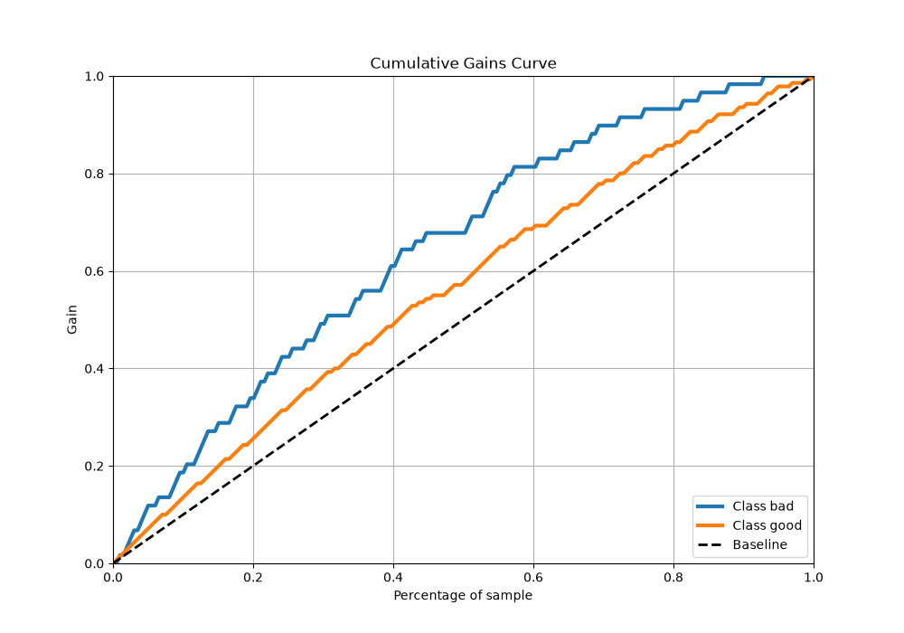
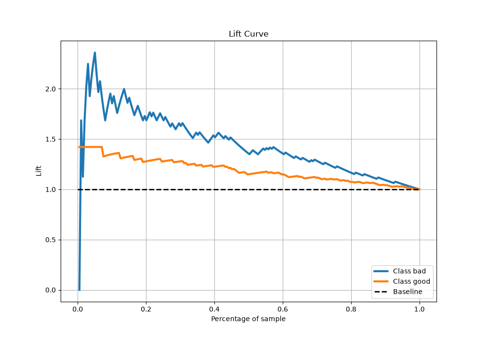

# Summary of 6_Default_RandomForest

[<< Go back](../README.md)

## Random Forest
- **n_jobs**: -1
- **criterion**: gini
- **max_features**: 0.9
- **min_samples_split**: 30
- **max_depth**: 4
- **eval_metric_name**: logloss
- **explain_level**: 2

## Validation
 - **validation_type**: split
 - **train_ratio**: 0.75
 - **shuffle**: True
 - **stratify**: True

## Optimized metric
logloss

## Training time

2.0 seconds

## Metric details
|           |    score |   threshold |
|:----------|---------:|------------:|
| logloss   | 0.556278 |  nan        |
| auc       | 0.711259 |  nan        |
| f1        | 0.832827 |    0.34768  |
| accuracy  | 0.728643 |    0.463443 |
| precision | 0.827273 |    0.738076 |
| recall    | 1        |    0.184404 |
| mcc       | 0.305997 |    0.708603 |

## Metric details with threshold from accuracy metric
|           |    score |   threshold |
|:----------|---------:|------------:|
| logloss   | 0.556278 |  nan        |
| auc       | 0.711259 |  nan        |
| f1        | 0.826923 |    0.463443 |
| accuracy  | 0.728643 |    0.463443 |
| precision | 0.75     |    0.463443 |
| recall    | 0.921429 |    0.463443 |
| mcc       | 0.256882 |    0.463443 |

## Confusion matrix (at threshold=0.463443)
|                 |   Predicted as bad |   Predicted as good |
|:----------------|-------------------:|--------------------:|
| Labeled as bad  |                 16 |                  43 |
| Labeled as good |                 11 |                 129 |

## Learning curves

## Permutation-based Importance

## Confusion Matrix

## Normalized Confusion Matrix

## ROC Curve

## Kolmogorov-Smirnov Statistic

## Precision-Recall Curve

## Calibration Curve

## Cumulative Gains Curve

## Lift Curve

[<< Go back](../README.md)
