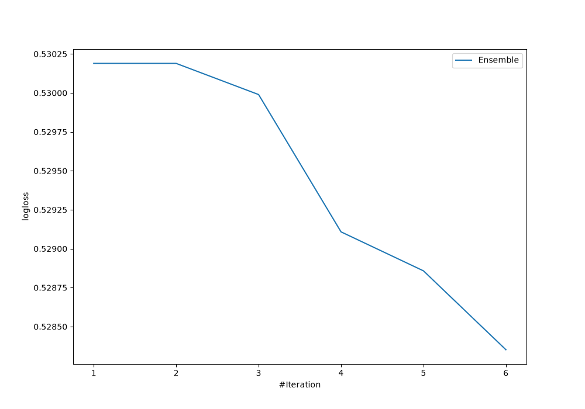
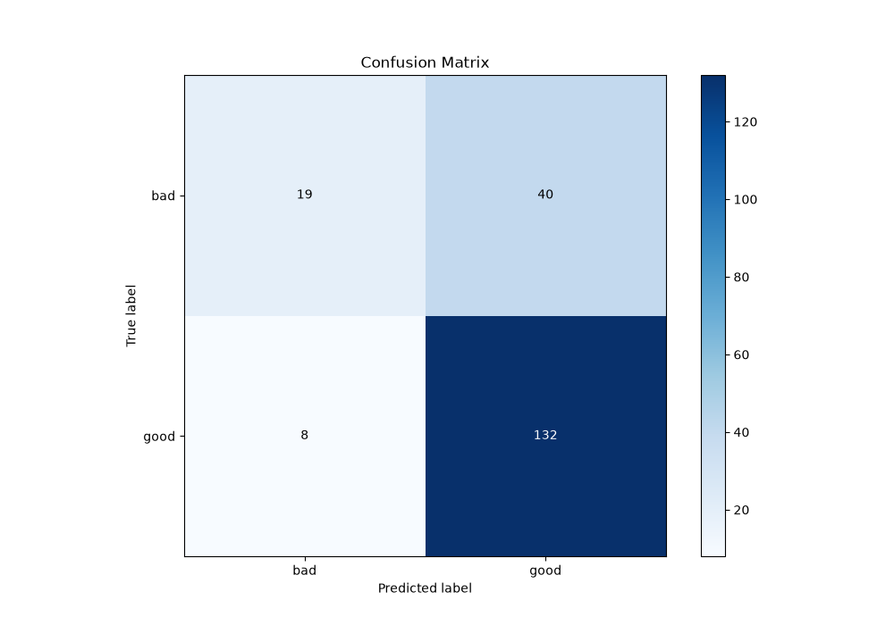
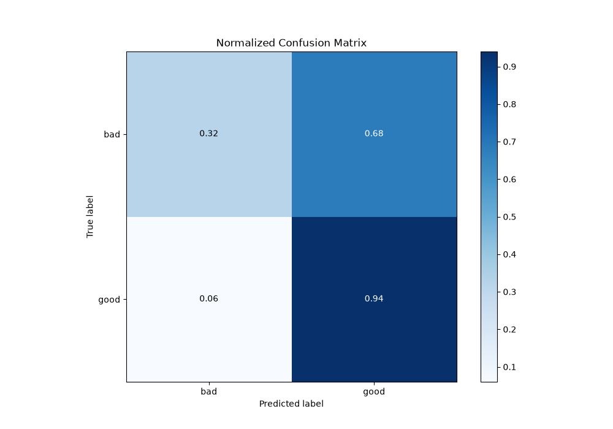
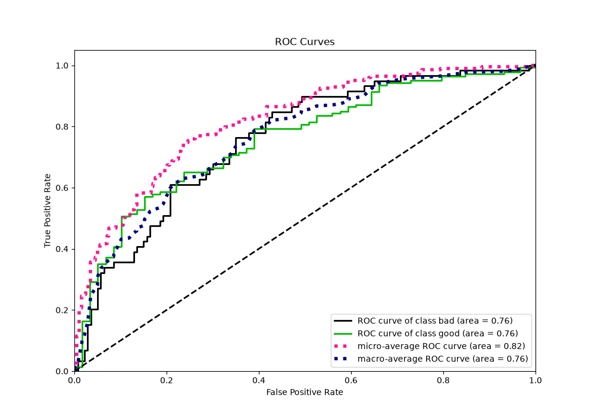
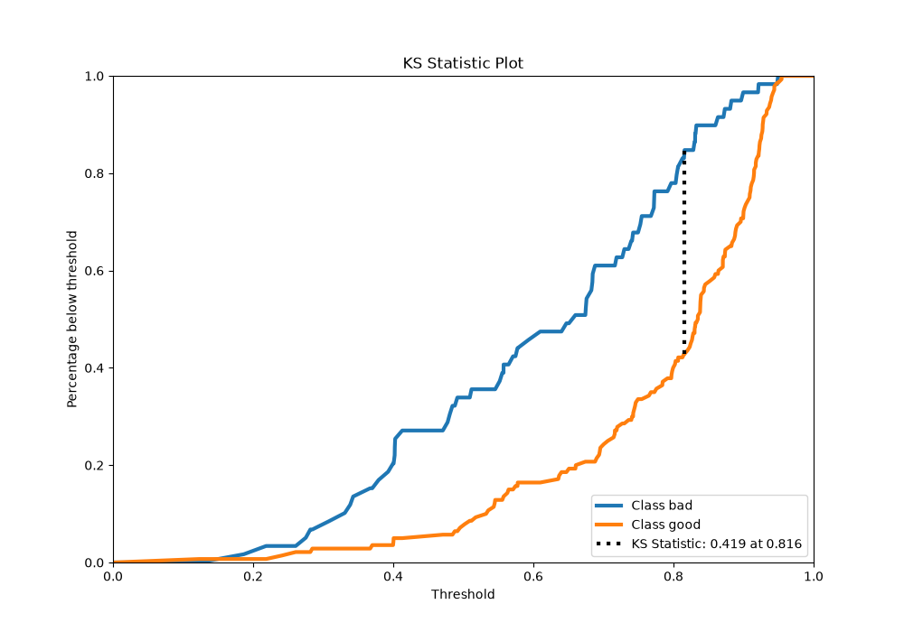
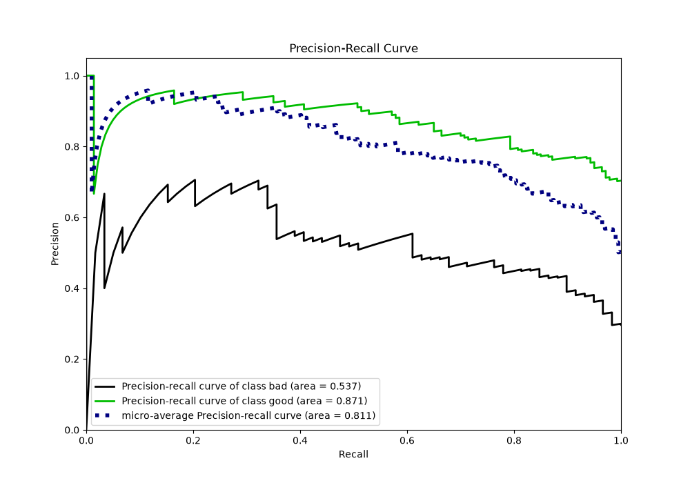
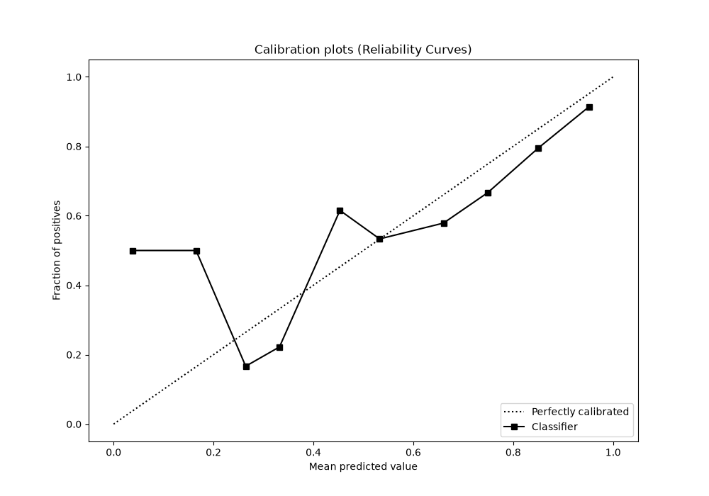
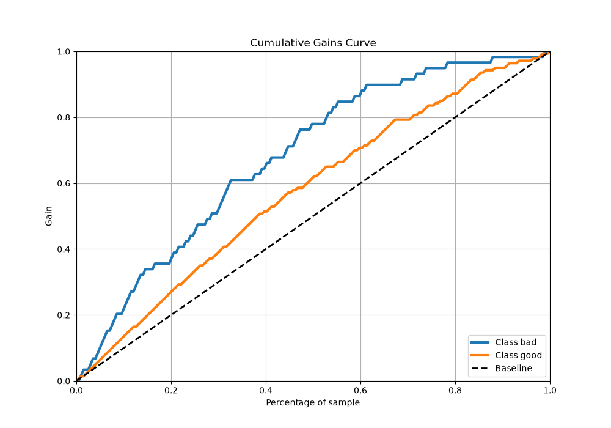
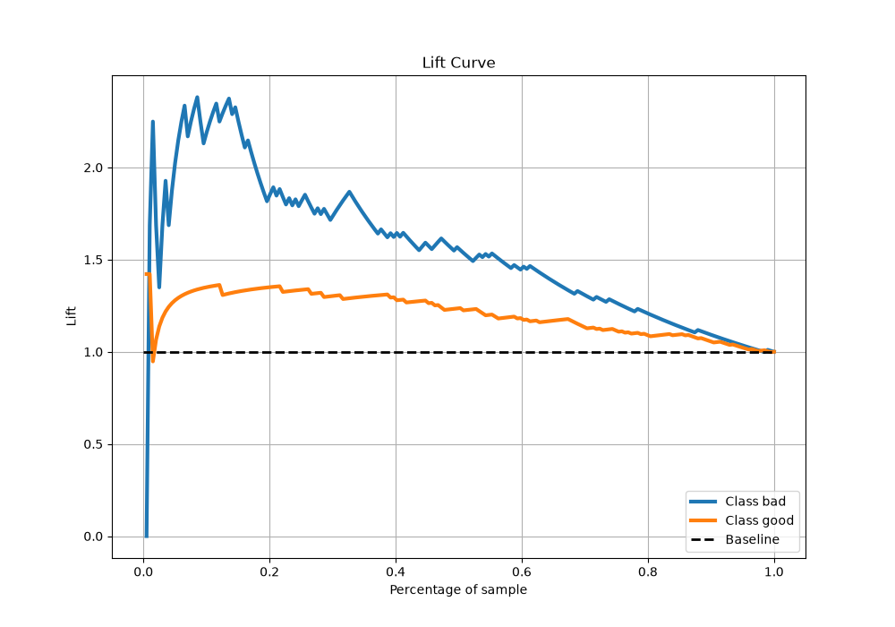

# Summary of Ensemble

[<< Go back](../README.md)

## Ensemble structure
| Model                  |   Weight |
|:-----------------------|---------:|
| 2_DecisionTree         |        1 |
| 4_Default_Xgboost      |        4 |
| 6_Default_RandomForest |        1 |

## Metric details
|           |    score |   threshold |
|:----------|---------:|------------:|
| logloss   | 0.528352 |  nan        |
| auc       | 0.758354 |  nan        |
| f1        | 0.846154 |    0.486227 |
| accuracy  | 0.758794 |    0.486227 |
| precision | 0.87     |    0.797015 |
| recall    | 1        |    0.110738 |
| mcc       | 0.392477 |    0.689174 |

## Metric details with threshold from accuracy metric
|           |    score |   threshold |
|:----------|---------:|------------:|
| logloss   | 0.528352 |  nan        |
| auc       | 0.758354 |  nan        |
| f1        | 0.846154 |    0.486227 |
| accuracy  | 0.758794 |    0.486227 |
| precision | 0.767442 |    0.486227 |
| recall    | 0.942857 |    0.486227 |
| mcc       | 0.353274 |    0.486227 |

## Confusion matrix (at threshold=0.486227)
|                 |   Predicted as bad |   Predicted as good |
|:----------------|-------------------:|--------------------:|
| Labeled as bad  |                 19 |                  40 |
| Labeled as good |                  8 |                 132 |

## Learning curves

## Confusion Matrix

## Normalized Confusion Matrix

## ROC Curve

## Kolmogorov-Smirnov Statistic

## Precision-Recall Curve

## Calibration Curve

## Cumulative Gains Curve

## Lift Curve

[<< Go back](../README.md)
