# Summary of 2_DecisionTree

[<< Go back](../README.md)

## Decision Tree
- **n_jobs**: -1
- **criterion**: entropy
- **max_depth**: 4
- **explain_level**: 2

## Validation
 - **validation_type**: split
 - **train_ratio**: 0.75
 - **shuffle**: True
 - **stratify**: True

## Optimized metric
logloss

## Training time

4.4 seconds

## Metric details
|           |    score |   threshold |
|:----------|---------:|------------:|
| logloss   | 0.392292 |  nan        |
| auc       | 0.937712 |  nan        |
| f1        | 0.955326 |    0        |
| accuracy  | 0.934673 |    0        |
| precision | 0.971429 |    0.956044 |
| recall    | 0.992857 |    0        |
| mcc       | 0.842782 |    0        |

## Metric details with threshold from accuracy metric
|           |    score |   threshold |
|:----------|---------:|------------:|
| logloss   | 0.392292 |         nan |
| auc       | 0.937712 |         nan |
| f1        | 0.955326 |           0 |
| accuracy  | 0.934673 |           0 |
| precision | 0.92053  |           0 |
| recall    | 0.992857 |           0 |
| mcc       | 0.842782 |           0 |

## Confusion matrix (at threshold=0.0)
|                 |   Predicted as bad |   Predicted as good |
|:----------------|-------------------:|--------------------:|
| Labeled as bad  |                 47 |                  12 |
| Labeled as good |                  1 |                 139 |

## Learning curves
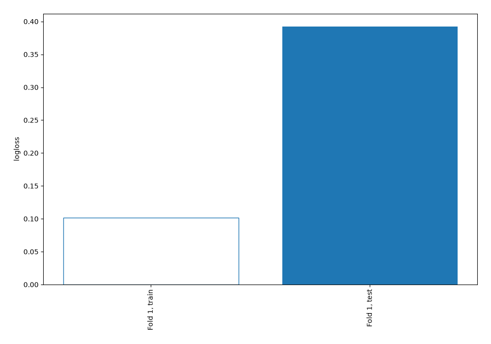

## Decision Tree 

### Tree #1
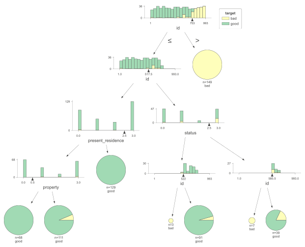

### Rules

if (id > 753.0) then class: bad (proba: 100.0%) | based on 149 samples

if (id <= 753.0) and (id <= 517.5) and (present_residence > 2.5) then class: good (proba: 100.0%) | based on 129 samples

if (id <= 753.0) and (id <= 517.5) and (present_residence <= 2.5) and (property > 0.5) then class: good (proba: 93.69%) | based on 111 samples

if (id <= 753.0) and (id > 517.5) and (status <= 2.5) and (id > 522.0) then class: good (proba: 95.6%) | based on 91 samples

if (id <= 753.0) and (id <= 517.5) and (present_residence <= 2.5) and (property <= 0.5) then class: good (proba: 100.0%) | based on 68 samples

if (id <= 753.0) and (id > 517.5) and (status > 2.5) and (id > 585.5) then class: good (proba: 82.05%) | based on 39 samples

if (id <= 753.0) and (id > 517.5) and (status > 2.5) and (id <= 585.5) then class: bad (proba: 100.0%) | based on 7 samples

if (id <= 753.0) and (id > 517.5) and (status <= 2.5) and (id <= 522.0) then class: bad (proba: 100.0%) | based on 3 samples

## Permutation-based Importance
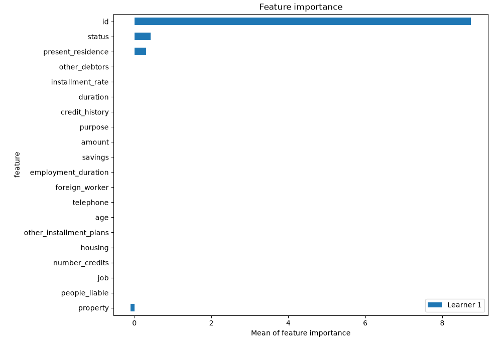
## Confusion Matrix

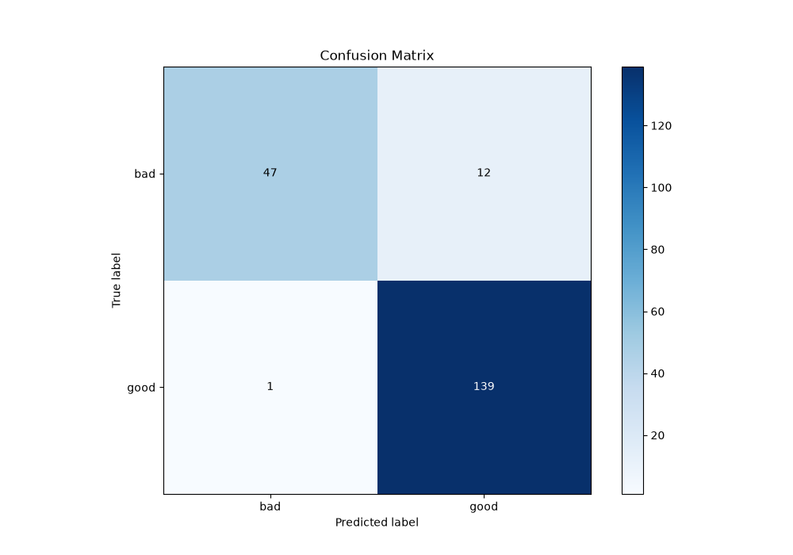

## Normalized Confusion Matrix

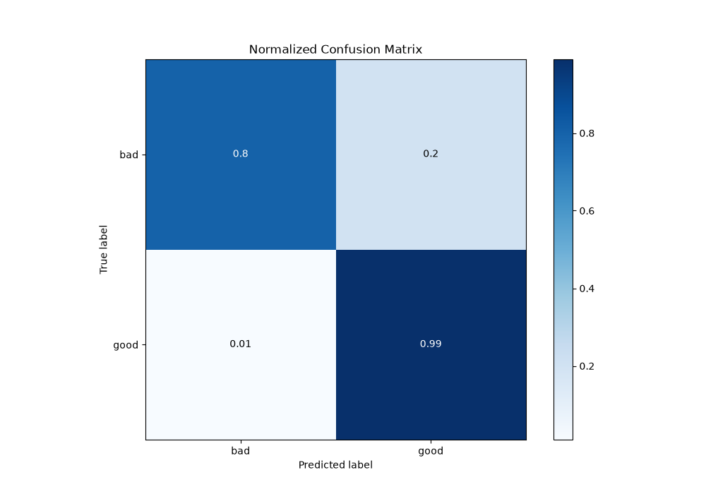

## ROC Curve

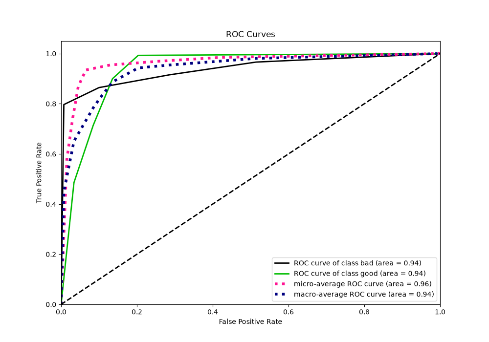

## Kolmogorov-Smirnov Statistic

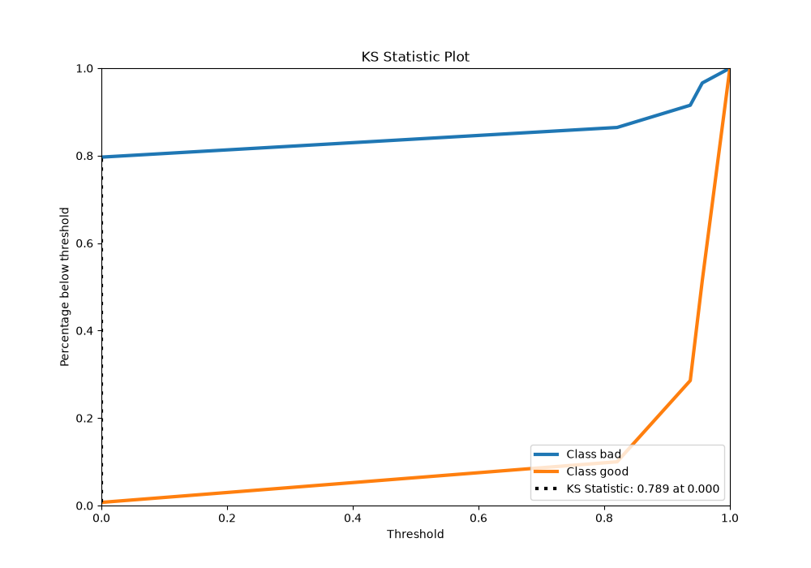

## Precision-Recall Curve

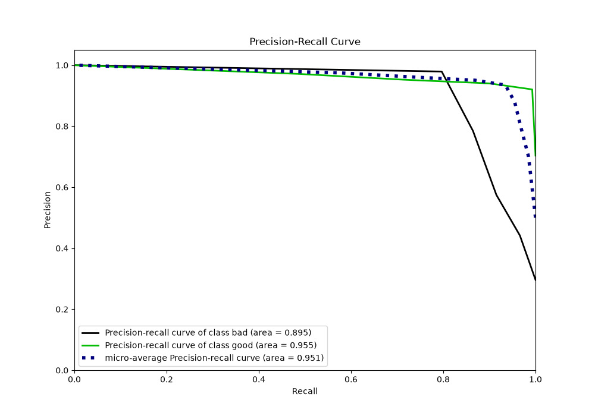

## Calibration Curve

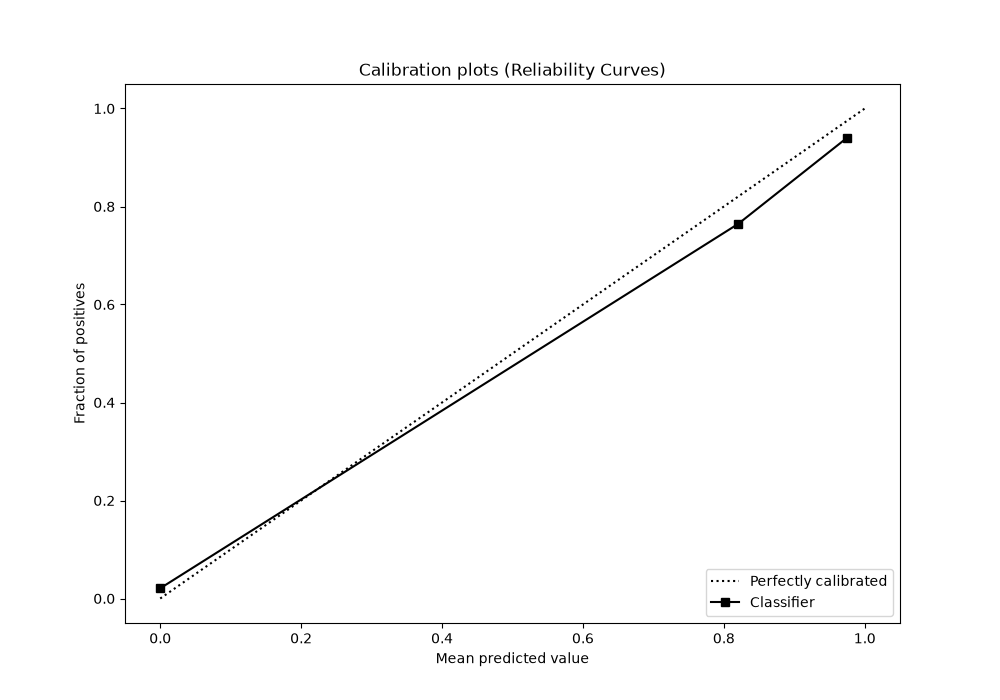

## Cumulative Gains Curve

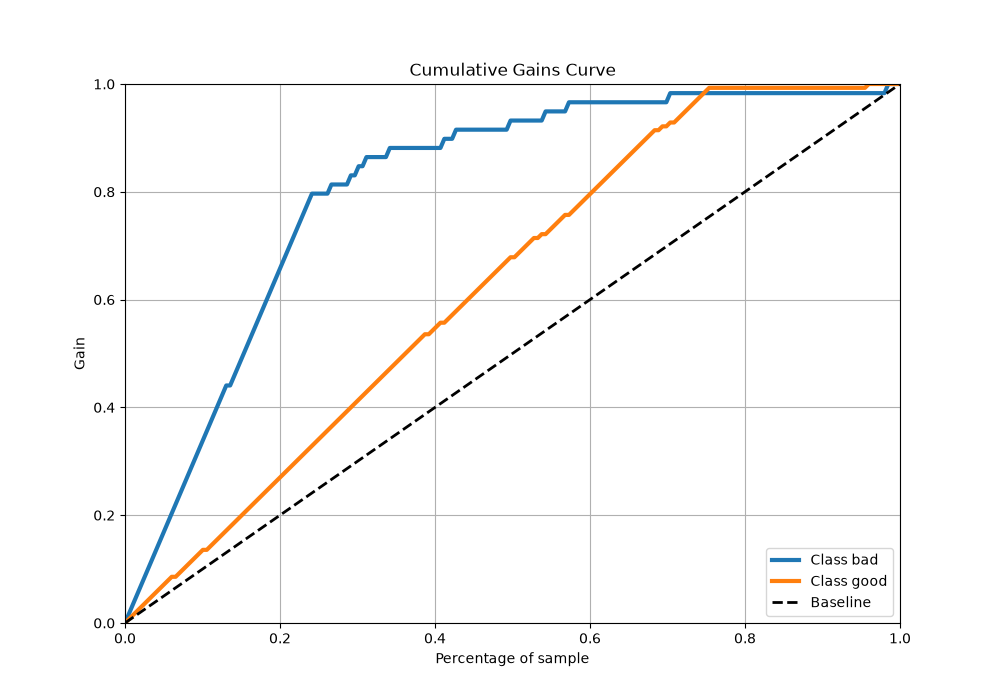

## Lift Curve

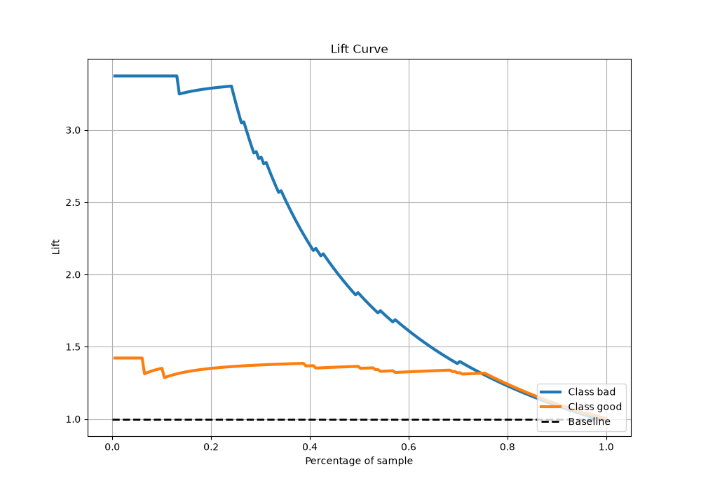

[<< Go back](../README.md)
