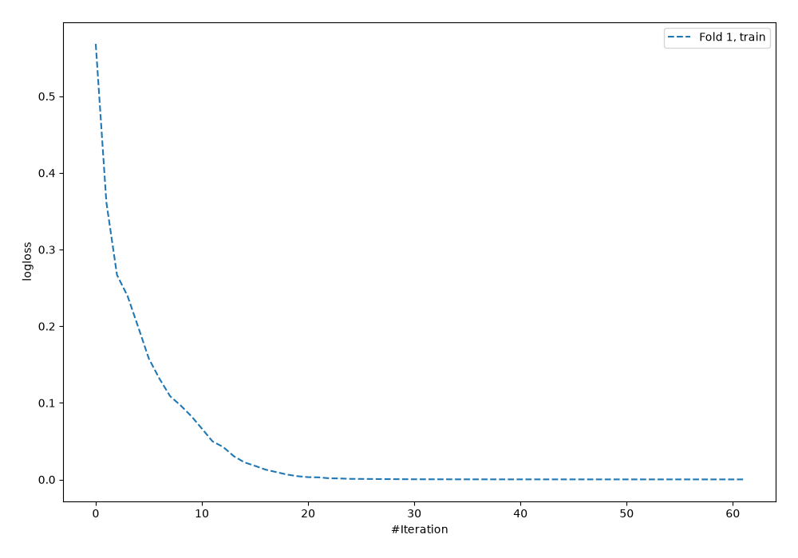
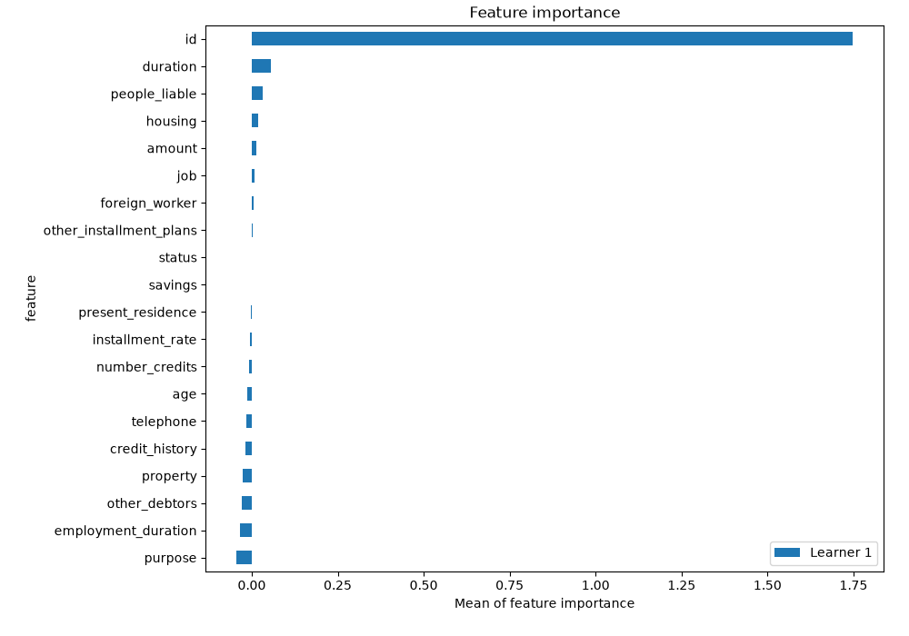
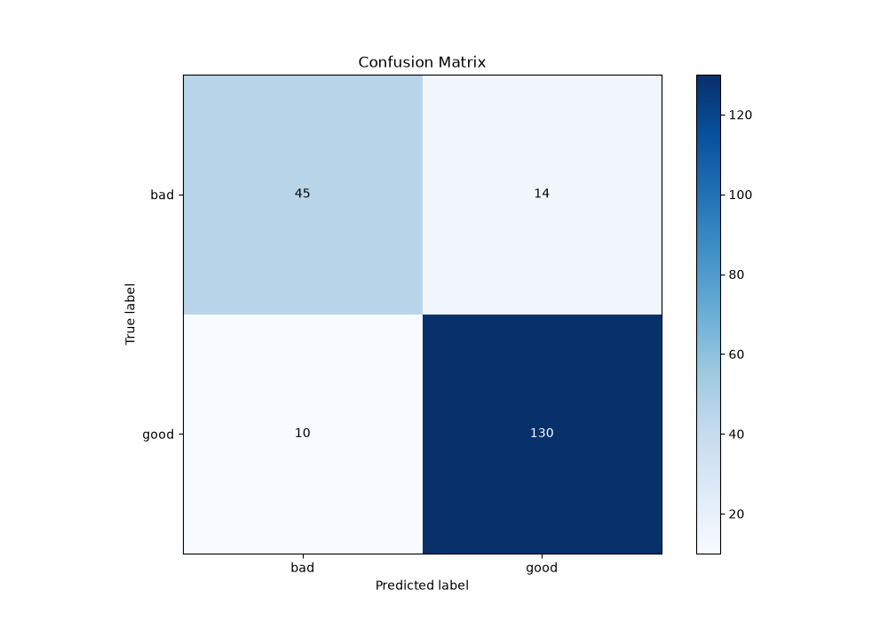
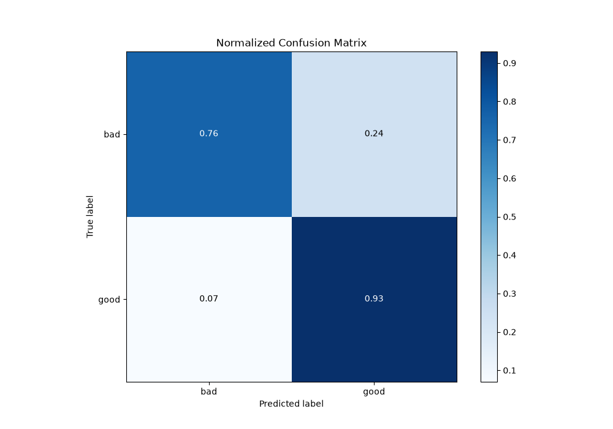
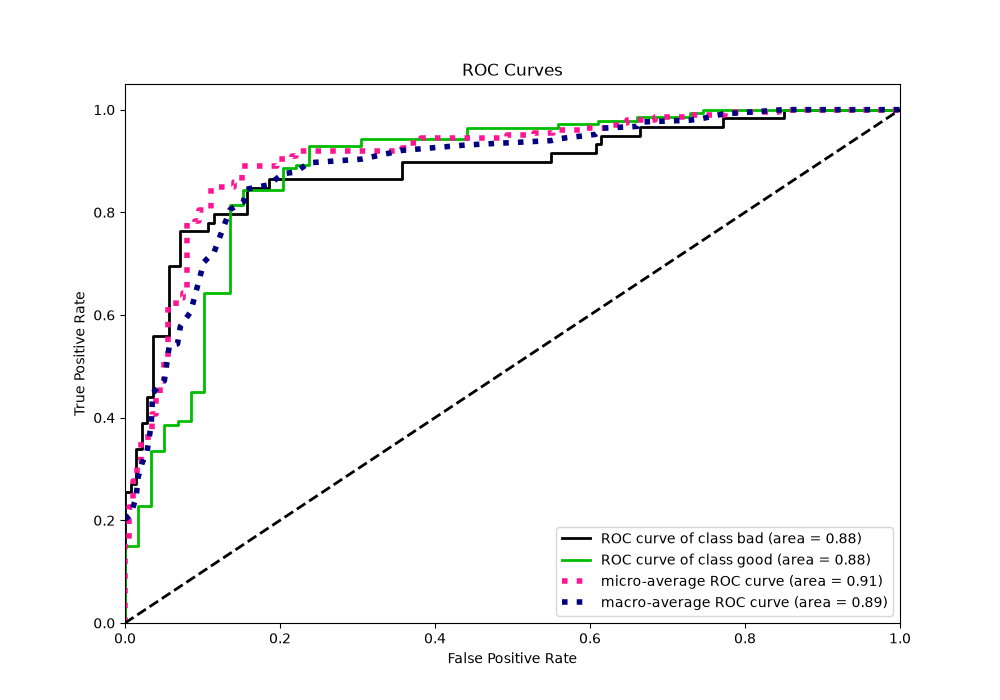
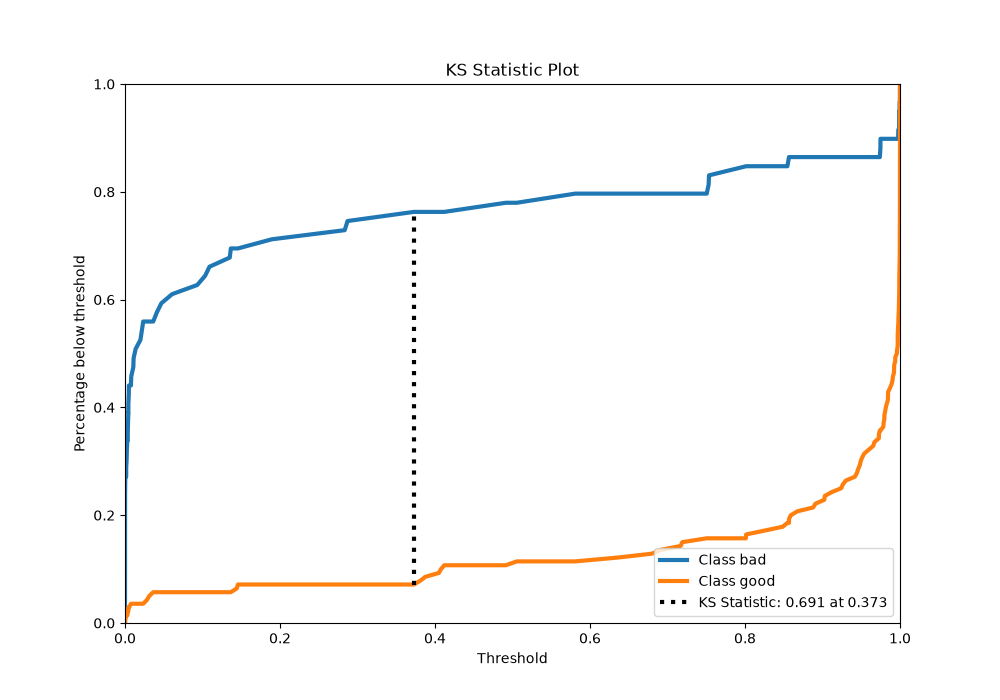
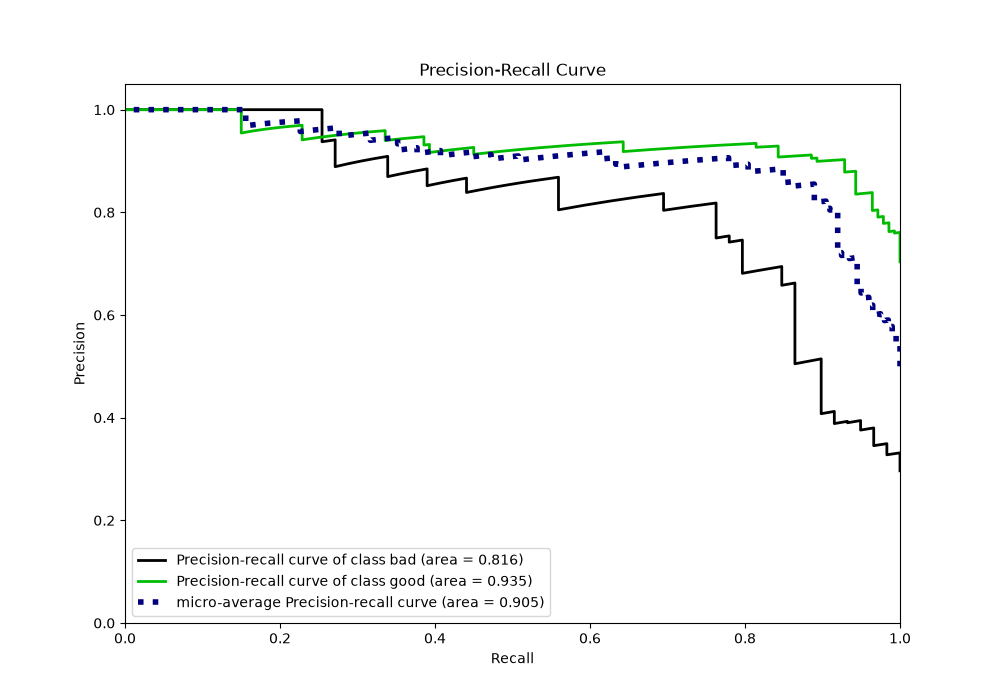
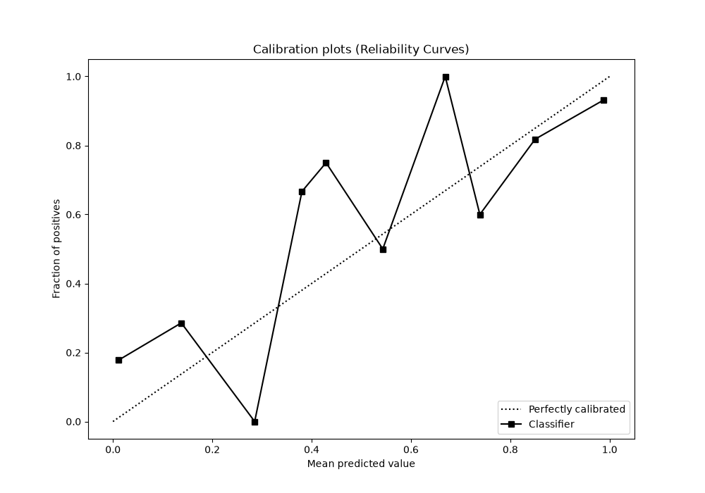
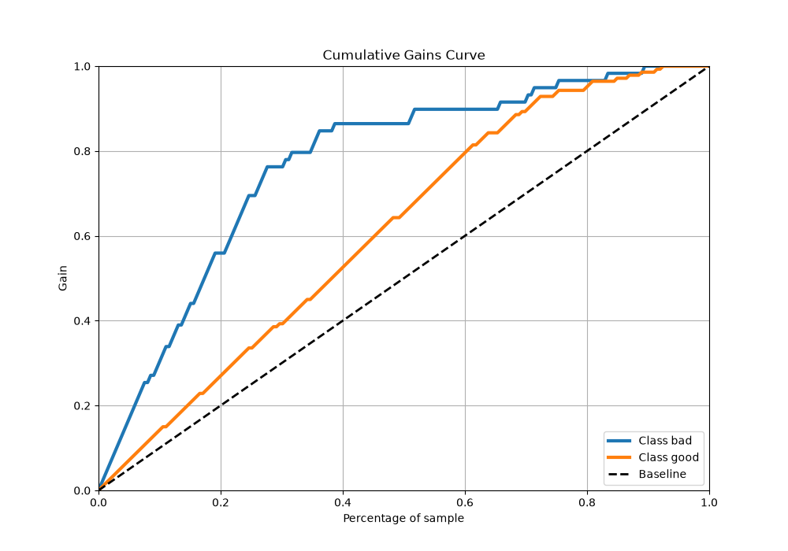
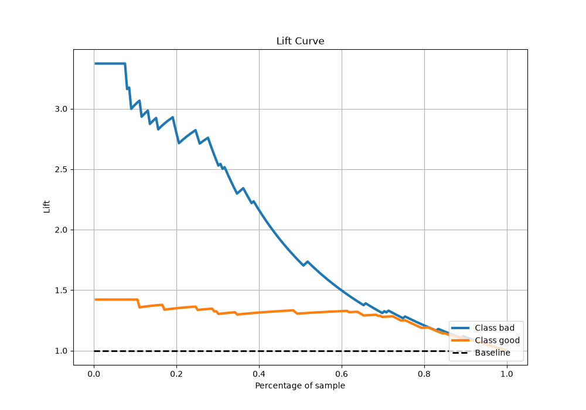

# Summary of 5_Default_NeuralNetwork

[<< Go back](../README.md)

## Neural Network
- **n_jobs**: -1
- **dense_1_size**: 32
- **dense_2_size**: 16
- **learning_rate**: 0.05
- **explain_level**: 2

## Validation
 - **validation_type**: split
 - **train_ratio**: 0.75
 - **shuffle**: True
 - **stratify**: True

## Optimized metric
logloss

## Training time

1.0 seconds

## Metric details
|           |    score |     threshold |
|:----------|---------:|--------------:|
| logloss   | 0.602468 | nan           |
| auc       | 0.883777 | nan           |
| f1        | 0.915493 |   0.376944    |
| accuracy  | 0.879397 |   0.376944    |
| precision | 0.934426 |   0.856768    |
| recall    | 1        |   1.01675e-08 |
| mcc       | 0.705966 |   0.376944    |

## Metric details with threshold from accuracy metric
|           |    score |   threshold |
|:----------|---------:|------------:|
| logloss   | 0.602468 |  nan        |
| auc       | 0.883777 |  nan        |
| f1        | 0.915493 |    0.376944 |
| accuracy  | 0.879397 |    0.376944 |
| precision | 0.902778 |    0.376944 |
| recall    | 0.928571 |    0.376944 |
| mcc       | 0.705966 |    0.376944 |

## Confusion matrix (at threshold=0.376944)
|                 |   Predicted as bad |   Predicted as good |
|:----------------|-------------------:|--------------------:|
| Labeled as bad  |                 45 |                  14 |
| Labeled as good |                 10 |                 130 |

## Learning curves

## Permutation-based Importance

## Confusion Matrix

## Normalized Confusion Matrix

## ROC Curve

## Kolmogorov-Smirnov Statistic

## Precision-Recall Curve

## Calibration Curve

## Cumulative Gains Curve

## Lift Curve

[<< Go back](../README.md)
