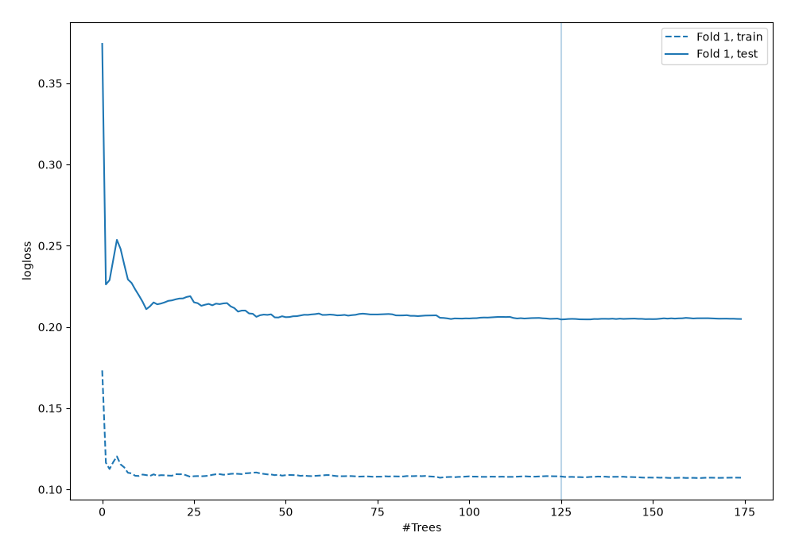
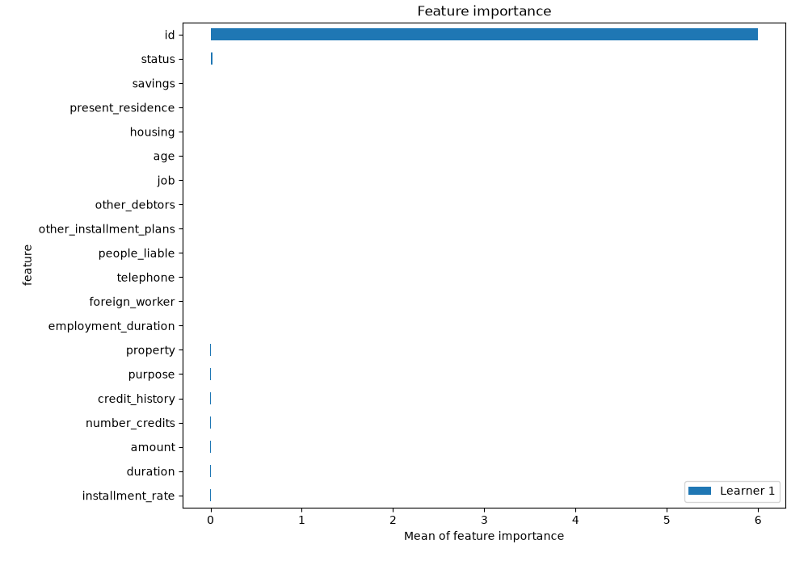
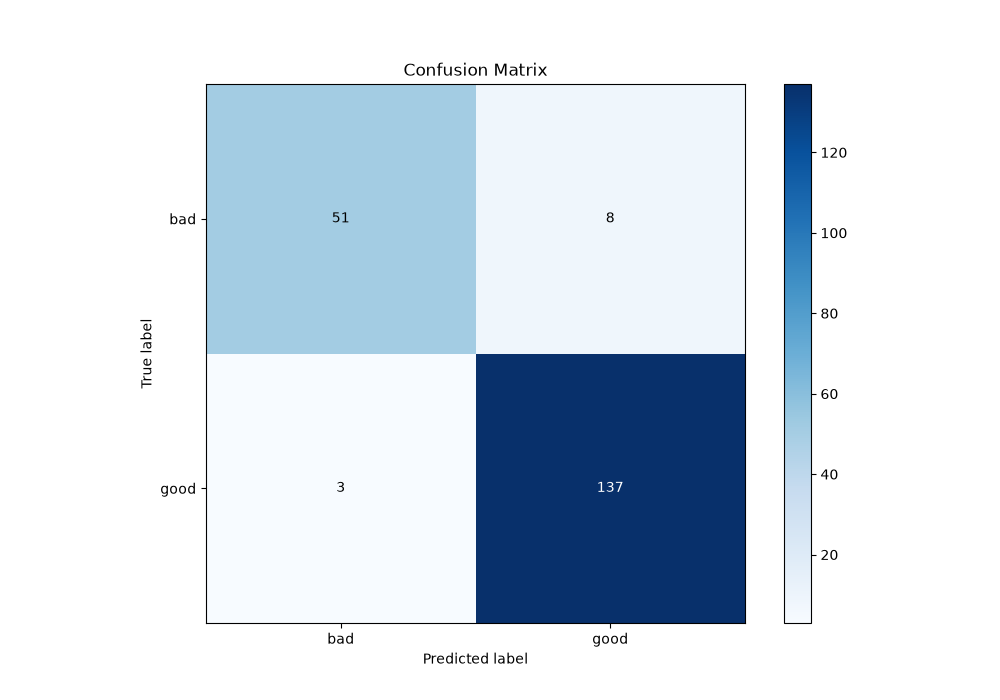
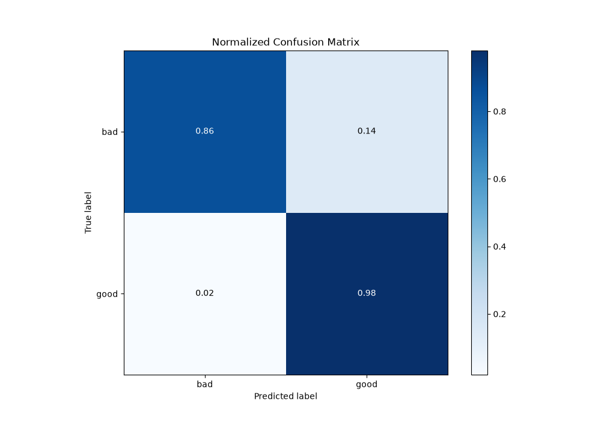
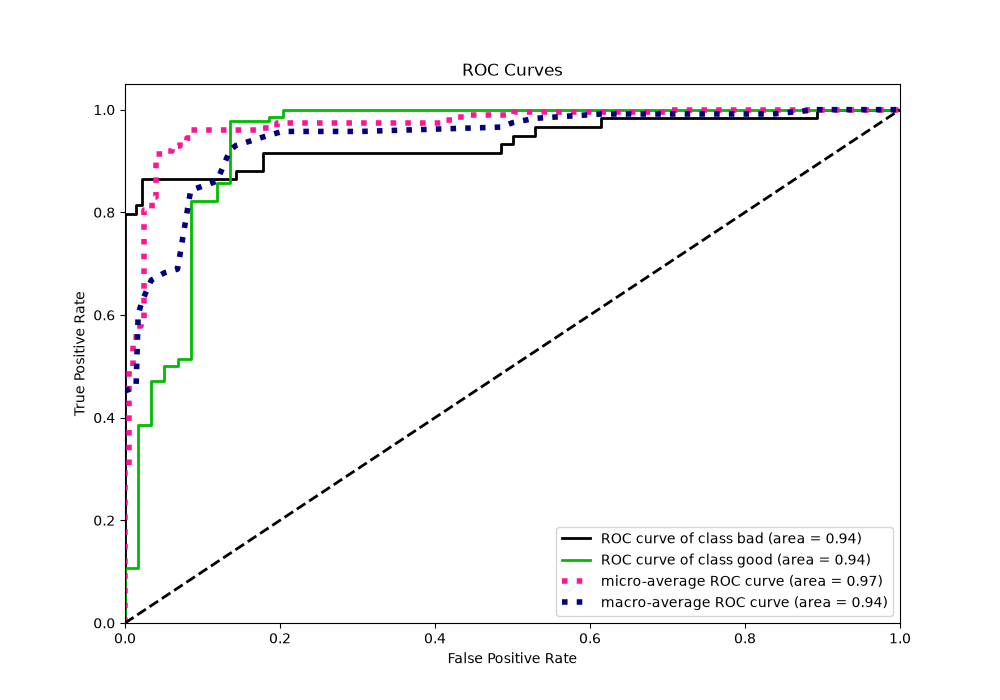
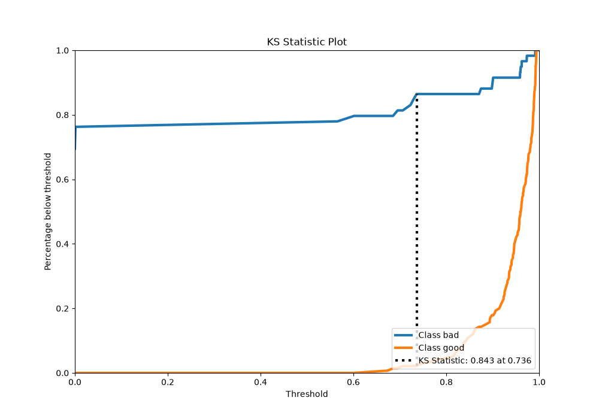
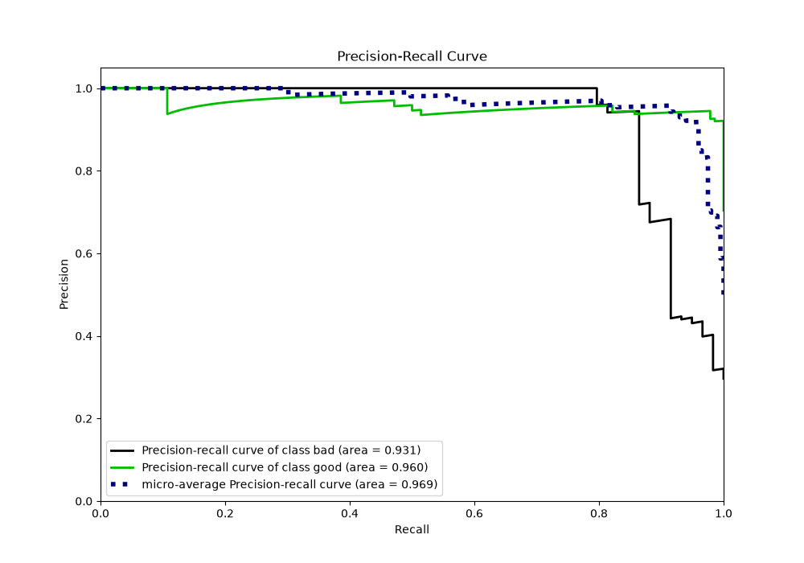
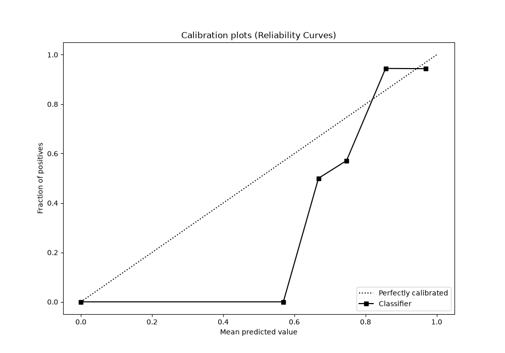
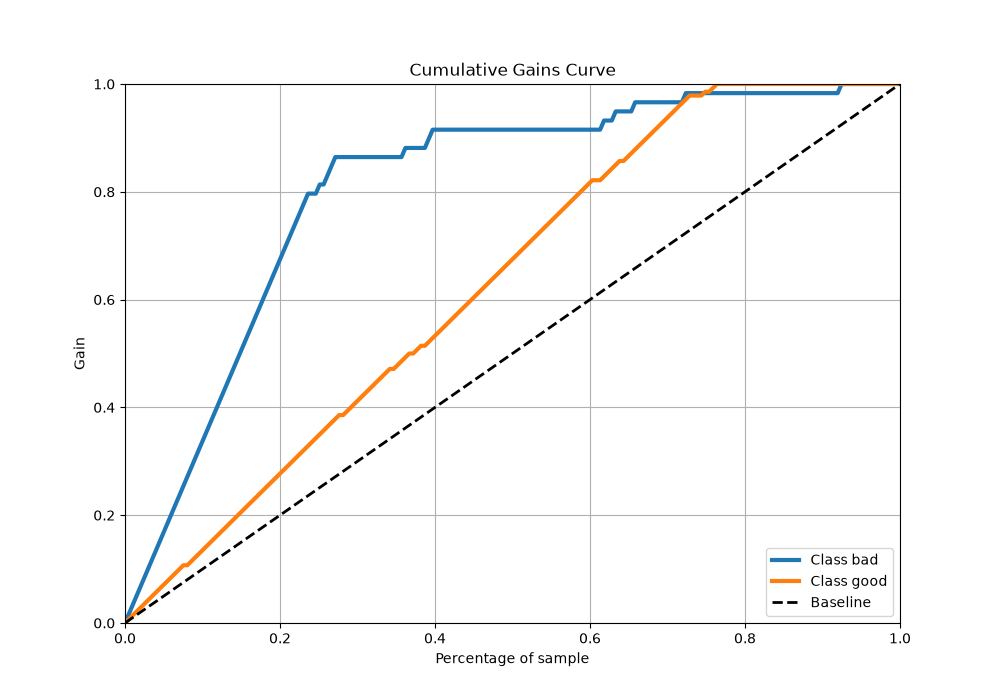
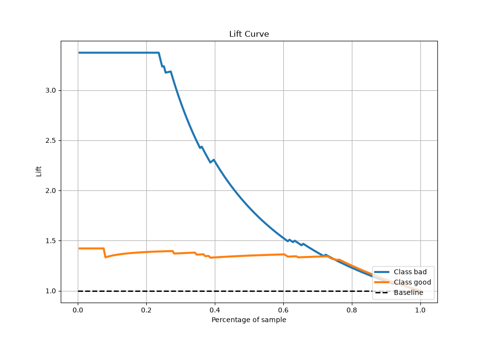

# Summary of 6_Default_RandomForest

[<< Go back](../README.md)

## Random Forest
- **n_jobs**: -1
- **criterion**: gini
- **max_features**: 0.9
- **min_samples_split**: 30
- **max_depth**: 4
- **eval_metric_name**: logloss
- **explain_level**: 2

## Validation
 - **validation_type**: split
 - **train_ratio**: 0.75
 - **shuffle**: True
 - **stratify**: True

## Optimized metric
logloss

## Training time

2.2 seconds

## Metric details
|           |    score |   threshold |
|:----------|---------:|------------:|
| logloss   | 0.20464  |  nan        |
| auc       | 0.938983 |  nan        |
| f1        | 0.961404 |    0.741099 |
| accuracy  | 0.944724 |    0.741099 |
| precision | 0.958333 |    0.902737 |
| recall    | 1        |    0        |
| mcc       | 0.865816 |    0.741099 |

## Metric details with threshold from accuracy metric
|           |    score |   threshold |
|:----------|---------:|------------:|
| logloss   | 0.20464  |  nan        |
| auc       | 0.938983 |  nan        |
| f1        | 0.961404 |    0.741099 |
| accuracy  | 0.944724 |    0.741099 |
| precision | 0.944828 |    0.741099 |
| recall    | 0.978571 |    0.741099 |
| mcc       | 0.865816 |    0.741099 |

## Confusion matrix (at threshold=0.741099)
|                 |   Predicted as bad |   Predicted as good |
|:----------------|-------------------:|--------------------:|
| Labeled as bad  |                 51 |                   8 |
| Labeled as good |                  3 |                 137 |

## Learning curves

## Permutation-based Importance

## Confusion Matrix

## Normalized Confusion Matrix

## ROC Curve

## Kolmogorov-Smirnov Statistic

## Precision-Recall Curve

## Calibration Curve

## Cumulative Gains Curve

## Lift Curve

[<< Go back](../README.md)
