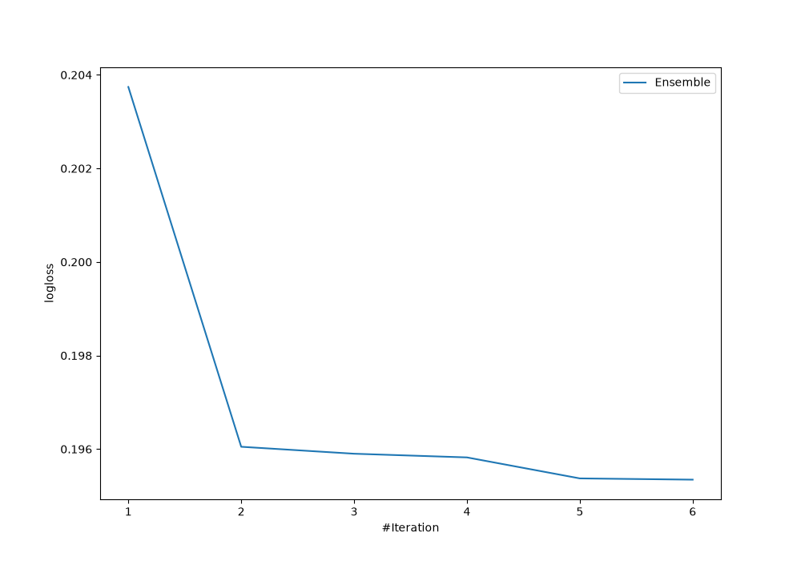
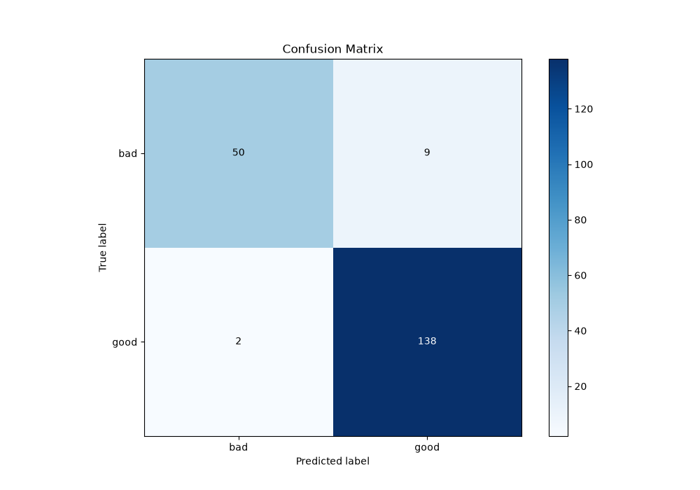
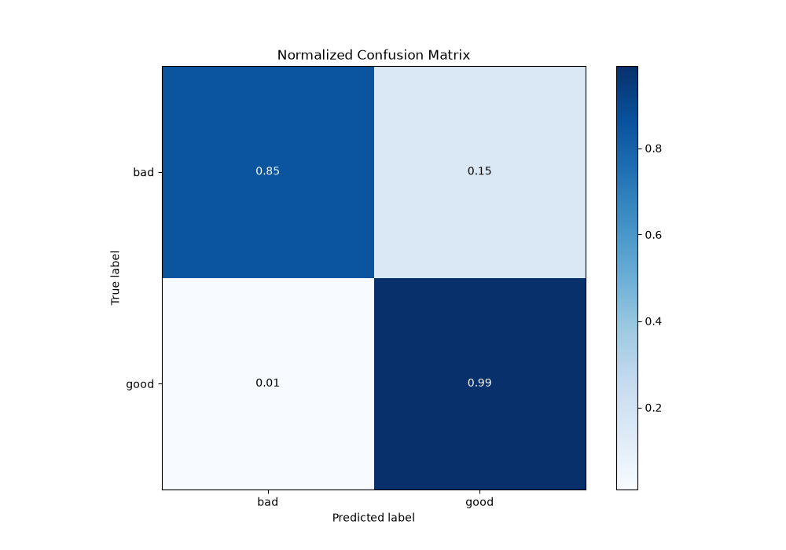
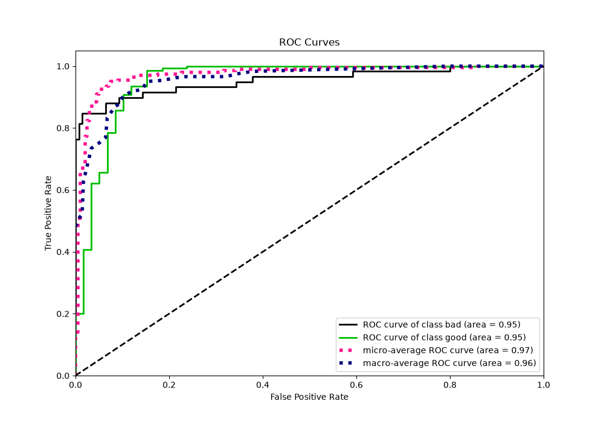
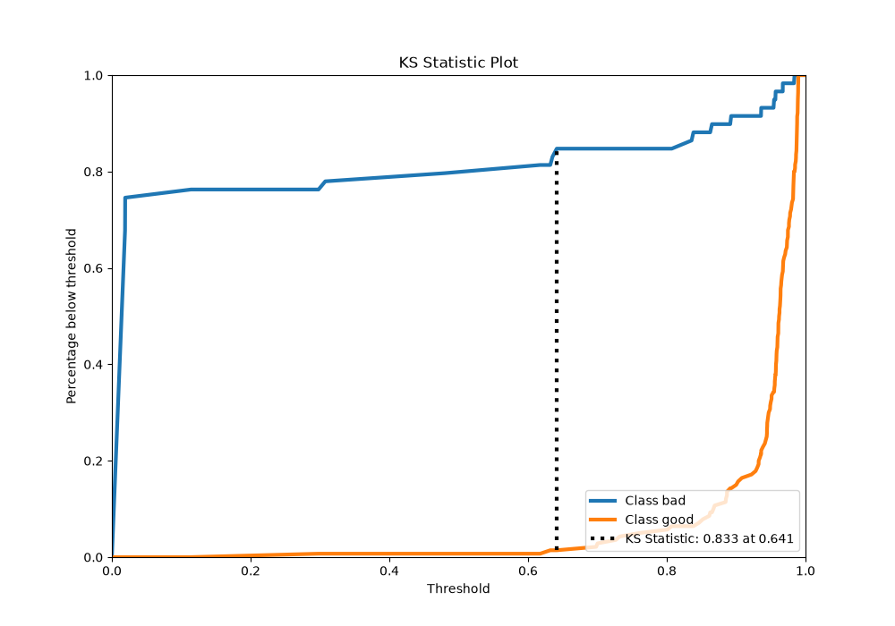
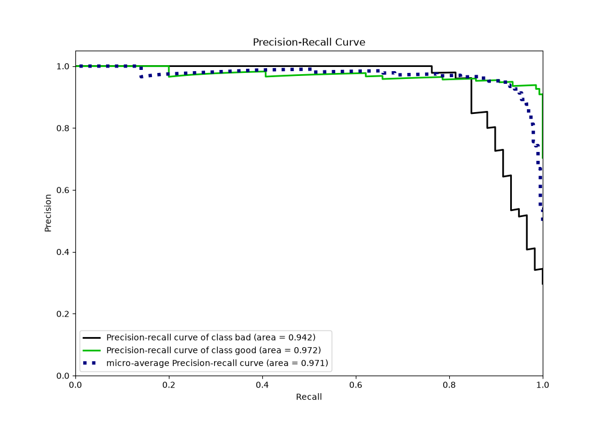
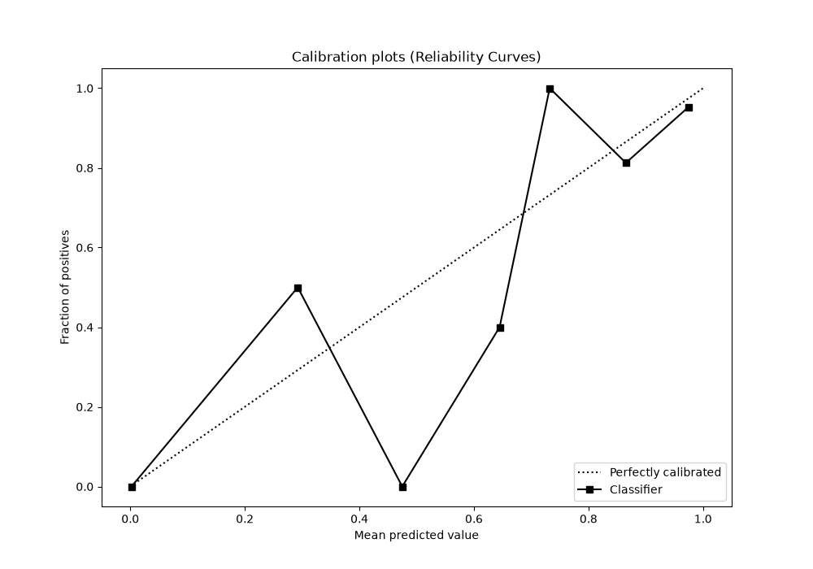
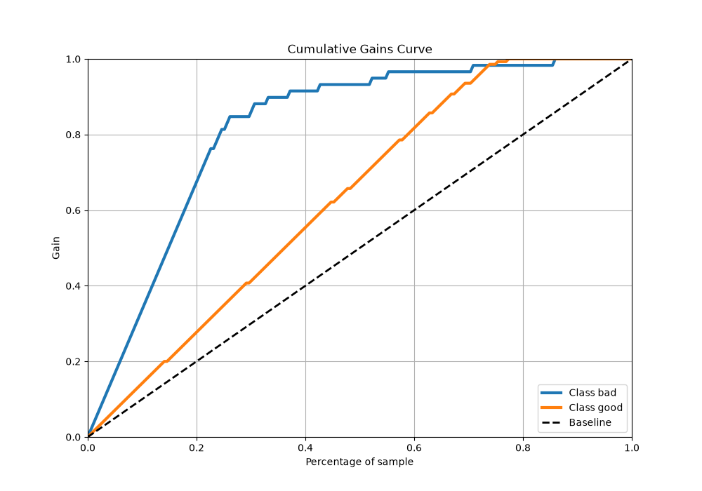
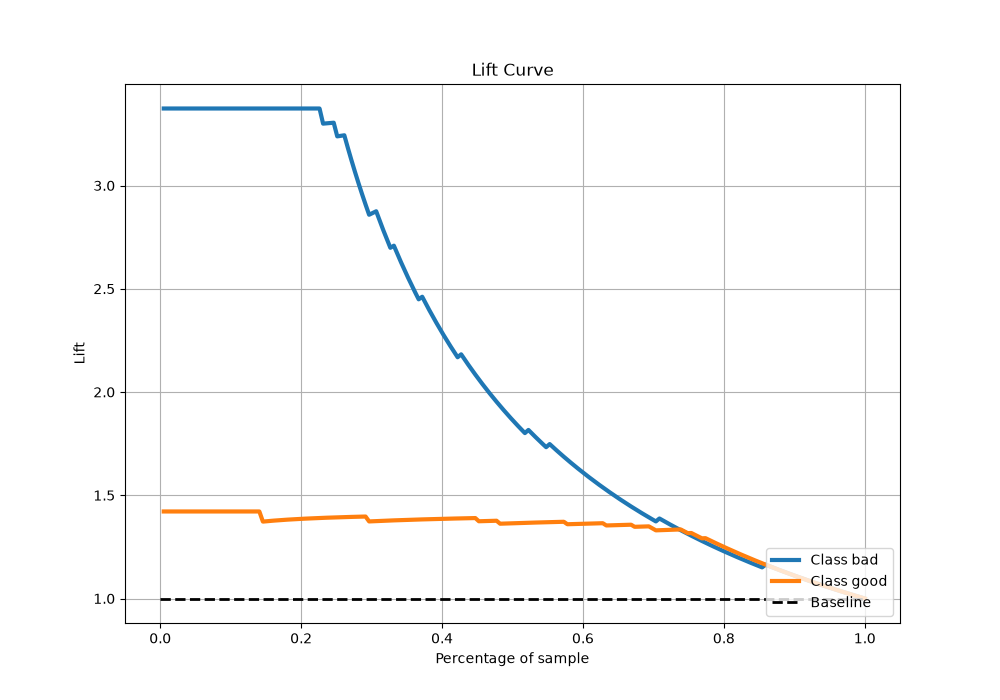

# Summary of Ensemble

[<< Go back](../README.md)

## Ensemble structure
| Model                  |   Weight |
|:-----------------------|---------:|
| 2_DecisionTree         |        2 |
| 4_Default_Xgboost      |        3 |
| 6_Default_RandomForest |        1 |

## Metric details
|           |    score |   threshold |
|:----------|---------:|------------:|
| logloss   | 0.195346 | nan         |
| auc       | 0.953511 | nan         |
| f1        | 0.961672 |   0.669805  |
| accuracy  | 0.944724 |   0.669805  |
| precision | 0.964912 |   0.93611   |
| recall    | 1        |   0.0170839 |
| mcc       | 0.866093 |   0.669805  |

## Metric details with threshold from accuracy metric
|           |    score |   threshold |
|:----------|---------:|------------:|
| logloss   | 0.195346 |  nan        |
| auc       | 0.953511 |  nan        |
| f1        | 0.961672 |    0.669805 |
| accuracy  | 0.944724 |    0.669805 |
| precision | 0.938776 |    0.669805 |
| recall    | 0.985714 |    0.669805 |
| mcc       | 0.866093 |    0.669805 |

## Confusion matrix (at threshold=0.669805)
|                 |   Predicted as bad |   Predicted as good |
|:----------------|-------------------:|--------------------:|
| Labeled as bad  |                 50 |                   9 |
| Labeled as good |                  2 |                 138 |

## Learning curves

## Confusion Matrix

## Normalized Confusion Matrix

## ROC Curve

## Kolmogorov-Smirnov Statistic

## Precision-Recall Curve

## Calibration Curve

## Cumulative Gains Curve

## Lift Curve

[<< Go back](../README.md)
