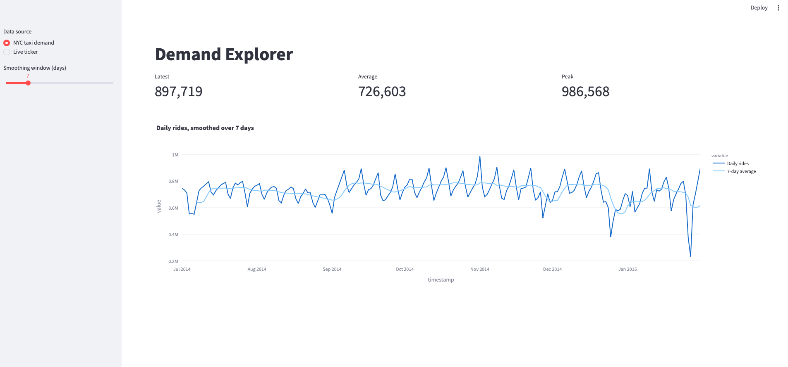
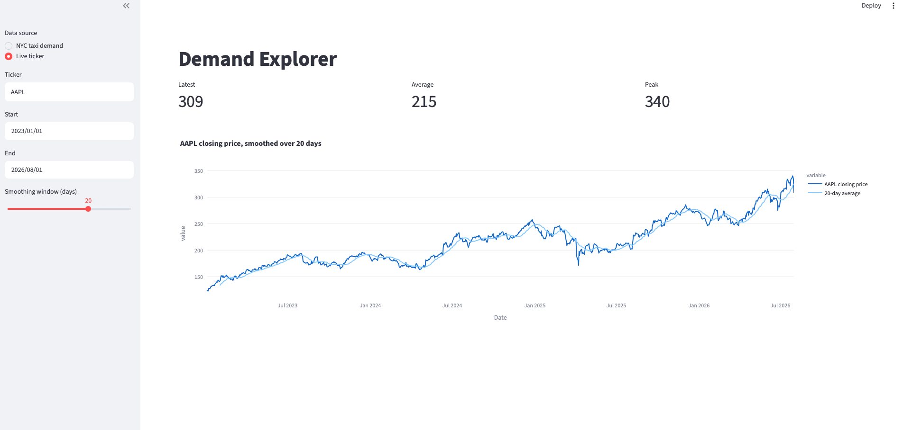

# Activity 5: The Demand Explorer

**Module:** Week 7 Day 1
**Estimated Time:** 40 minutes
**Difficulty:** Beginner to Intermediate
**Format:** Individual
**Prerequisites:** Activity 4 complete (comfortable with `@st.cache_data`, `st.metric`, and the Streamlit rerun model)

## Objective

In this activity, you will extend the single-source app from Activity 4 into an app with a switchable data source: the bundled NYC taxi CSV, or a live stock ticker pulled with `yfinance`. You will add a smoothing control and three KPI tiles, and you will handle a bad ticker without crashing the app.





## Background

Activity 4 only ever read one file. Real dashboards usually need to read from more than one place, and the data does not always cooperate: an API can time out, a ticker symbol can be wrong, or a date range can return nothing. This activity is about building an app that switches sources cleanly and fails gracefully when the second source misbehaves.

The source switch itself is a `st.sidebar.radio`. Whatever the user picks changes which branch of an `if/else` runs, and each branch is responsible for producing the same shape of data (a pandas Series with a date index) so the rest of the script does not need to know which source it came from.

The live source uses `yfinance` to download daily closing prices. This is where you need to be careful. By default, `yf.download(...)` returns a DataFrame with MultiIndex columns shaped like `('Close', 'AAPL')`, not a flat `'Close'` column:

```text
Price          Close        High         Low        Open     Volume
Ticker          AAPL        AAPL        AAPL        AAPL       AAPL
Date
2024-01-02  184.25...   187.33...   182.87...   187.15...   82488700
```

With that shape, `frame["Close"]` returns a DataFrame, not a Series, and every downstream call that expects a Series (`.rolling()`, `.mean()`, `.iloc[-1]`) either fails or silently does the wrong thing. Passing `auto_adjust=True` and `multi_level_index=False` together fixes this and returns flat columns instead:

```text
Close        High         Low        Open      Volume
Date
2024-01-02  184.25...   187.33...   182.87...   187.15...   82488700
```

Now `frame["Close"]` is a plain Series, which is what `load_prices` should return. Remember this shape. You will meet the MultiIndex trap again the moment you work with any multi-symbol or multi-field API response, and knowing the symptom (a Series-shaped call behaving like it got a DataFrame) will save you real debugging time.

A bad ticker or an empty date range will not always raise an exception. Sometimes `yfinance` just returns an empty DataFrame with a warning printed to the terminal. That is why the app needs two separate checks: a `try/except` around the download for outright failures, and an `if series.empty` check afterward for the case where the call succeeds but returns nothing.

## Instructions

1. Copy the starter file into your work folder:

   ```bash
   cp "Week 7/Labs/Day 1/starter/activity_5_demand_explorer.py" student-work/week7/day1/
   ```

   Do not edit the file under `Week 7/Labs/Day 1/starter/` in place. Work only on the copy in `student-work/`.

2. Open `student-work/week7/day1/activity_5_demand_explorer.py` in VS Code. Read the whole file before changing anything. The imports, `st.set_page_config`, the path resolver, `load_taxi`, the bad-ticker `try/except`, and the empty-result check are already done for you. There are four `# TODO` blocks left to fill in:
   - the body of `load_prices`
   - the sidebar radio that sets `source`
   - the sidebar slider and the `.rolling(window).mean()` call
   - the `st.plotly_chart(...)` call

   Each `# TODO` comment tells you exactly what to write and what the result should look like. Replace the placeholder code with your own.

3. Run the app from the repository root:

   ```bash
   uv run streamlit run student-work/week7/day1/activity_5_demand_explorer.py
   ```

4. Test the default path first. With "NYC taxi demand" selected in the sidebar, you should see three KPI tiles (Latest, Average, Peak), a smoothing slider, and a line chart with a raw series and a smoothed series.

5. Switch the sidebar radio to "Live ticker" and leave the ticker as `AAPL`. You should see a text input, two date pickers, and after a short download, the same three tiles and chart, now built from real closing prices.

6. Test the failure path. This step is required, not optional. In the ticker field, type `NOTAREALTICKER` and press Enter. Confirm you see an `st.error` message on the page, not a traceback. This is exactly the behavior described in the Background section: a bad symbol does not crash the app, it produces a clean message the user can act on.

7. While you are on the live source, try narrowing the date range to a single weekend day (for example, set Start and End to the same Saturday). Confirm you see the "no rows" error message instead of a broken chart. This exercises the second safety check, the one that catches an empty result that did not raise an exception.

## Success Criteria

- All four `# TODO` blanks are filled in and the placeholder values are gone.
- The app runs with `uv run streamlit run student-work/week7/day1/activity_5_demand_explorer.py`.
- With "NYC taxi demand" selected, the KPI tiles, slider, and chart all render correctly.
- With "Live ticker" selected and a valid symbol, the KPI tiles, slider, and chart render from live data.
- Entering `NOTAREALTICKER` shows an `st.error` message, never a traceback.
- An empty-result date range shows an `st.error` message, never a broken or blank chart.
- You can explain, in your own words, why `multi_level_index=False` is required and what breaks without it.
