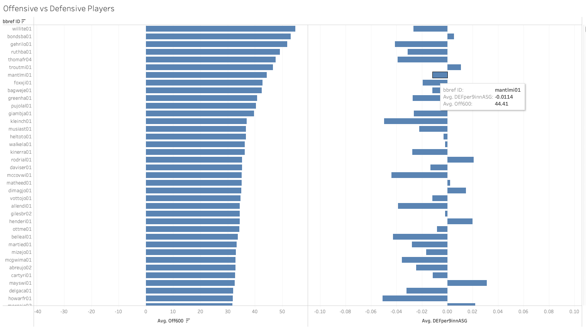
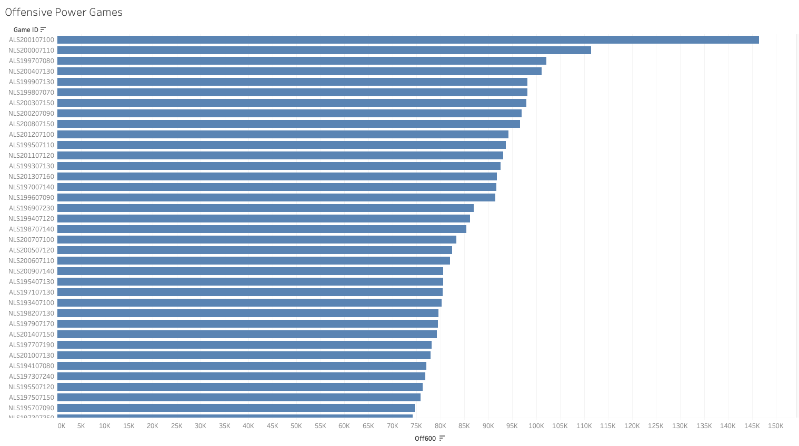
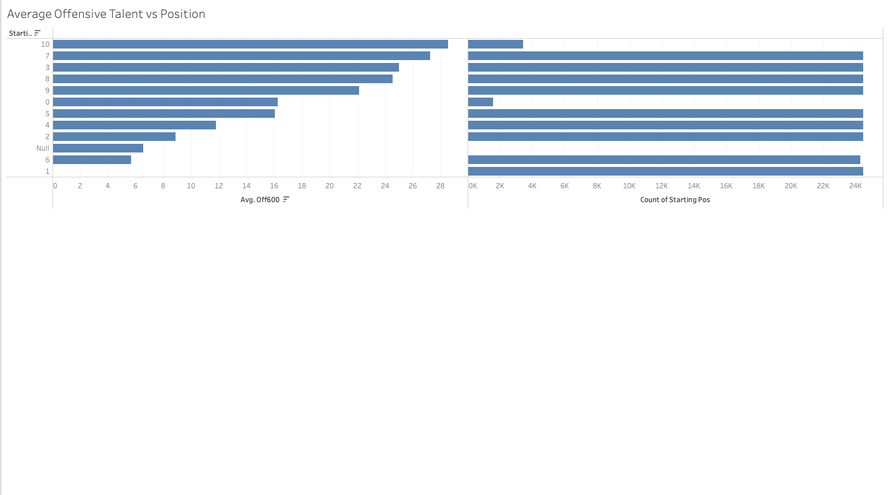
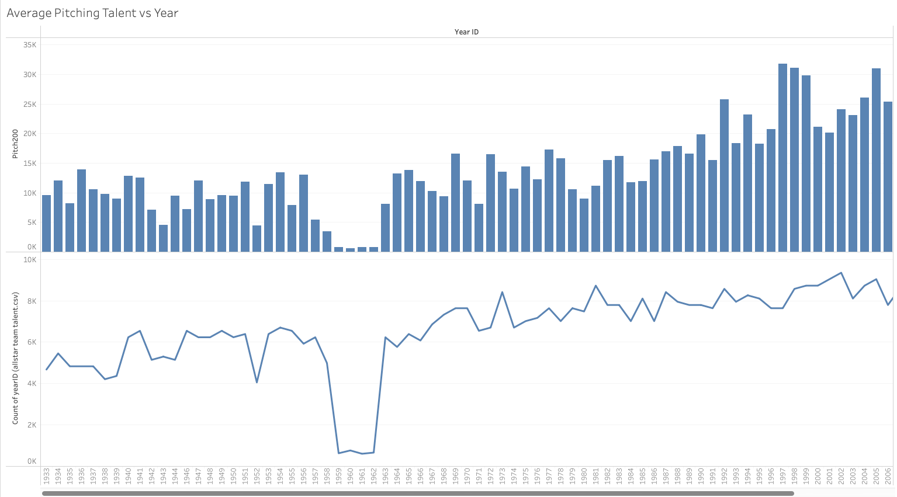
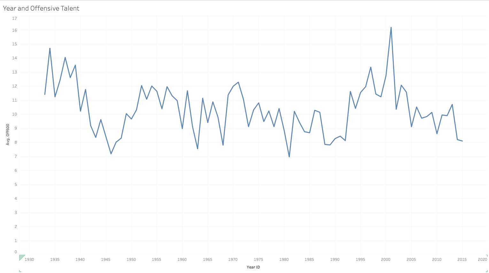

# MLB Analysis

In this activity, you will create tables based on MLB All-Star Teams datasets. This will require you to merge multiple data sources together and then create visualizations from the new dataset.

## Instructions

 * Create a join between each of the charts so that each player's data is matched up correctly.

  * Create a pair of charts that compare the offensive talent of a player (`OFF600` column) to their fielding talent(`DEF600` column). Then sort them from best to worst.

  * Create a chart that determines which game (`GameID` column) has the highest offensive talent (`OFF600` column).

  * Create a chart that determines which position (`startingPos` column) has the greatest fielding talent (`DEF600` column) on average. In a second chart,  Be sure to note how many players are from each position in a second chart.

  * Create a chart that determines which year has the greatest pitching power (`PITCH200` column) on average.

  * Create a chart that marks year versus the average offensive talent (`OFF600` column).

## References

MLB All-Star Teams (2022). Data repository maintained by [https://fivethirtyeight.com]( https://fivethirtyeight.com).
[https://github.com/fivethirtyeight/data/tree/master/mlb-allstar-teams](https://github.com/fivethirtyeight/data/tree/master/mlb-allstar-teams)

