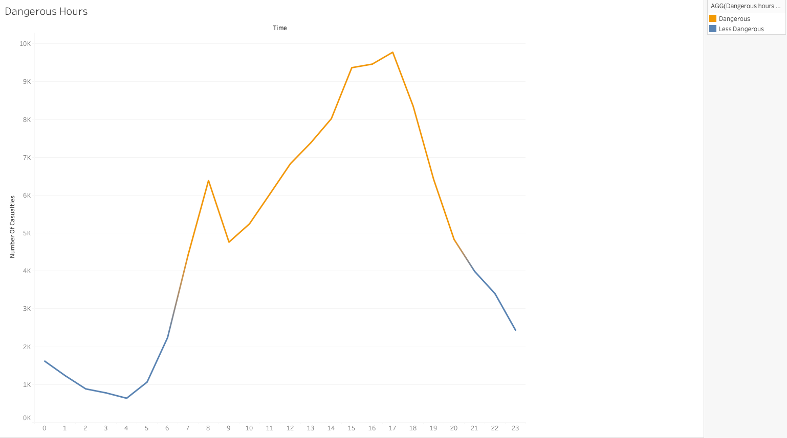
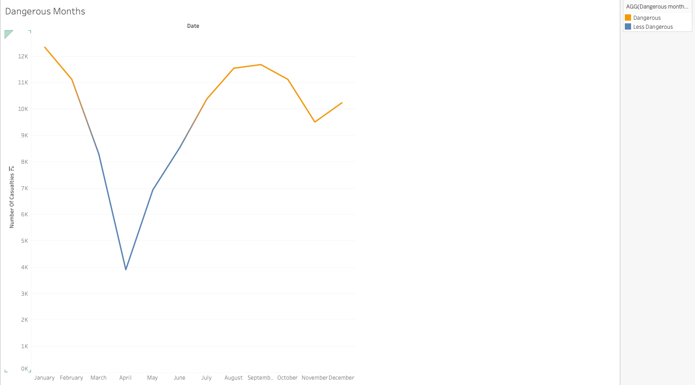
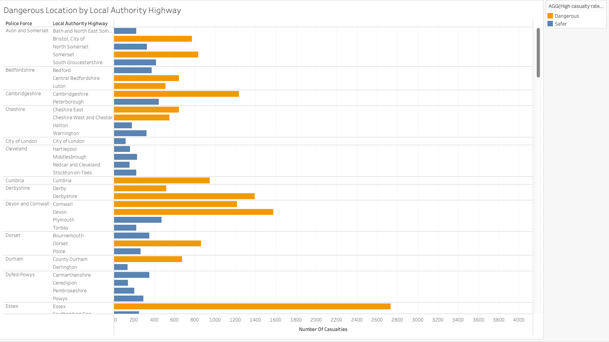
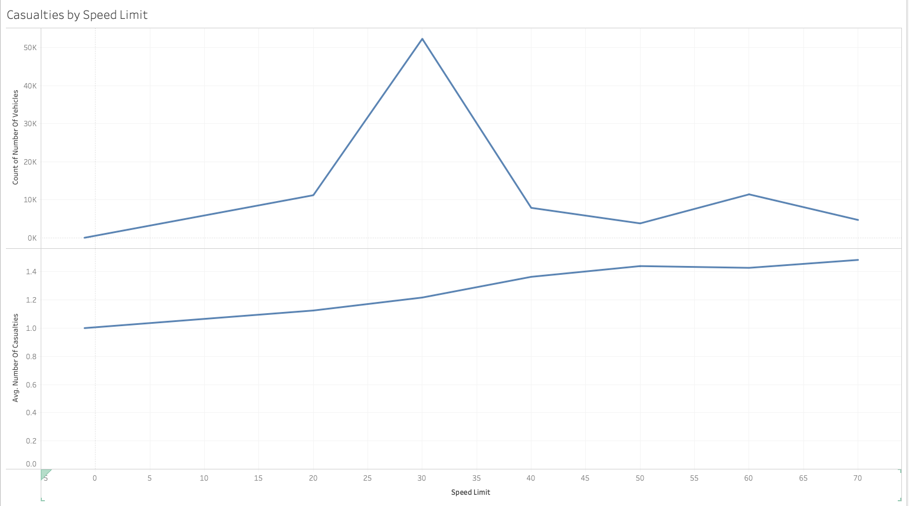
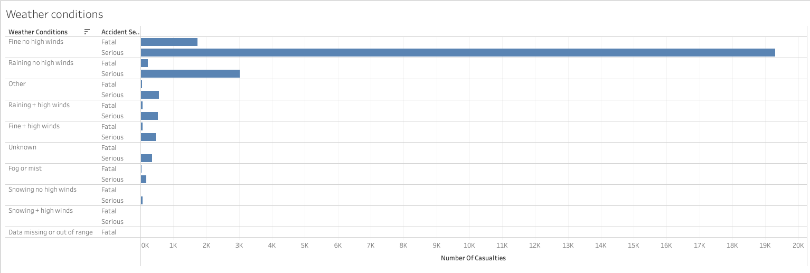
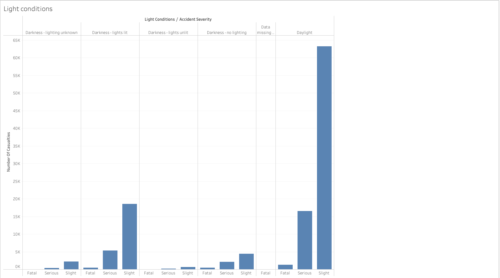
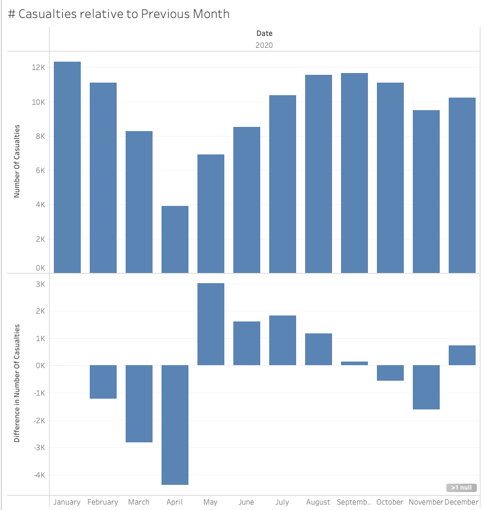

# Calculations

In this activity, you will create visualizations using a dataset on motor vehicle accidents in the United Kingdom in 2020.

## Instructions

* Try to create visualizations for the following questions:

  * What are the most dangerous hours that produce casualties?

  * What are the most dangerous months that produce casualties?

  * What speed limit is the most common for accidents to occur in?

  * Does the speed limit impact the average number of casualties?

  * What are the most common weather conditions for accidents?

  * Do light conditions have any impact on accidents?

* Are there any possible problems or issues with these visualizations?

* Use calculations and logical statements to enhance your visualizations, such as:

  * Using conditional logic to color dangerous months, locations, and hours.

  * Charting the increase or decrease in the number of casualties in each month relative to the previous month.

    * Feel free to revisit earlier datasets to create calculations.

* Use your imagination and good luck!

## References

UK Department for Transport (2021). Road Safety Data - Accidents 2020. [https://data.gov.uk/dataset/cb7ae6f0-4be6-4935-9277-47e5ce24a11f/road-safety-data](https://data.gov.uk/dataset/cb7ae6f0-4be6-4935-9277-47e5ce24a11f/road-safety-data). Accessed May 17, 2022.

