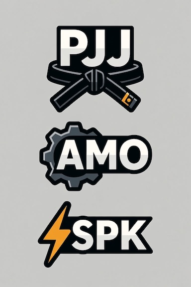

# Team Charter

Fill this in Monday morning. Keep the decision log current all week. You will be asked about it at the Architecture Defense and again on Demo Day.

---

## Team

**Team name:**

**Repository URL:**

| Member | Primary focus | Backup focus |
| :--- | :--- | :--- |
| | | |
| | | |
| | | |

Primary focus is what you own. Backup focus is the area you can pick up if a teammate is stuck or absent. No area should have only one person who understands it.

Suggested areas, adapt as you like: ingestion and loading, transformation and dbt modeling, analysis and BI, data quality, documentation and presentation. With three people everyone owns more than one.

---

## Our question

State it in one sentence. Be specific enough that someone could tell whether you answered it.

> 

**Why it matters:**

**How we will know we have answered it:**

---

## Architecture decision

**Pattern chosen:** A (ELT, warehouse-centric) / B (ETL, engine-side) / Custom

**Why:**

**What we gave up by choosing it:**

**Optional lanes we are attempting, if any:**

---

## Working agreements

**Git workflow:** branch per person / branch per feature / other

**How we review:** pull requests / pair review / direct to main with notice

**Where the decision log lives:** this file / repository docs / other

**Daily sync:** when and how long

**When we disagree:** how you break a tie. Decide this before you need it.

**Blocked rule:** how long one person struggles alone before asking the team, and before asking the instructor. Thirty minutes and ninety minutes are reasonable defaults.

---

## Decision log

Every non-obvious choice goes here, as you make it. This is what you will draw on for the Architecture Defense and the Demo Day questions. Reconstructing it from memory at the end does not work and it shows.

| Date | Decision | Options considered | Why we chose this | Who |
| :--- | :--- | :--- | :--- | :--- |
| | | | | |
| | | | | |
| | | | | |

Good entries to capture: which pattern and why, how you handled a specific data defect, why a model is a table rather than a view, why you cut a feature, which warehouse size you settled on.

---

## Data quality decisions

Summary view. The full report is a separate deliverable.

| Defect | Records affected | Decision | Rationale |
| :--- | :--- | :--- | :--- |
| | | | |
| | | | |

---

## Cost and performance rationale

Answer these by Thursday.

**Table types used, and why:**

**Warehouse size and auto-suspend setting, and why:**

**How we handled file sizing and format on load:**

**dbt materialization choices and the reasoning per layer:**

**What we would change at ten times the data volume:**

---

## AI use disclosure

Required deliverable. Be specific and honest. This is not held against you; undisclosed use is.

| Where we used AI | What for | What we verified ourselves |
| :--- | :--- | :--- |
| | | |
| | | |

**Anything we rejected or corrected from an AI suggestion:**

That last line is the interesting one. An answer there is evidence of judgment.

---

## Presentation plan

| Section | Presenter | Target minutes |
| :--- | :--- | :--- |
| Problem and question | | |
| Data and approach | | |
| Data quality | | |
| Findings | | |
| Technical deep dive | | |
| Future state | | |
| Recommendation | | |

**Rehearsal completed (date and time):**

**Dashboard screenshots captured:** yes / no
